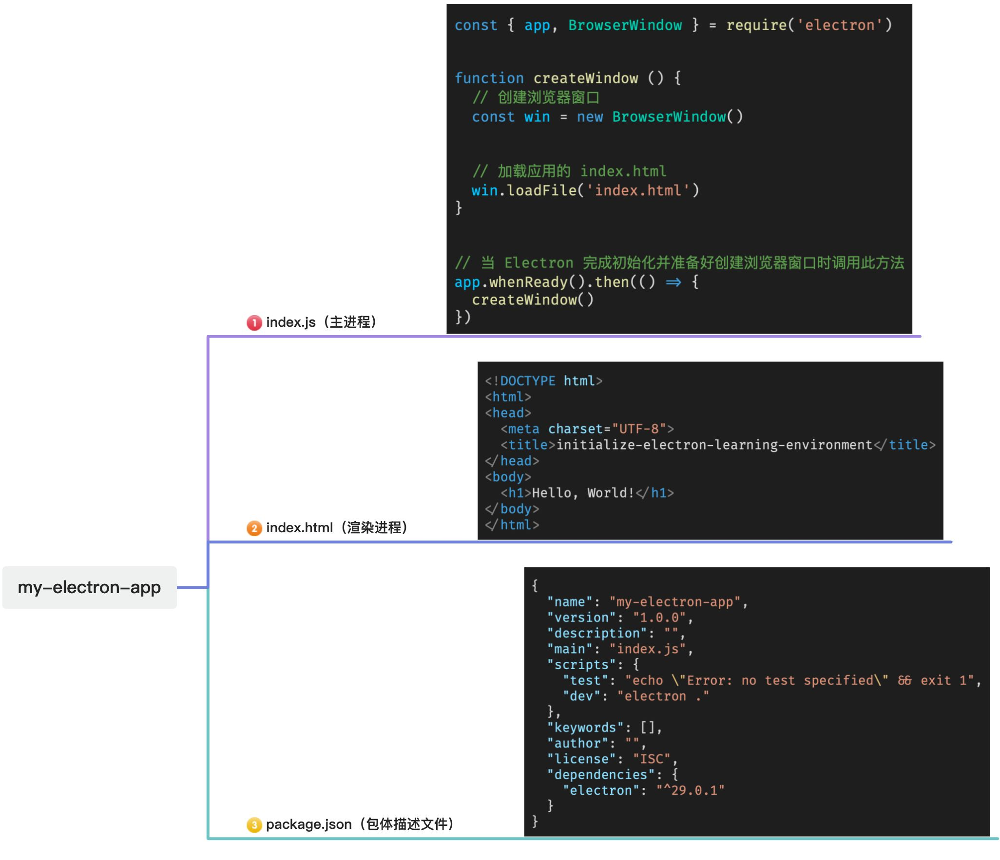
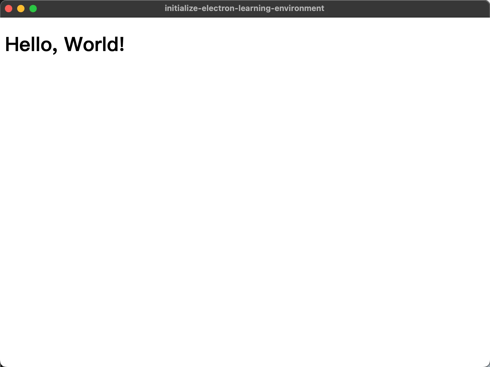

# [0001. Electron 应用的最小组成](https://github.com/Tdahuyou/electron/tree/main/0001.%20Electron%20%E5%BA%94%E7%94%A8%E7%9A%84%E6%9C%80%E5%B0%8F%E7%BB%84%E6%88%90)

<!-- region:toc -->


- [bilibili.electron.0001.1](https://www.bilibili.com/video/BV1kBFyeREXv)
- [1. 📺 视频](#1--视频)
- [2. 🔗 links](#2--links)
- [3. 📒 electron 应用的最小组成](#3--electron-应用的最小组成)
- [4. 📒 最终效果展示](#4--最终效果展示)
- [5. 💻 demo - 实现步骤](#5--demo---实现步骤)
  - [5.1. 安装 Node.js 和 npm](#51-安装-nodejs-和-npm)
  - [5.2. 安装 Electron](#52-安装-electron)
  - [5.3. 准备入口文件（主进程）](#53-准备入口文件主进程)
  - [5.4. 准备页面（渲染进程，非必需）](#54-准备页面渲染进程非必需)
  - [5.5. 配置启动命令（非必需）](#55-配置启动命令非必需)
  - [5.6. 启动 Electron 应用](#56-启动-electron-应用)
- [6. 🤔 问：主进程加载的入口文件是？](#6--问主进程加载的入口文件是)
<!-- endregion:toc -->
- 实现一个 demo - 从 0 到 1 搭建一个 hello world 应用
  - 知道 Electron 应用的最小组成，要求能够做到快速搭建一个简单的 Electron 学习环境，全程耗时控制在 1min ~ 3min（不算下载依赖耗时）实现一个小 demo，为接下来的 Electron 相关知识点的学习做准备。
- 本节内容，主要就是仨文件：
  - package.json 指定入口
  - index.js 主进程
  - index.html 渲染进程（非必需）

## 1. 📺 视频

<BilibiliOutsidePlayer id="BV1kBFyeREXv" />

## 2. 🔗 links

- https://nodejs.org/en - 这是 NodeJS 官网，如果你的电脑没有安装 NodeJS 的话，需要到官网安装它。

## 3. 📒 electron 应用的最小组成



## 4. 📒 最终效果展示

本节需要实现的 demo 效果非常简单 —— 启动 Electron 应用并在页面上渲染出 `Hello World`。



## 5. 💻 demo - 实现步骤

### 5.1. 安装 Node.js 和 npm
下面，我们来过一下具体的实现步骤。要初始化 Electron 学习环境，需要先安装 Node.js 和 npm。你可以通过 `npm -v`、`node -v` 来查看是否装好了这俩玩意儿。

```bash
# 检查 npm、node 版本
npm -v
# 10.2.3
node -v
# v20.10.0
```

如果成功打印出版本号，那么意味着已经成功安装好了。否则，你需要到 [Node.js 官网](https://nodejs.org/en) 事先下载好 nodejs 和 npm，直接下来 LTS 版本即可，下载过程全程下一步，傻瓜式安装。安装好 nodejs 之后，npm 也会随之自动安装好的。装完之后，再用上述命令试试看。

在安装好 nodejs、npm 之后，可以按照以下步骤初始化 Electron 学习环境。

### 5.2. 安装 Electron
创建一个新的空目录，例如 `my-electron-app`。并进入该目录，执行 `npm init -y` 命令来初始化 npm 包，这将创建一个默认的 `package.json` 文件。通过 npm 来安装 Electron：`npm i electron`。

```bash
# 创建一个新的空目录
mkdir my-electron-app

# 进入该目录
cd my-electron-app

# 初始化 npm 包
npm init

# 安装 Electron
npm i electron
```

如果你在使用 `npm` 安装 `electron` 时速度特别慢，那么可以考虑改用 `cnpm`（或者 yarn、pnpm 都行，推荐 pnpm） 来安装 `electron`，命令为 `cnpm i electron`。不过在使用 `cnpm` 之前，你得事先通过下载好 `cnpm` 才行。你可以通过 `npm i -g cnpm` 来在你的电脑上全局安装 `cnpm`。

完成上述操作后，你将会得到一个 `package.json` 文件，内容如下。

```json
{
  "name": "my-electron-app",
  "version": "1.0.0",
  "description": "",
  "main": "index.js",
  "scripts": {
    "test": "echo \"Error: no test specified\" && exit 1"
  },
  "keywords": [],
  "author": "",
  "license": "ISC",
  "dependencies": {
    "electron": "^29.0.1"
  }
}
```

在 `package.json` 文件中的 `dependencies` 字段中，可以看到我们已经成功安装好了 electron，并且版本为 `v29`（当前时间 2024 年 02 月 24 日 18:59:43）。我们还可以看到一个 `main` 字段，这个字段表示的是我们程序的 **入口**，默认是没有这个文件的，我们需要手动新建一个入口文件 `index.js`。

### 5.3. 准备入口文件（主进程）
创建一个新的 JavaScript 文件 `index.js`，并在其中编写 Electron 应用程序的主进程代码。

```bash
# 创建 index.js 文件
touch index.js
```

下面是 index.js 文件的内容，将这些内容复制到新建的 index.js 文件中。

```javascript
const { app, BrowserWindow } = require('electron')

function createWindow () {
  // 创建浏览器窗口
  const win = new BrowserWindow()

  // 加载应用的 index.html
  win.loadFile('index.html')
}

// 当 Electron 完成初始化并准备好创建浏览器窗口时调用此方法
app.whenReady().then(() => {
  createWindow()
})
```

上述 index.js 文件中提供的示例代码会创建一个简单的 Electron 应用程序窗口。但是，创建窗口还需要加载一个 `index.html` 文件，因此，我们还需要准备好这个文件，它相当于一个渲染进程的页面文件。

这个渲染进程的页面文件不是必须的，即便没有它，我们的 Electron 程序依旧可以正常启动，有些桌面应用程序就是始终在后台运行的，并没有和用户交互的 UI 界面。这里为了更加直观地展示出 Electron 应用，我们可以准备这样一个渲染进程的 `.html` 页面文件。

### 5.4. 准备页面（渲染进程，非必需）
创建一个新的 HTML 文件 `index.html`，并在其中编写应用程序的界面代码。

```bash
# 创建 index.html 文件
touch index.html
```

下面是 index.html 文件的内容，将这些内容复制到新建的 index.html 文件中。

```html
<!DOCTYPE html>
<html>
<head>
  <meta charset="UTF-8">
  <title>initialize-electron-learning-environment</title>
</head>
<body>
  <h1>Hello, World!</h1>
</body>
</html>
```

上述代码将在应用程序窗口中显示一个简单的“Hello, World!”消息。截止到这一步，其实我们已经完成了这个 demo，可以通过 `npx electron .` 命令来启动 electron 应用程序来看下最终的效果。

你如果习惯于使用 `npm run dev` 命令的写法来启动应用，你也可以将启动命令给配置到 `package.json` 的 `scripts` 字段中，无非就是加一个命令的映射脚本罢了。这或许能够给你提供一丢丢便利，方便你接下来能够以自己更熟悉的写法启动应用。

### 5.5. 配置启动命令（非必需）
修改 `package.json` 文件，以指定应用程序的入口文件和打包命令。

```json
{
  "name": "my-electron-app",
  "version": "1.0.0",
  "description": "",
  "main": "index.js",
  "scripts": {
    "test": "echo \"Error: no test specified\" && exit 1",
    "dev": "electron ."
  },
  "keywords": [],
  "author": "",
  "license": "ISC",
  "dependencies": {
    "electron": "^29.0.1"
  }
}
```

上面是修改后的 `package.json` 文件的内容，主要就是在 `scripts` 字段中新增了一个 `"dev": "electron ."` 命令映射脚本。`electron .` 表示在当前目录下启动 Electron 应用，下面对 `electron .` 命令做一个简单的阐述。

其中 `electron` 是启动 Electron 应用的命令，后面的 `.` 表示当前目录，也就是将当前目录下的代码作为 Electron 应用的代码进行启动。在执行该命令前需要确保当前目录下存在 `package.json` 文件并且已经安装了 electron 依赖。`electron` 会去读取 `package.json` 中的 `main` 字段指定的文件，将其作为应用程序的入口。

### 5.6. 启动 Electron 应用
运行应用程序：`npm run dev`，这将启动 Electron 应用程序，并在窗口中显示“Hello, World!”消息。


## 6. 🤔 问：主进程加载的入口文件是？

主进程就是 `package.json` 中的 main 字段标识的文件，它是整个程序的入口，也是 Electron 的主进程。

通过 `npm init -y` 生成的默认 `package.json` 文件中的 main 字段的值为 `index.js`。


