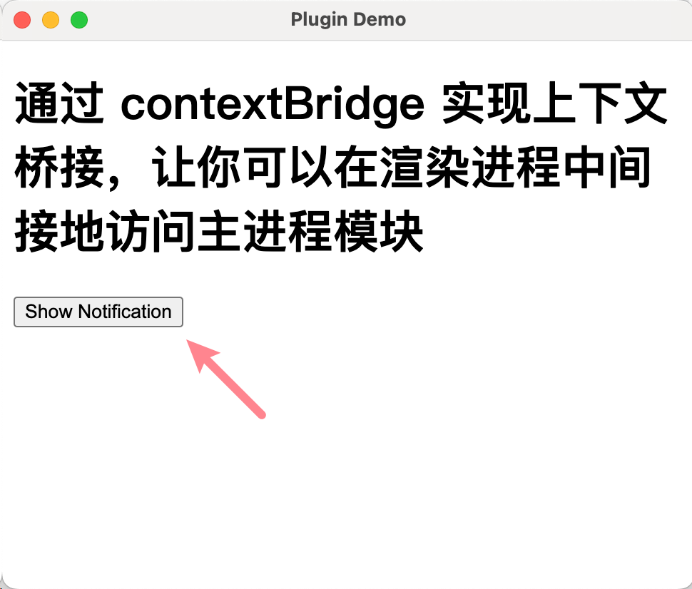
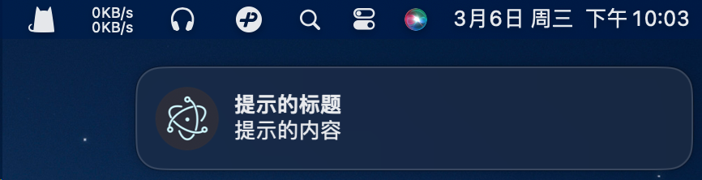

# 0002. 使用 contextBridge 暴露 API 给渲染进程

- `contextBridge` 的基本使用

学会在开启 `contextIsolation` 的情况下，使用 `contextBridge` 来给渲染进程暴露 Electron API，使用系统的原生能力。

## 🔗 链接

https://www.electronjs.org/zh/docs/latest/api/context-bridge - contextBridge 模块，查看渲染进程模块 contextBridge 的相关描述。

https://www.electronjs.org/zh/docs/latest/api/structures/web-preferences - WebPreferences Object，查看 WebPreferences 数据结构。

## 💻 示例

```javascript
const { app, BrowserWindow, ipcMain, Notification } = require('electron')
const { join } = require('path')

let win
function createWindow() {
  win = new BrowserWindow({
    webPreferences: {
      preload: join(__dirname, 'preload.js'),
      // contextIsolation: true,
      // 这里可以省略 contextIsolation 字段，因为它的默认值就是 true。
    },
  })

  win.loadFile('index.html')

  ipcMain.on('TdahuyouPlugin-showNotification',(_, { title, body }) => {
      if (Notification.isSupported()) {
        const notification = new Notification({ title, body })
        notification.show()
      }
    }
  )
}

app.whenReady().then(createWindow)
```

开启上下文隔离之后，Electron API 将只在预加载脚本 `preload.js` 中可用，在已加载页面 `index.html` 中不可用。

```javascript
const { contextBridge, ipcRenderer } = require('electron')

const TdahuyouAPI = {
  showNotification: (opts) => { // { title: string, body: string, ... }
    ipcRenderer.send('TdahuyouPlugin-showNotification', { body: opts.body, title: opts.title })
  },
  // other apis ...
}

if (process.contextIsolated) {
  contextBridge.exposeInMainWorld('TdahuyouPlugin', TdahuyouAPI)
} else {
  window.TdahuyouPlugin = TdahuyouAPI
}
```

```html
<!DOCTYPE html>
<html>
  <head>
    <title>Plugin Demo</title>
  </head>
  <body>
    <h1>通过 contextBridge 实现上下文桥接，让你可以在渲染进程中间接地访问主进程模块</h1>

    <button id="btn">Show Notification</button>

    <script>
      document.getElementById('btn').addEventListener('click', () => {
        TdahuyouPlugin.showNotification({ title: '提示的标题', body: '提示的内容' })
      })
    </script>
  </body>
</html>
```

**最终效果**





点击页面上的按钮【Show Notification】后，会在桌面右上角弹出提示窗。

这个提示 Notification 是系统级别的，只能在主进程访问此 API。示例通过上下文桥接的方式，将 API 的调用暴露给渲染进程，并绑定鼠标点击事件，当页面上的按钮被点击之后，触发消息通知。

