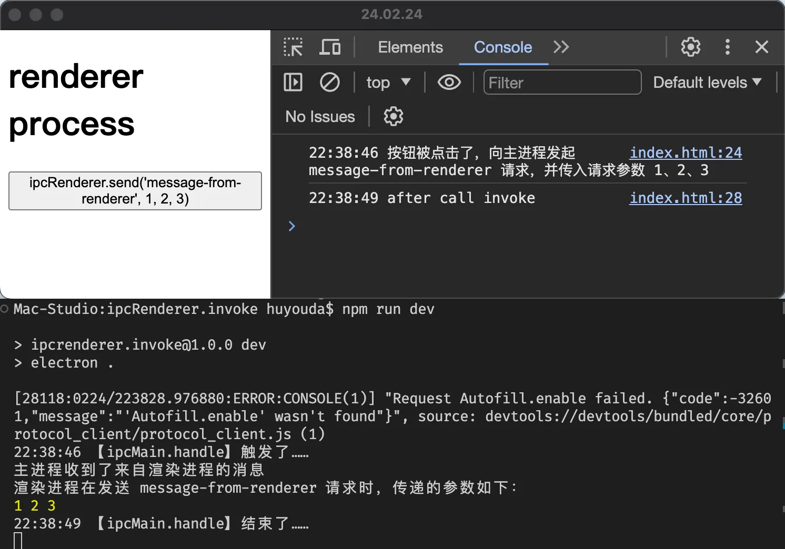

# [0035. 使用 ipcRenderer.invoke、ipcMain.handle 实现从渲染进程到主进程的单向 IPC 通信](https://github.com/Tdahuyou/electron/tree/main/0035.%20%E4%BD%BF%E7%94%A8%20ipcRenderer.invoke%E3%80%81ipcMain.handle%20%E5%AE%9E%E7%8E%B0%E4%BB%8E%E6%B8%B2%E6%9F%93%E8%BF%9B%E7%A8%8B%E5%88%B0%E4%B8%BB%E8%BF%9B%E7%A8%8B%E7%9A%84%E5%8D%95%E5%90%91%20IPC%20%E9%80%9A%E4%BF%A1)

<!-- region:toc -->
<BilibiliOutsidePlayer id="BV1544219774" />


- [bilibili.electron.0035.1](https://www.bilibili.com/video/BV1544219774)
- [1. 💻 demo](#1--demo)
<!-- endregion:toc -->

## 1. 💻 demo

```js
// renderer.js
const { ipcRenderer } = require('electron')
const now = () => new Date().toLocaleTimeString('en-US', { hour12: false, hour: '2-digit', minute: '2-digit', second: '2-digit' })

btn.onclick = async () => {
  console.log(now(), '按钮被点击了，向主进程发起 message-from-renderer 请求，并传入请求参数 1、2、3')

  await ipcRenderer.invoke('message-from-renderer', 1, 2, 3)

  console.log(now(), 'after call invoke')
}
```

```js
// index.js
const { app, BrowserWindow, ipcMain } = require('electron')

let win
function createWindow() {
  win = new BrowserWindow({
    webPreferences: { nodeIntegration: true, contextIsolation: false },
  })

  win.webContents.openDevTools()

  win.loadFile('./index.html')
}

const now = () => new Date().toLocaleTimeString('en-US', { hour12: false, hour: '2-digit', minute: '2-digit', second: '2-digit' })
const sleep = (duration) => new Promise((resolve) => setTimeout(resolve, duration))

function handleIPC() {
  ipcMain.handle('message-from-renderer', async (event, ...args) => {
    console.log(now(), '【ipcMain.handle】触发了……')
    await sleep(3000)
    console.log('主进程收到了来自渲染进程的消息')
    console.log('渲染进程在发送 message-from-renderer 请求时，传递的参数如下：')
    console.log(...args)
    console.log(now(), '【ipcMain.handle】结束了……')
  })
}

app.on('ready', () => {
  createWindow()
  handleIPC()
})
```

**最终效果**

渲染进程通过 `ipcRenderer.invoke` 方法向主进程发送消息，主进程通过 `ipcMain.handle` 方法监听来自渲染进程的消息。实现从渲染进程到主进程的单向通信。




