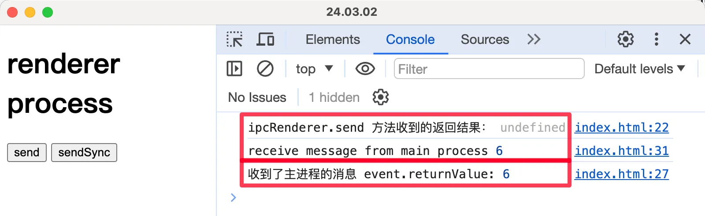

# 0039. 使用 ipcRenderer.sendSync、ipcMain.on 实现主进程和渲染进程之间的双向 IPC 通信

- 视频：✅

通过对比 `ipcRenderer.send`、`ipcRenderer.sendSync` 来熟悉 `sendSync` API 的一些特点和基本用法。

注意：ipcRenderer.sendSync 非必要，不建议使用。

## 💻 demo

**通信原理图**


本文档通过对比 ipcRenderer.send、ipcRenderer.sendSync 这两种通信方法，简单介绍了有关 ipcRenderer.sendSync API 的一些特点和基本用法。

**源码实现**

```javascript
// renderer.js
const {
  ipcRenderer
} = require('electron')

btn1.onclick = () => {
  // ipcRenderer.send 是异步的，之后的输出语句会立即打印。
  const res = ipcRenderer.send('send-message', 1, 2, 3)

  console.log('ipcRenderer.send 方法收到的返回结果：')
  console.log(res) // => undefined
}

ipcRenderer.on('message-from-main', (_, res) => {
  console.log('receive message from main process')
  console.log(res) // => 6
})

btn2.onclick = () => {
  // ipcRenderer.sendSync 是同步的，会阻塞程序的执行，等主进行处理完任务之后，才会继续往下执行。
  const res = ipcRenderer.sendSync('sendSync-message', 1, 2, 3)

  console.log('收到了主进程的消息 event.returnValue:')
  console.log(res) // => 6
}
```

```javascript
// index.js
const {app, BrowserWindow, ipcMain} = require('electron')

let win
function createWindow() {
  win = new BrowserWindow({
    webPreferences: { nodeIntegration: true, contextIsolation: false }
  })

  win.webContents.openDevTools()

  win.loadFile("./index.html")
}

const sleep = (duration) => new Promise((resolve) => setTimeout(resolve, duration))

function handleIPC() {
  ipcMain.on('send-message', async (event, ...args) => {

    // 睡个 3s，渲染进程不会等。
    await sleep(3000)

    console.log('主进程收到了来自渲染进程的 ipcRenderer.send 方法发送的消息', ...args)

    const sum = args.reduce((a, b) => a + b, 0)

    event.reply('message-from-main', sum)
  })

  ipcMain.on('sendSync-message', async (event, ...args) => {

    // 睡个 3s，渲染进程会等。
    await sleep(3000)

    console.log('主进程收到了来自渲染进程的 ipcRenderer.sendSync 方法发送的消息', ...args)

    const sum = args.reduce((a, b) => a + b, 0)

    event.returnValue = sum
  })
}

app.on('ready', () => {
  createWindow()
  handleIPC()
})
```

**最终效果**

先点击 send 按钮，然后再点击 sendSync 按钮，最终结果如下。



```bash
# 主进程日志
主进程收到了来自渲染进程的 ipcRenderer.send 方法发送的消息 1 2 3
主进程收到了来自渲染进程的 ipcRenderer.sendSync 方法发送的消息 1 2 3
```

