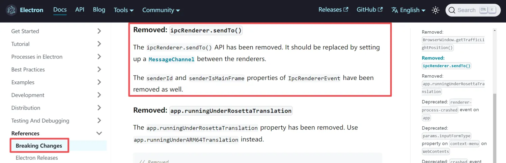

# 0041. 通过主进程获取另一个渲染进程的 ID 来实现两个渲染进程之间的通信

- 视频：✅

## 🔗 links

- https://www.electronjs.org/zh/docs/latest/breaking-changes#%E5%B7%B2%E7%A7%BB%E9%99%A4-ipcrenderersendto
  - Electron--文档--引用--重大变更。
  - 这是 Electron 的官方文档，在版本更新中的一些 Breaking Changes 截断式的更新（也就是不兼容的更新）。
  - 文中提到 v28 版本的更新中提到 ipcRenderer.sendTo() 方法已经被移除了，取而代之的是 MessageChannel。

## 📝 notes

介绍了两个渲染进程之间实现互相通信的一种方式 —— 通过主进程获取另一个渲染进程的 ID 来实现两个渲染进程之间的通信。
- 本文介绍的这种通信方式需要依赖 ipcRenderer 模块中的 ipcRenderer.sendTo方法，这个方法在 Electron 的 v28 版本中已经被丢弃了，如果要使用这种通信方案的话，需要注意 Electron 的版本问题。
- 这种方式在最新版的 Electron 中已经被淘汰了。



## 💻 demo

**【最终效果】**

使用窗口 1 给窗口 2 发消息。


使用窗口 2 给窗口 1 发消息。


**源码实现**

package.json 内容如下。

```json
{
  "name": "get-other-renderer-id-by-main-process",
  "version": "1.0.0",
  "description": "",
  "main": "index.js",
  "scripts": {
    "test": "echo \"Error: no test specified\" && exit 1",
    "dev": "electron ."
  },
  "author": "",
  "license": "ISC",
  "dependencies": {
    "electron": "^27.3.4"
  }
}
```

> ⚠️ 注意 Electron 的版本要低于 v28
>
> `"electron": "^27.3.4"`
>
> 要实现该文档中的效果，涉及到一个核心 API ipcRenderer.sendTo，而这个 API 在 Electron v28 版本中已经被 remove 掉了。

```js
// index.js
const { ipcMain, app, BrowserWindow } = require('electron')

let win1, win2
function createWindows() {
  win1 = new BrowserWindow({
    webPreferences: { nodeIntegration: true, contextIsolation: false }
  })

  win2 = new BrowserWindow({
    y: 0, x: 0,
    webPreferences: { nodeIntegration: true, contextIsolation: false }
  })

  win1.webContents.openDevTools()
  win2.webContents.openDevTools()

  win1.loadFile('./index1.html')
  win2.loadFile('./index2.html')
}

function handleIPC() {
  ipcMain.handle('get-win2-id', _ => win2.webContents.id)
  ipcMain.handle('get-win1-id', _ => win1.webContents.id)
}

app.on('ready', () => {
  createWindows()
  handleIPC()
})
```

```js
// renderer1.js
const { ipcRenderer } = require('electron')

btn.addEventListener('click', async () => {
  const win2ID = await ipcRenderer.invoke('get-win2-id')
  console.log('获取到「窗口2」的id：', win2ID, '并给它发送消息')
  ipcRenderer.sendTo(win2ID, 'renderer1-to-renderer2', 1, 2)
})

ipcRenderer.on('renderer2-to-renderer1', (e, a, b) => {
  console.log('「窗口1」收到了「窗口2」发送来的消息')
  console.log('发送者「窗口2」的 id 为：', e.senderId)
  console.log('参数为：', a, b)
})
```

```js
// renderer2.js
const { ipcRenderer } = require('electron')

btn.addEventListener('click', async () => {
  const win1ID = await ipcRenderer.invoke('get-win1-id')
  console.log('获取到「窗口1」的id：', win1ID, '并给它发送消息')
  ipcRenderer.sendTo(win1ID, 'renderer2-to-renderer1', 3, 4)
})

ipcRenderer.on('renderer1-to-renderer2', (e, a, b) => {
  console.log('「窗口2」收到了「窗口1」发送来的消息')
  console.log('发送者「窗口1」的 id 为：', e.senderId)
  console.log('参数为：', a, b)
})
```