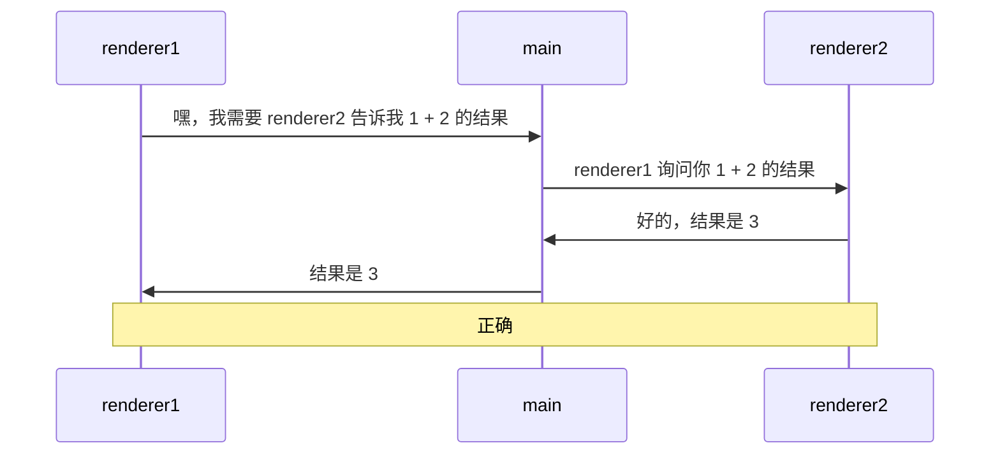

# 0042. 通过主进程转发消息的方式实现两个渲染进程之间互相通信

- 视频：✅

## 📝 概述

- 理解 demo1 的写法存在的问题
- 理解 demo2 的实现原理

一共有 2 个 demo，其中 demo1 的写法是存在一些问题的，demo2 对 demo1 的问题进行了处理。

类似于 demo2 的效果，在工作中实践过，使用起来感觉没啥问题，还 OK。需要注意的是 channel 的语义化，如果 channel 的数量比较多，那么可以尝试通过一些特殊的自定义命名规则来区分哪些 channel 是用于在两个渲染进程之间互相通信的。当然，除了通过自定义命名规范来区分，还可以单独写一个全局对象来存储 channel，比如 `CHANNEL_LIST.r2r.xxx`、`CHANNEL_LIST.r2m.xxx`、`CHANNEL_LIST.m2r.xxx`。

## 💻 demo

```js
// index.js
const { app, BrowserWindow, ipcMain } = require('electron')

let win1, win2

function createWin() {
  win1 = new BrowserWindow({
    webPreferences: { nodeIntegration: true, contextIsolation: false },
  })

  win2 = new BrowserWindow({
    webPreferences: { nodeIntegration: true, contextIsolation: false },
  })

  win1.webContents.openDevTools()
  win2.webContents.openDevTools()

  win1.loadFile('./index1.html')
  win2.loadFile('./index2.html')
}

function handleIPC() {
  ipcMain.handle('message-from-renderer1', async (_, ...args) => {
    console.log('main process received message from renderer1 with args:', args)
    win2.webContents.send('message-to-renderer2', ...args)
    return new Promise((resolve) => ipcMain.on('message-from-renderer2', (_, result) => resolve(result)))
  })
}

app.whenReady().then(() => {
  createWin()
  handleIPC()
})
```

```js
// renderer2.js
const { ipcRenderer } = require('electron')

ipcRenderer.on('message-to-renderer2', (event, ...args) => {
  console.log('message-to-renderer2', ...args)
  ipcRenderer.send('message-from-renderer2', args.reduce((a, b) => a + b, 0))
})
```

```js
// renderer1.1.js
const { ipcRenderer } = require('electron')

async function test() {
  console.log('1 + 2 =', await ipcRenderer.invoke('message-from-renderer1', 1, 2))
}

test() // => 1 + 2 = 3
```

**通信原理图：**

