```mermaid
sequenceDiagram
      participant renderer1
		  participant main
      participant renderer2
      renderer1->>main: 【test1】嘿，我需要 renderer2 告诉我 1 + 2 的结果
			Note right of main: 别急，我先给你这个任务创建一个标识 ID1
      renderer1->>main: 【test2】嘿，我需要 renderer2 告诉我 1 + 2 + 3 的结果
			Note right of main: 别急，我再给你这个任务创建一个标识 ID2
			main->>renderer2: renderer1 询问你 1 + 2 的结果，任务标识是 ID1
			main->>renderer2: renderer1 询问你 1 + 2 + 3 的结果，任务标识是 ID2
      renderer2->>main: 好的，任务标识是 ID1 的任务完成了，结果是 3
			main->>renderer1: 任务标识是 ID1 的任务询问的是 1 + 2 结果是 3
      renderer2->>main: 好的，任务标识是 ID2 的任务完成了，结果是 6
			main->>renderer1: 任务标识是 ID2 的任务询问的是 1 + 2 + 3 结果是 6
```

# [0042. 通过主进程转发消息的方式实现两个渲染进程之间互相通信](https://github.com/Tdahuyou/electron/tree/main/0042.%20%E9%80%9A%E8%BF%87%E4%B8%BB%E8%BF%9B%E7%A8%8B%E8%BD%AC%E5%8F%91%E6%B6%88%E6%81%AF%E7%9A%84%E6%96%B9%E5%BC%8F%E5%AE%9E%E7%8E%B0%E4%B8%A4%E4%B8%AA%E6%B8%B2%E6%9F%93%E8%BF%9B%E7%A8%8B%E4%B9%8B%E9%97%B4%E4%BA%92%E7%9B%B8%E9%80%9A%E4%BF%A1)

<!-- region:toc -->


- [bilibili.electron.0042.1](https://www.bilibili.com/video/BV1544219774)
- [1. 💻 demo1](#1--demo1)
- [2. 💻 demo2](#2--demo2)
<!-- endregion:toc -->
- 理解 demo1 的写法存在的问题
- 理解 demo2 的实现原理
- 一共有 2 个 demo，其中 demo1 的写法是存在一些问题的，demo2 对 demo1 的问题进行了处理。
- 类似于 demo2 的效果，在工作中实践过，使用起来感觉没啥问题，还 OK。需要注意的是 channel 的语义化，如果 channel 的数量比较多，那么可以尝试通过一些特殊的自定义命名规则来区分哪些 channel 是用于在两个渲染进程之间互相通信的。当然，除了通过自定义命名规范来区分，还可以单独写一个全局对象来存储 channel，比如 `CHANNEL_LIST.r2r.xxx`、`CHANNEL_LIST.r2m.xxx`、`CHANNEL_LIST.m2r.xxx`。

## 1. 💻 demo1

```js
// index.js
const { app, BrowserWindow, ipcMain } = require('electron')

let win1, win2

function createWin() {
  win1 = new BrowserWindow({
    webPreferences: { nodeIntegration: true, contextIsolation: false },
  })

  win2 = new BrowserWindow({
    webPreferences: { nodeIntegration: true, contextIsolation: false },
  })

  win1.webContents.openDevTools()
  win2.webContents.openDevTools()

  win1.loadFile('./index1.html')
  win2.loadFile('./index2.html')
}

function handleIPC() {
  ipcMain.handle('message-from-renderer1', async (_, ...args) => {
    console.log('main process received message from renderer1 with args:', args)
    win2.webContents.send('message-to-renderer2', ...args)
    return new Promise((resolve) => ipcMain.on('message-from-renderer2', (_, result) => resolve(result)))
  })
}

app.whenReady().then(() => {
  createWin()
  handleIPC()
})
```

```js
// renderer2.js
const { ipcRenderer } = require('electron')

ipcRenderer.on('message-to-renderer2', (event, ...args) => {
  console.log('message-to-renderer2', ...args)
  ipcRenderer.send('message-from-renderer2', args.reduce((a, b) => a + b, 0))
})
```

```js
// renderer1.1.js
const { ipcRenderer } = require('electron')

async function test() {
  console.log('1 + 2 =', await ipcRenderer.invoke('message-from-renderer1', 1, 2))
}

test() // => 1 + 2 = 3
```

**通信原理图：**



```mermaid
sequenceDiagram
      participant renderer1
		  participant main
      participant renderer2
      renderer1->>main: 嘿，我需要 renderer2 告诉我 1 + 2 的结果
			main->>renderer2: renderer1 询问你 1 + 2 的结果
      renderer2->>main: 好的，结果是 3
			main->>renderer1: 结果是 3
			Note over renderer1,renderer2: 正确
```

**缺陷分析：**

修改渲染进程 2 的脚本 renderer1.2.js，试着同时多发几个任务，修改后的内容如下。

```js
// renderer1.2.js
const { ipcRenderer } = require('electron')

async function test1() {
  console.log('1 + 2 =', await ipcRenderer.invoke('message-from-renderer1', 1, 2))
}

async function test2() {
  console.log('1 + 2 + 3 =', await ipcRenderer.invoke('message-from-renderer1', 1, 2, 3))
}

test1() // => 1 + 2 = 3
test2() // => 1 + 2 + 3 = 3 ❌
```



```mermaid
sequenceDiagram
      participant renderer1
		  participant main
      participant renderer2
      renderer1->>main: 【test1】嘿，我需要 renderer2 告诉我 1 + 2 的结果
      renderer1->>main: 【test2】嘿，我需要 renderer2 告诉我 1 + 2 + 3 的结果
			main->>renderer2: renderer1 询问你 1 + 2 的结果
			main->>renderer2: renderer1 询问你 1 + 2 + 3 的结果
      renderer2->>main: 好的，1 + 2 结果是 3
			main->>renderer1: 1 + 2 的结果是 3
			Note over renderer1,main: 上面这一步出现了问题，会同时触发【test1、2】结束
      renderer2->>main: 好的，1 + 2 + 3 结果是 6
			main->>renderer1: 1 + 2 + 3 结果是 6
```

## 2. 💻 demo2

就 demo1 中的问题，我们针对性地处理一下，解决方案也非常简单，给每一个任务加上 id，区分开不同的任务即可。

事先下载一个第三方包 uuid，用于生成任务的唯一 id。

package.json 内容如下：

```json
{
  "name": "renderer2renderer",
  "version": "1.0.0",
  "description": "",
  "main": "index.js",
  "scripts": {
    "test": "echo \"Error: no test specified\" && exit 1",
    "dev": "electron ."
  },
  "author": "",
  "license": "ISC",
  "dependencies": {
    "electron": "^29.1.0",
    "uuid": "^9.0.1"
  }
}
```

```js
// index.js
const { app, BrowserWindow, ipcMain } = require('electron')
const { v4: uuidv4 } = require('uuid')

let win1, win2

function createWin() {
  win1 = new BrowserWindow({
    webPreferences: { nodeIntegration: true, contextIsolation: false },
  })
  win2 = new BrowserWindow({
    webPreferences: { nodeIntegration: true, contextIsolation: false },
  })

  win1.webContents.openDevTools()
  win2.webContents.openDevTools()

  win1.loadFile('./index1.html')
  win2.loadFile('./index2.html')
}

function handleIPC() {
  const promises = new Map()

  ipcMain.on('message-from-renderer2', (_, { id, result }) => {
    const { resolve } = promises.get(id)
    promises.delete(id)

    resolve(result)
  })

  ipcMain.handle('message-from-renderer1', async (_, ...args) => {
    console.log('main process received message from renderer1 with args:', args)
    return await sendRequestToRenderer2(...args)
  })

  function sendRequestToRenderer2(...args) {
    return new Promise((resolve, reject) => {
      const id = uuidv4()

      promises.set(id, { resolve, reject })

      win2.webContents.send('message-to-renderer2', id, ...args)
    })
  }
}

app.whenReady().then(() => {
  createWin()
  handleIPC()
})
```

主进程在转发的时候，给每个转发的任务加上 id。

```js
// renderer1.js
const { ipcRenderer } = require('electron')

async function test1() {
  console.log('1 + 2 =', await ipcRenderer.invoke('message-from-renderer1', 1, 2))
}

async function test2() {
  console.log('1 + 2 + 3 =', await ipcRenderer.invoke('message-from-renderer1', 1, 2, 3))
}

test1() // => 1 + 2 = 3
test2() // => 1 + 2 + 3 = 6
```

```js
// renderer2.js
const { ipcRenderer } = require('electron')

ipcRenderer.on('message-to-renderer2', async (event, id, ...args) => {
  console.log('message-to-renderer2', id, ...args)

  const result = args.reduce((a, b) => a + b, 0)

  ipcRenderer.send('message-from-renderer2', { id, result })
})
```

渲染进程处理任务的时候，会收到主进程传递过来的对应任务 id，任务处理完之后，再将 id 一并携带上，丢给主进程。

**通信原理图：**




