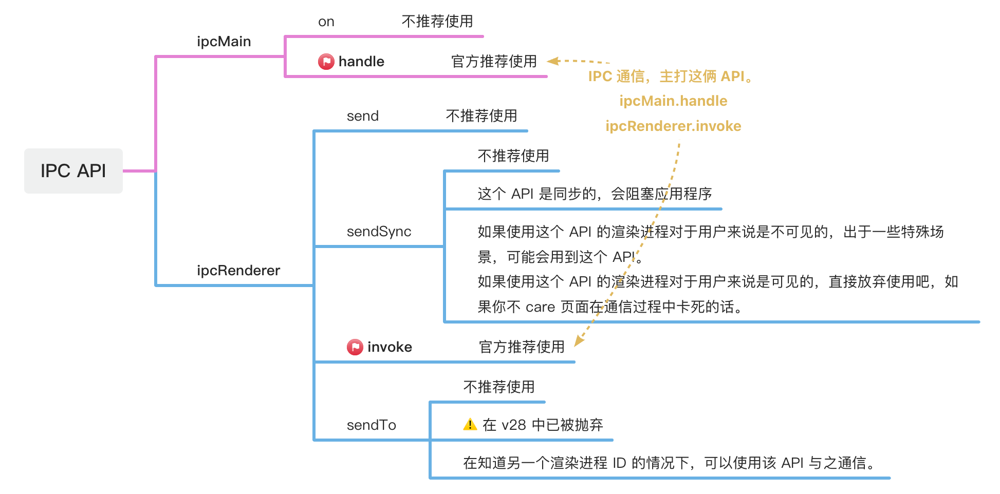

# [0046. 认识 IPC 相关模块](https://github.com/Tdahuyou/electron/tree/main/0046.%20%E8%AE%A4%E8%AF%86%20IPC%20%E7%9B%B8%E5%85%B3%E6%A8%A1%E5%9D%97)

<!-- region:toc -->
- [1. 📝 Summary](#1--summary)
- [2. 🔗 links](#2--links)
- [3. 💡 导图](#3--导图)
- [4. 📝 electron doc - 进程间通信教程](#4--electron-doc---进程间通信教程)
- [5. 📝 send vs. sendSync](#5--send-vs-sendsync)
  - [5.1. send、sendSync 是什么](#51-sendsendsync-是什么)
  - [5.2. 同步 vs. 异步](#52-同步-vs-异步)
  - [5.3. 返回值](#53-返回值)
  - [5.4. 看看官方建议](#54-看看官方建议)
- [6. 📝 send vs. invoke](#6--send-vs-invoke)
  - [6.1. 先给出结论](#61-先给出结论)
  - [6.2. 场景 - 双向通信](#62-场景---双向通信)
  - [6.3. 场景 - 单向通信](#63-场景---单向通信)
- [7. 🤔 问：使用 send 来实现单向通信能减少开销提高性能？](#7--问使用-send-来实现单向通信能减少开销提高性能)
<!-- endregion:toc -->
## 1. 📝 Summary
- 把官方教程中提到的 IPC 通信模式刷一遍
- 认识用于实现 IPC 通信的模块 ipcMain、ipcRenderer
- send 和 sendSync 之间的一些差异（这俩 API “已过时”）
- invoke 比 send 好在哪

## 2. 🔗 links

- https://www.electronjs.org/zh/docs/latest/tutorial/ipc
  - 这是官方提供的 IPC 通信教程。
- https://www.electronjs.org/docs/latest/tutorial/ipc#note-legacy-approaches
  - 官方建议 - 推荐使用 invoke 的说明。

## 3. 💡 导图

## 4. 📝 electron doc - 进程间通信教程

> from: https://www.electronjs.org/zh/docs/latest/tutorial/ipc

这是官方提供的 IPC 通信教程，包含以下几个要点：

- 上下文隔离进程
- 一些基本的 IPC 通信模式，并提供了具体的示例。
  - 模式 1：渲染器进程到主进程（单向）
  - 模式 2：渲染器进程到主进程（双向）
  - 模式 3：主进程到渲染器进程
  - 模式 4：渲染器进程到渲染器进程
- 对象序列化

## 5. 📝 send vs. sendSync

ipcRenderer.send 和 ipcRenderer.sendSync 这俩 API，可以认为它们已经过时了，重点掌握好 ipcRenderer.invoke 即可。

### 5.1. send、sendSync 是什么

这里所说的 send 是指 ipcRenderer.send，sendSync 是指 ipcRenderer.sendSync。

ipcRenderer.send 和 ipcRenderer.sendSync 它们都是 Electron 的 ipcRenderer 模块中用于发送消息到主进程的方法。但是它们在发送消息的方式上有一些差异，其中最明显的差异就是 send 是异步的，sendSync 是同步的。

### 5.2. 同步 vs. 异步

下面，我们从“同步”、“异步”的角度来对比两者之间的差异。

ipcRenderer.send 是一个 **异步** 方法，它会立即返回，**不会阻塞渲染进程**。当主进程接收到消息并处理完后，如果需要回复消息，主进程会再发送一个消息给渲染进程，渲染进程需要另外设置监听来接收。

ipcRenderer.sendSync 是一个 **同步** 方法，它 **会阻塞渲染进程**，等待主进程接收消息并返回结果。当这个方法返回时，返回的就是主进程处理的结果。在主进程返回结果之前，渲染进程将始终处于阻塞状态。

由于 ipcRenderer.send 是非阻塞的，从性能和用户体验角度来看，它通常都优于 ipcRenderer.sendSync。因为 ipcRenderer.sendSync 会阻塞渲染进程，直到主进程返回结果，这将会导致渲染进程界面的暂停或卡顿，很影响用户体验。

需要知道，阻塞 JavaScript 的执行线程是非常危险的。因为 JavaScript 本身就是单线程运行，一旦某个方法阻塞了这个仅有的线程，JavaScript 的运行就停滞了，只能等这个方法退出。假设此时预期需要有一个 setTimeout 事件或 setInterval 事件被执行，那么此预期也落空了。这可能使我们的业务处于不可知的异常中。JavaScript 语言本身以“异步编程”著称，我们应该尽量避免用它的同步方法和长耗时方法，避免造成执行线程阻塞。

这里顺带着提一嘴，Electron 中的 remote 模块不推荐使用的原因之一也是因为它底层的执行逻辑是同步的，玩不好很可能导致程序卡死。

### 5.3. 返回值

**Q：如果从返回值的角度来看，它们两者之间又有何区别呢？**

ipcRenderer.send 的返回值是 undefined，因为它只是发送消息，不关心主进程是否有返回结果。

ipcRenderer.sendSync 的返回值是主进程处理结果，因为它会等待主进程处理完消息并返回结果。

通过上述的对比分析，你可能会得出以下“过时的”结论。

如果我们的应用对性能有较高要求，或者不需要即刻得到主进程处理的结果，那么应优先使用 ipcRenderer.send。

如果我们的应用需要即刻得到主进程处理的结果，并且对可能的性能影响可以接受，那么可以使用 ipcRenderer.sendSync。

其实上述说法是没错的，不过现在有比 send 更优的选择 —— invoke，所以说是“过时”的结论。

### 5.4. 看看官方建议

上述提到的结论真的“过时”了？这时候可以让我们来看看官方建议。

简言之就是，**如果我们开发的应用所使用的 Electron 的版本高于 v7，那么推荐使用新版的 API ipcRenderer.invoke 来实现渲染进程到主进程之间的通信。放弃使用传统的 ipcRenderer.send、ipcRenderer.sendSync。**

## 6. 📝 send vs. invoke

### 6.1. 先给出结论

- ipcRenderer.invoke 新版 API
- ipcRenderer.invoke 仍健在
- ~~ipcRenderer.send 旧版 API~~
- ~~ipcRenderer.send 已淘汰~~

---

- 两者都是异步的
- 从能力角度来看 send = invoke
  - send 能做的，invoke 都能做
  - invoke 能做的，send 也都能做
- 从使用体验来看 invoke > send。针对一些常见的通信场景，比如双向通信，invoke 写起来比 send 更舒服。

### 6.2. 场景 - 双向通信

假设我们需要实现这样一种通信的场景：

渲染进程给主进程发一个消息，并等待接收主进程的处理结果，拿到处理结果之后再执行后续操作，要求这个过程不能阻塞程序的执行。

其实，实现的方案有很多，由于不能阻塞程序的执行，首先被放弃的方案就是使用 ipcRenderer.sendSync。然后，我们再来看看 ipcRenderer.send、ipcRenderer.invoke。

invoke 更简洁。仅需要一个事件即可完成通信。在渲染进程中，通过 ipcRenderer.invoke 将请求发送给主进程，在主进程的 ipcMain.handle 中，将处理完的结果直接 return 即可返回给我们的渲染进程。

send 更麻烦。因为需要绑定俩事件：
- 事件 1：渲染进程发起请求，主进程接收请求
- 事件 2：主进程发起响应，渲染进程接收响应
绑定俩事件处理函数倒也不难，痛苦的是你需要将本该在一起的逻辑给拆到两个不同的地方。无论是对写代码的人还是后续读代码的人，都是很不友好的。

从上面描述的场景来看，显然没有必要使用 send。

### 6.3. 场景 - 单向通信

如果仅仅是渲染进程发起请求，不需要管主进程的响应，也就是单向通信，send 和 invoke 又有何区别呢？

答案是，**几乎没有区别**。

## 7. 🤔 问：使用 send 来实现单向通信能减少开销提高性能？

这是一位网友提的问题，由于缺乏论据，并且也没在官方文档找到支持这种说法的点，因此暂且认为这种说法是不成立的。

> 咨询时间：24.06.27
>
> 顺带提一嘴 - 不习惯被称呼为老师。
> - 可以把老师给去掉，直接问问题；
> - 也可以把老师替换为 up；
>
> 看到消息后会尽快去回复。

