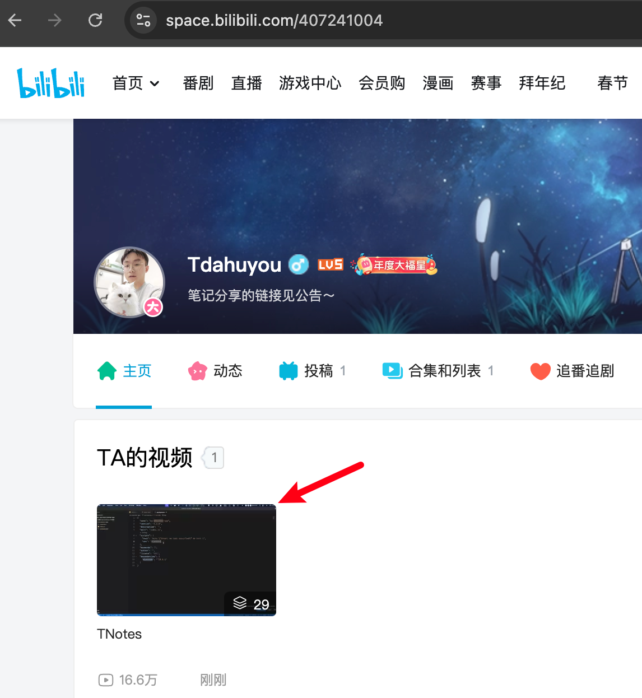
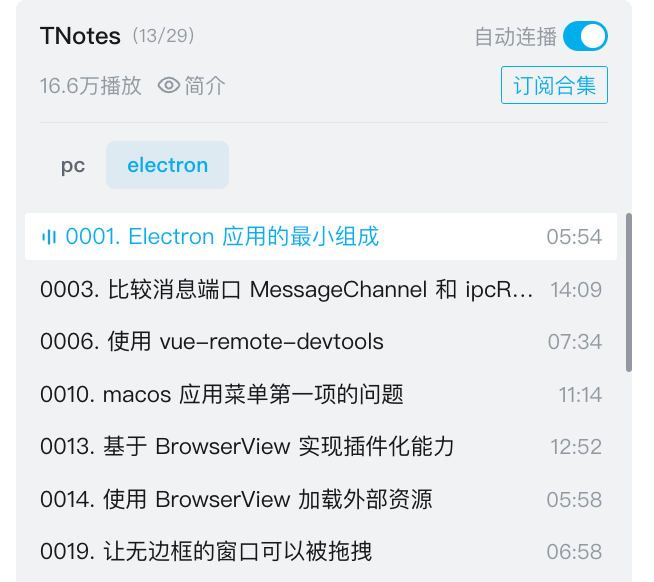

# [0059. electron 笔记简介](https://github.com/Tdahuyou/electron/tree/main/0059.%20electron%20%E7%AC%94%E8%AE%B0%E7%AE%80%E4%BB%8B)

<!-- region:toc -->
- [1. 🔗 electron 笔记仓库 - github](#1--electron-笔记仓库---github)
- [2. 🔗 B 站视频](#2--b-站视频)
- [3. 📒 视频内容及更新说明](#3--视频内容及更新说明)
<!-- endregion:toc -->

## 1. 🔗 electron 笔记仓库 - github

- https://github.com/Tdahuyou/electron
- 该仓库存放的是个人的 electron 学习笔记，有需要的可自行 clone。

## 2. 🔗 B 站视频

- https://space.bilibili.com/407241004
- 
- 

## 3. 📒 视频内容及更新说明

- **根据编号定位**：B 站上仅录制了一小部分的视频，可以根据编号来定位笔记和视频。
- **不定期更新**：结合实际情况，会不定期更新笔记和视频。
  - 由于目前的工作暂时不涉及 electron 技术栈，这部分视频是 24 年初录制的，比较长时间没有更新了。
- **内容**：视频内容主要是展示一些 demo 效果，并附带简单的说明。
  - **时长**：大部分视频的时长均在 10min 左右。
  - **可作为参考**：若在查看具体笔记时若有疑问，可查阅视频作为一个参考，获取能找到答案。
    - 个人习惯是先看笔记，若没问题了就没必要回看早期录制的视频了。

