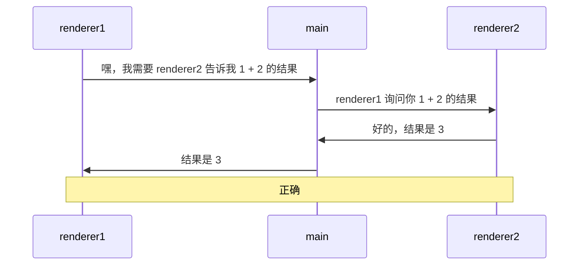
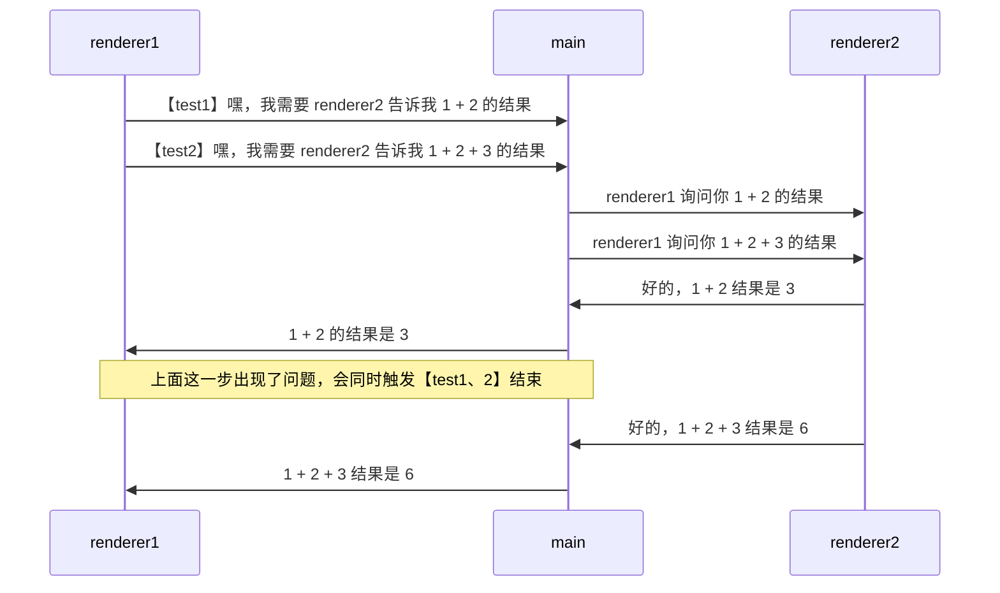
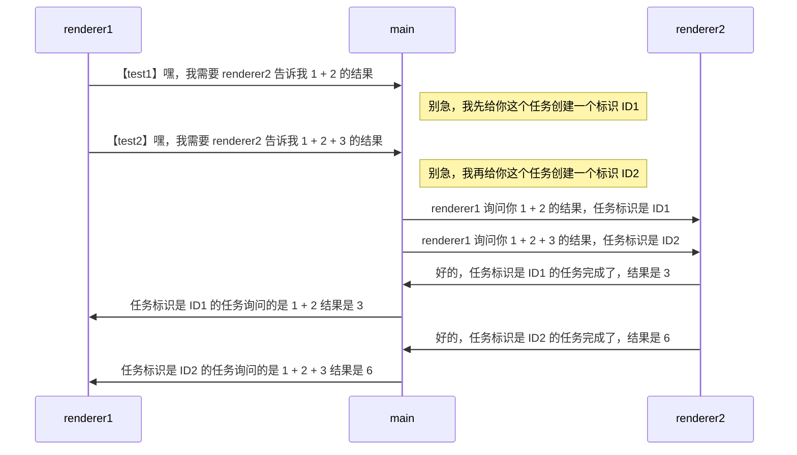
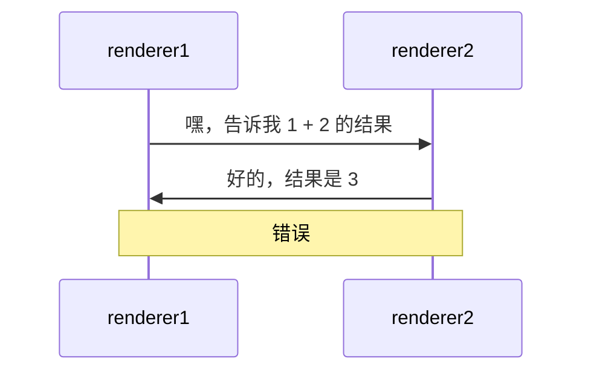
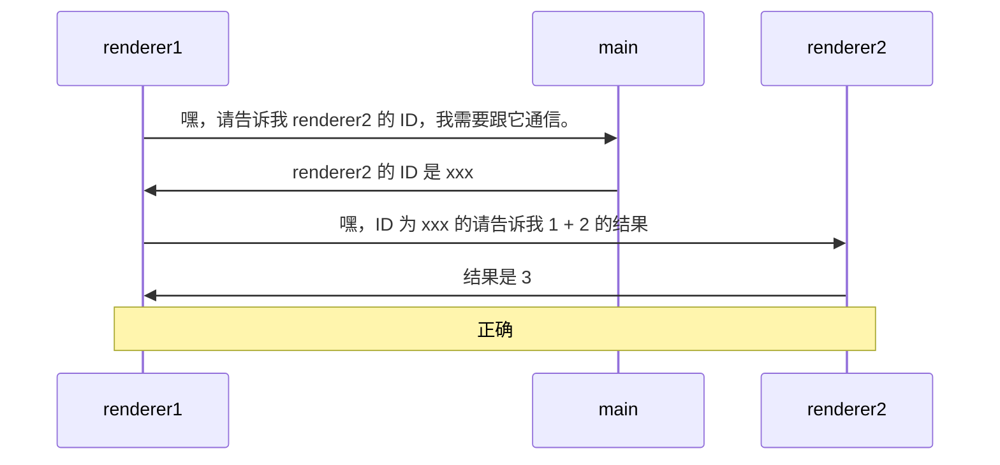

# [README.md](./0001.%20Electron%20应用的最小组成/README.md)<!-- !======> SEPERATOR <====== -->
# [0001. Electron 应用的最小组成](https://github.com/Tdahuyou/electron/tree/main/0001.%20Electron%20%E5%BA%94%E7%94%A8%E7%9A%84%E6%9C%80%E5%B0%8F%E7%BB%84%E6%88%90)

<!-- region:toc -->
- [1. 📝 summary](#1--summary)
- [2. 🔗 links](#2--links)
- [3. 📒 electron 应用的最小组成](#3--electron-应用的最小组成)
- [4. 📒 最终效果展示](#4--最终效果展示)
- [5. 💻 demo - 实现步骤](#5--demo---实现步骤)
  - [5.1. 安装 Node.js 和 npm](#51-安装-nodejs-和-npm)
  - [5.2. 安装 Electron](#52-安装-electron)
  - [5.3. 准备入口文件（主进程）](#53-准备入口文件主进程)
  - [5.4. 准备页面（渲染进程，非必需）](#54-准备页面渲染进程非必需)
  - [5.5. 配置启动命令（非必需）](#55-配置启动命令非必需)
  - [5.6. 启动 Electron 应用](#56-启动-electron-应用)
- [6. 🤔 问：主进程加载的入口文件是？](#6--问主进程加载的入口文件是)
<!-- endregion:toc -->
## 1. 📝 summary

- [📺 bilibili](https://www.bilibili.com/video/BV1544219774)
- 实现一个 demo - 从 0 到 1 搭建一个 hello world 应用
  - 知道 Electron 应用的最小组成，要求能够做到快速搭建一个简单的 Electron 学习环境，全程耗时控制在 1min ~ 3min（不算下载依赖耗时）实现一个小 demo，为接下来的 Electron 相关知识点的学习做准备。
- 本节内容，主要就是仨文件：
  - package.json 指定入口
  - index.js 主进程
  - index.html 渲染进程（非必需）

## 2. 🔗 links

- https://nodejs.org/en - 这是 NodeJS 官网，如果你的电脑没有安装 NodeJS 的话，需要到官网安装它。

## 3. 📒 electron 应用的最小组成


## 4. 📒 最终效果展示

本节需要实现的 demo 效果非常简单 —— 启动 Electron 应用并在页面上渲染出 `Hello World`。


## 5. 💻 demo - 实现步骤

### 5.1. 安装 Node.js 和 npm
下面，我们来过一下具体的实现步骤。要初始化 Electron 学习环境，需要先安装 Node.js 和 npm。你可以通过 `npm -v`、`node -v` 来查看是否装好了这俩玩意儿。

```bash
# 检查 npm、node 版本
npm -v
# 10.2.3
node -v
# v20.10.0
```

如果成功打印出版本号，那么意味着已经成功安装好了。否则，你需要到 [Node.js 官网](https://nodejs.org/en) 事先下载好 nodejs 和 npm，直接下来 LTS 版本即可，下载过程全程下一步，傻瓜式安装。安装好 nodejs 之后，npm 也会随之自动安装好的。装完之后，再用上述命令试试看。

在安装好 nodejs、npm 之后，可以按照以下步骤初始化 Electron 学习环境。

### 5.2. 安装 Electron
创建一个新的空目录，例如 `my-electron-app`。并进入该目录，执行 `npm init -y` 命令来初始化 npm 包，这将创建一个默认的 `package.json` 文件。通过 npm 来安装 Electron：`npm i electron`。

```bash
# 创建一个新的空目录
mkdir my-electron-app

# 进入该目录
cd my-electron-app

# 初始化 npm 包
npm init

# 安装 Electron
npm i electron
```

如果你在使用 `npm` 安装 `electron` 时速度特别慢，那么可以考虑改用 `cnpm`（或者 yarn、pnpm 都行，推荐 pnpm） 来安装 `electron`，命令为 `cnpm i electron`。不过在使用 `cnpm` 之前，你得事先通过下载好 `cnpm` 才行。你可以通过 `npm i -g cnpm` 来在你的电脑上全局安装 `cnpm`。

完成上述操作后，你将会得到一个 `package.json` 文件，内容如下。

```json
{
  "name": "my-electron-app",
  "version": "1.0.0",
  "description": "",
  "main": "index.js",
  "scripts": {
    "test": "echo \"Error: no test specified\" && exit 1"
  },
  "keywords": [],
  "author": "",
  "license": "ISC",
  "dependencies": {
    "electron": "^29.0.1"
  }
}
```

在 `package.json` 文件中的 `dependencies` 字段中，可以看到我们已经成功安装好了 electron，并且版本为 `v29`（当前时间 2024 年 02 月 24 日 18:59:43）。我们还可以看到一个 `main` 字段，这个字段表示的是我们程序的 **入口**，默认是没有这个文件的，我们需要手动新建一个入口文件 `index.js`。

### 5.3. 准备入口文件（主进程）
创建一个新的 JavaScript 文件 `index.js`，并在其中编写 Electron 应用程序的主进程代码。

```bash
# 创建 index.js 文件
touch index.js
```

下面是 index.js 文件的内容，将这些内容复制到新建的 index.js 文件中。

```javascript
const { app, BrowserWindow } = require('electron')

function createWindow () {
  // 创建浏览器窗口
  const win = new BrowserWindow()

  // 加载应用的 index.html
  win.loadFile('index.html')
}

// 当 Electron 完成初始化并准备好创建浏览器窗口时调用此方法
app.whenReady().then(() => {
  createWindow()
})
```

上述 index.js 文件中提供的示例代码会创建一个简单的 Electron 应用程序窗口。但是，创建窗口还需要加载一个 `index.html` 文件，因此，我们还需要准备好这个文件，它相当于一个渲染进程的页面文件。

这个渲染进程的页面文件不是必须的，即便没有它，我们的 Electron 程序依旧可以正常启动，有些桌面应用程序就是始终在后台运行的，并没有和用户交互的 UI 界面。这里为了更加直观地展示出 Electron 应用，我们可以准备这样一个渲染进程的 `.html` 页面文件。

### 5.4. 准备页面（渲染进程，非必需）
创建一个新的 HTML 文件 `index.html`，并在其中编写应用程序的界面代码。

```bash
# 创建 index.html 文件
touch index.html
```

下面是 index.html 文件的内容，将这些内容复制到新建的 index.html 文件中。

```html
<!DOCTYPE html>
<html>
<head>
  <meta charset="UTF-8">
  <title>initialize-electron-learning-environment</title>
</head>
<body>
  <h1>Hello, World!</h1>
</body>
</html>
```

上述代码将在应用程序窗口中显示一个简单的“Hello, World!”消息。截止到这一步，其实我们已经完成了这个 demo，可以通过 `npx electron .` 命令来启动 electron 应用程序来看下最终的效果。

你如果习惯于使用 `npm run dev` 命令的写法来启动应用，你也可以将启动命令给配置到 `package.json` 的 `scripts` 字段中，无非就是加一个命令的映射脚本罢了。这或许能够给你提供一丢丢便利，方便你接下来能够以自己更熟悉的写法启动应用。

### 5.5. 配置启动命令（非必需）
修改 `package.json` 文件，以指定应用程序的入口文件和打包命令。

```json
{
  "name": "my-electron-app",
  "version": "1.0.0",
  "description": "",
  "main": "index.js",
  "scripts": {
    "test": "echo \"Error: no test specified\" && exit 1",
    "dev": "electron ."
  },
  "keywords": [],
  "author": "",
  "license": "ISC",
  "dependencies": {
    "electron": "^29.0.1"
  }
}
```

上面是修改后的 `package.json` 文件的内容，主要就是在 `scripts` 字段中新增了一个 `"dev": "electron ."` 命令映射脚本。`electron .` 表示在当前目录下启动 Electron 应用，下面对 `electron .` 命令做一个简单的阐述。

其中 `electron` 是启动 Electron 应用的命令，后面的 `.` 表示当前目录，也就是将当前目录下的代码作为 Electron 应用的代码进行启动。在执行该命令前需要确保当前目录下存在 `package.json` 文件并且已经安装了 electron 依赖。`electron` 会去读取 `package.json` 中的 `main` 字段指定的文件，将其作为应用程序的入口。

### 5.6. 启动 Electron 应用
运行应用程序：`npm run dev`，这将启动 Electron 应用程序，并在窗口中显示“Hello, World!”消息。


## 6. 🤔 问：主进程加载的入口文件是？

主进程就是 `package.json` 中的 main 字段标识的文件，它是整个程序的入口，也是 Electron 的主进程。

通过 `npm init -y` 生成的默认 `package.json` 文件中的 main 字段的值为 `index.js`。


# [README.md](./0002.%20使用%20contextBridge%20暴露%20API%20给渲染进程/README.md)<!-- !======> SEPERATOR <====== -->
# [0002. 使用 contextBridge 暴露 API 给渲染进程](https://github.com/Tdahuyou/electron/tree/main/0002.%20%E4%BD%BF%E7%94%A8%20contextBridge%20%E6%9A%B4%E9%9C%B2%20API%20%E7%BB%99%E6%B8%B2%E6%9F%93%E8%BF%9B%E7%A8%8B)

<!-- region:toc -->
- [1. 📝 summary](#1--summary)
- [2. 🔗 links](#2--links)
- [3. 💻 demo](#3--demo)
<!-- endregion:toc -->
## 1. 📝 summary

- 学会在开启 `contextIsolation` 的情况下，使用 `contextBridge` 来给渲染进程暴露 Electron API，使用系统的原生能力。

## 2. 🔗 links

- https://www.electronjs.org/zh/docs/latest/api/context-bridge - contextBridge 模块，查看渲染进程模块 contextBridge 的相关描述。
- https://www.electronjs.org/zh/docs/latest/api/structures/web-preferences - WebPreferences Object，查看 WebPreferences 数据结构。

## 3. 💻 demo

```javascript
const { app, BrowserWindow, ipcMain, Notification } = require('electron')
const { join } = require('path')

let win
function createWindow() {
  win = new BrowserWindow({
    webPreferences: {
      preload: join(__dirname, 'preload.js'),
      // contextIsolation: true,
      // 这里可以省略 contextIsolation 字段，因为它的默认值就是 true。
    },
  })

  win.loadFile('index.html')

  ipcMain.on('TdahuyouPlugin-showNotification',(_, { title, body }) => {
      if (Notification.isSupported()) {
        const notification = new Notification({ title, body })
        notification.show()
      }
    }
  )
}

app.whenReady().then(createWindow)
```

开启上下文隔离之后，Electron API 将只在预加载脚本 `preload.js` 中可用，在已加载页面 `index.html` 中不可用。

```javascript
const { contextBridge, ipcRenderer } = require('electron')

const TdahuyouAPI = {
  showNotification: (opts) => { // { title: string, body: string, ... }
    ipcRenderer.send('TdahuyouPlugin-showNotification', { body: opts.body, title: opts.title })
  },
  // other apis ...
}

if (process.contextIsolated) {
  contextBridge.exposeInMainWorld('TdahuyouPlugin', TdahuyouAPI)
} else {
  window.TdahuyouPlugin = TdahuyouAPI
}
```

```html
<!DOCTYPE html>
<html>
  <head>
    <title>Plugin Demo</title>
  </head>
  <body>
    <h1>通过 contextBridge 实现上下文桥接，让你可以在渲染进程中间接地访问主进程模块</h1>

    <button id="btn">Show Notification</button>

    <script>
      document.getElementById('btn').addEventListener('click', () => {
        TdahuyouPlugin.showNotification({ title: '提示的标题', body: '提示的内容' })
      })
    </script>
  </body>
</html>
```

**最终效果**


点击页面上的按钮【Show Notification】后，会在桌面右上角弹出提示窗。

这个提示 Notification 是系统级别的，只能在主进程访问此 API。示例通过上下文桥接的方式，将 API 的调用暴露给渲染进程，并绑定鼠标点击事件，当页面上的按钮被点击之后，触发消息通知。


# [README.md](./0003.%20比较消息端口%20MessageChannel%20和%20ipcRenderer.invoke、ipcMain.handle%20的性能/README.md)<!-- !======> SEPERATOR <====== -->
# [0003. 比较消息端口 MessageChannel 和 ipcRenderer.invoke、ipcMain.handle 的性能](https://github.com/Tdahuyou/electron/tree/main/0003.%20%E6%AF%94%E8%BE%83%E6%B6%88%E6%81%AF%E7%AB%AF%E5%8F%A3%20MessageChannel%20%E5%92%8C%20ipcRenderer.invoke%E3%80%81ipcMain.handle%20%E7%9A%84%E6%80%A7%E8%83%BD)

<!-- region:toc -->
- [1. 📝 summary](#1--summary)
- [2. 💻 demo - MessageChannel vs. ipcRenderer.invoke、ipcMain.handle](#2--demo---messagechannel-vs-ipcrendererinvokeipcmainhandle)
<!-- endregion:toc -->

## 1. 📝 summary

- [📺 bilibili](https://www.bilibili.com/video/BV1544219774)
- 本文通过一个 Electron 应用示例对比了 `MessageChannel` 和 `ipcRenderer.invoke`/`ipcMain.handle` 两种 IPC 通信方式的性能，结果显示在单向通信中两者差异不大，但在双向通信中 `MessageChannel` 的性能明显优于 `ipcRenderer.invoke`。
- 这篇文档写了一个 demo 来比较两种 IPC 通信方式的性能差异。
- 该 demo 仅仅作为一个参考，实际需求往往会更加复杂，比如通信过程中会携带大量数据。本 demo 的测试用例比较简单，仅仅是传递一个写死的字符串。
- 建议先读源码，再看视频的后半段测试结果演示。从最终表现出来的结果来看，单向通信几乎没差，但如果是双向通信的话，MessageChannel 比 invoke 快了 3～5 倍。

## 2. 💻 demo - MessageChannel vs. ipcRenderer.invoke、ipcMain.handle

- **先说结论**
  - 单向：用哪个都行，差异不大。
  - 双向：使用消息端口的性能会更好。
- 如果有短时间内多次在主进程和渲染进程之间互相通信的情况，可以优先考虑使用消息端口的方式来跑。

**源码实现**

```js
// index.js
// 主进程
const { ipcMain, app, BrowserWindow, MessageChannelMain } = require('electron')

app.whenReady().then(() => {
  const win = new BrowserWindow({
    webPreferences: {
      nodeIntegration: true,
      contextIsolation: false,
    },
  })

  win.webContents.openDevTools()
  win.loadFile('./index.html')

  // #region 消息端口
  const { port1, port2 } = new MessageChannelMain()

  // 把其中一个端口丢给渲染进程
  win.once('ready-to-show', () => win.webContents.postMessage('port', null, [port1]))

  port2.on('message', ({ data }) => {
    console.count(`主进程收到了 message port 消息${data}`)
    port2.postMessage({ data: 'port2 response from main' })
  })
  port2.start()
  // #endregion 消息端口

  // #region invoke、handle
  ipcMain.handle('invoke', async (event, message) => {
    console.count(`主进程收到了 invoke 消息${message}`)
    return 'invoke response from main'
  })
  // #endregion invoke、handle
})
```

`port2.start()` 这一步别忘了，否则消息端口将无法正常接收消息。

```html
<!-- index.html -->
<!DOCTYPE html>
<html lang="en">
  <head>
    <meta charset="UTF-8" />
    <meta name="viewport" content="width=device-width, initial-scale=1.0" />
    <meta
      http-equiv="Content-Security-Policy"
      content="default-src 'self'; script-src 'self'"
    />
  </head>
  <body>
    <button id="btn1">testInvoke_1</button>
    <button id="btn2">testMessageChannel_1</button>
    <button id="btn3">testInvoke_2</button>
    <button id="btn4">testMessageChannel_2</button>

    <script src="./renderer.js"></script>
  </body>
</html>
```


```js
// renderer.js
const { ipcRenderer } = require('electron')

let port1
ipcRenderer.on('port', (e) => {
  port1 = e.ports[0]
  console.log('渲染进程收到了来自主进程的消息端口', port1)
})

function testInvoke_1() {
  const startTime = Date.now()
  for (let i = 0; i < 10000; i++) {
    ipcRenderer.invoke('invoke', 'Message from renderer')
  }
  const endTime = Date.now()
  console.log('测试用例 1：使用 ipcRenderer.invoke 和 ipcMain.handle【单向】', endTime - startTime)
}

function testMessageChannel_1() {
  const startTime = Date.now()
  for (let i = 0; i < 10000; i++) {
    port1.postMessage('Message from renderer')
  }
  const endTime = Date.now()
  console.log('测试用例 2：使用 MessageChannel【单向】', endTime - startTime)
}

async function testInvoke_2() {
  const startTime = Date.now()
  for (let i = 0; i < 10000; i++) {
    const res = await ipcRenderer.invoke('invoke', 'Message from renderer')
    // console.log(res)
  }
  const endTime = Date.now()
  console.log('测试用例 3：使用 ipcRenderer.invoke 和 ipcMain.handle【双向】', endTime - startTime)
}

function testMessageChannel_2() {
  const startTime = Date.now()
  let messagesReceived = 0

  for (let i = 0; i < 10000; i++) {
    port1.postMessage('Message from renderer')
  }

  port1.onmessage = ({ data: { data }}) => {
    // console.log(data)
    messagesReceived++

    if (messagesReceived === 10000) {
      const endTime = Date.now()
      console.log('测试用例 4：使用 MessageChannel【双向】', endTime - startTime)
    }
  }
}

document.getElementById('btn1').addEventListener('click', testInvoke_1)
document.getElementById('btn2').addEventListener('click', testMessageChannel_1)
document.getElementById('btn3').addEventListener('click', testInvoke_2)
document.getElementById('btn4').addEventListener('click', testMessageChannel_2)
```

- **最终结果**
  - 见视频……

# [README.md](./0004.%20使用%20web%20api%20MessageChannel%20实现主进程和渲染进程之间的互相通信/README.md)<!-- !======> SEPERATOR <====== -->
# [0004. 使用 web api MessageChannel 实现主进程和渲染进程之间的互相通信](https://github.com/Tdahuyou/electron/tree/main/0004.%20%E4%BD%BF%E7%94%A8%20web%20api%20MessageChannel%20%E5%AE%9E%E7%8E%B0%E4%B8%BB%E8%BF%9B%E7%A8%8B%E5%92%8C%E6%B8%B2%E6%9F%93%E8%BF%9B%E7%A8%8B%E4%B9%8B%E9%97%B4%E7%9A%84%E4%BA%92%E7%9B%B8%E9%80%9A%E4%BF%A1)

<!-- region:toc -->
- [1. 📝 summary](#1--summary)
- [2. 💻 demo](#2--demo)
<!-- endregion:toc -->

## 1. 📝 summary

- 介绍如何使用 web api 来实现 IPC 通信
- 主进程有 MessageChannelMain 模块，渲染进程可以使用 Web API MessageChannel。
- 用哪个模块都可以实现通信的效果，差异是通信的端口是在主进程生产还是在渲染进程生产。

## 2. 💻 demo

```js
// index.js
const { app, BrowserWindow, ipcMain } = require('electron')

// 创建窗口方法
const createWindow = () => {
  const win = new BrowserWindow({
    width: 800,
    height: 600,
    webPreferences: {
      nodeIntegration: true,
      contextIsolation: false,
    },
  })

  win.loadFile('./index.html')

  win.webContents.openDevTools()
}

// whenReady 是一个生命周期方法，当 Electron 完成初始化后会调用这个方法
app.whenReady().then(() => {
  createWindow()
})

ipcMain.on('port', (event) => {
  // 拿到渲染进程给我传递过来的 port2
  const port = event.ports[0]

  port.on('message', (event) => {
    console.log('渲染进程给我传递过来的信息为：', event.data)
    port.postMessage('我收到你的消息了，周末出来玩呗～')
  })

  // 开启这个端口 - 这意味着两者之间可以进行通信了
  port.start()
})
```

```js
// renderer.js
const { ipcRenderer } = require('electron')
const { port1, port2 } = new MessageChannel() // https://www.electronjs.org/zh/docs/latest/tutorial/message-ports/#messageports-in-the-main-process

// 需要将 port2 传递给主进程，这里通过 IPC 来进行传递。
/**
 * @param {string} channel 通道名，也就是说回头在主进程那边会监听这个名字的通道
 * @param {any} args 传递的参数，要传递给主进程的消息内容
 * @param {MessagePort[]} transferList 传递的 MessagePort 端口的数组
 */
ipcRenderer.postMessage('port', null, [port2])

// 监听 port1 的消息
port1.onmessage = (event) => {
  console.log('主进程给我传递过来的信息为：', event.data)
}

document.getElementById('btn').addEventListener('click', () => {
  // 向主进程发消息
  port1.postMessage('Hello, World!')
})
```

**最终效果**

1. 在渲染进程点击按钮【向主进程发消息】
2. 主进程将收到一条消息【Hello, World!】
3. 主进程再给渲染进程回复一条消息【我收到你的消息了，周末出来玩呗～】


# [README.md](./0005.%20使用%20electron-devtools-installer%20安装%20vue-devtools/README.md)<!-- !======> SEPERATOR <====== -->
# [0005. 使用 electron-devtools-installer 安装 vue-devtools](https://github.com/Tdahuyou/electron/tree/main/0005.%20%E4%BD%BF%E7%94%A8%20electron-devtools-installer%20%E5%AE%89%E8%A3%85%20vue-devtools)

<!-- region:toc -->
- [1. 📝 summary](#1--summary)
- [2. 🔗 links](#2--links)
- [3. 💻 demo](#3--demo)
<!-- endregion:toc -->
## 1. 📝 summary
- 按照官方提供的示例试了一下，最终结果是：**没能安装成功**。
- 如果不是自己写的测试用例有误，那就是 electron-devtools-installer 这个包过时了。

## 2. 🔗 links

- https://www.npmjs.com/package/electron-devtools-installer
  - npm，electron-devtools-installer

## 3. 💻 demo

```js
// index.js
const { app, BrowserWindow } = require('electron')
const {
  default: installExtension,
  VUEJS_DEVTOOLS,
} = require('electron-devtools-installer')

let win
function createWindow() {
  win = new BrowserWindow()
  win.loadFile('./index.html')
  win.webContents.openDevTools()
}

app.whenReady().then(() => {
  installExtension(VUEJS_DEVTOOLS)
    .then((name) => {
      console.log(`Added Extension:  ${name}`)
      createWindow()
    })
    .catch((err) => console.log('An error occurred: ', err))
})
```

```html
<!-- index.html -->
<!DOCTYPE html>
<html lang="en">
  <head>
    <meta charset="UTF-8" />
    <meta name="viewport" content="width=device-width, initial-scale=1.0" />
    <title>vue-devtools</title>
  </head>
  <body>
    <h1>测试窗口</h1>
    <script src="https://unpkg.com/vue@3/dist/vue.global.js"></script>

    <div id="app">{{ message }}</div>

    <script>
      const { createApp, ref } = Vue

      createApp({
        setup() {
          const message = ref('Hello vue!')
          return {
            message,
          }
        },
      }).mount('#app')
    </script>
  </body>
</html>
```

**最终效果**

程序启动后，打印了 `Added Extension:  Vue.js devtools`，但是并没有在 devtools 中看到 vue-devtools 面板。


`electron-devtools-installer` 这个包可能是存在一些兼容性问题，最近一次更新已是 3 年前了，在目前最新版本的 electron 中不可用。


# [README.md](./0006.%20使用%20vue-remote-devtools/README.md)<!-- !======> SEPERATOR <====== -->
# [0006. 使用 vue-remote-devtools](https://github.com/Tdahuyou/electron/tree/main/0006.%20%E4%BD%BF%E7%94%A8%20vue-remote-devtools)

<!-- region:toc -->
- [1. 📝 summary](#1--summary)
- [2. 🔗 links](#2--links)
- [3. 💻 demo](#3--demo)
<!-- endregion:toc -->
## 1. 📝 summary

- [📺 bilibili](https://www.bilibili.com/video/BV1544219774)
- 介绍 vue-remote-devtools 的基本使用
- 本文介绍如何让基于 Electron 搭建的 Vue 工程，能够远程地使用 Vue 调试工具。本节介绍的其实是一个通用的法子，那些在非浏览器环境下搭建的 Vue 工程，如果想要使用 vue-devtools 的能力，都可以参考文中提到的这种方式。
- 其它第三方插件的集成方案基本都类似，集成 vue 调试工具 vue-devtools 的示例可以作为一个参考。

## 2. 🔗 links

- https://github.com/vuejs/devtools/tree/main/packages/shell-electron#vue-remote-devtools
  - 这是 vuejs 的 GitHub 仓库中的一篇文档，介绍了使用 vue-remote-devtools 来实现远程调试的方案。
- https://devtools-next.vuejs.org/guide/getting-started
  - 这是 Vue DevTools Next 官网。
- https://github.com/vuejs/devtools-next
  - 这是 Vue DevTools Next 在 GitHub 上的仓库链接。

## 3. 💻 demo

```json
// package.json
{
  "name": "vue-remote-devtools",
  "version": "1.0.0",
  "description": "",
  "main": "index.js",
  "scripts": {
    "test": "echo \"Error: no test specified\" && exit 1",
    "dev": "electron ."
  },
  "author": "",
  "license": "ISC",
  "dependencies": {
    "electron": "^29.1.1",
    "vue": "^3.4.21"
  },
  "devDependencies": {
    "@vue/devtools": "^7.0.16"
  }
}
```

```js
// index.js
const { app, BrowserWindow } = require('electron')

let win
function createWindow() {
  win = new BrowserWindow()
  win.loadFile('./index.html')
  win.webContents.openDevTools()
}

app.whenReady().then(createWindow)
```

```html
<!-- index.html -->
<!DOCTYPE html>
<html lang="en">
  <head>
    <meta charset="UTF-8" />
    <meta name="viewport" content="width=device-width, initial-scale=1.0" />
    <title>vue-remote-devtools</title>
  </head>
  <body>
    <h1>测试窗口</h1>
    <div id="app">{{ message }}</div>

    <!-- vue devtools 要求将以下脚本引入到需要远程调试的应用中 -->
    <script src="http://localhost:8098"></script>

    <script src="https://unpkg.com/vue@3/dist/vue.global.js"></script>
    <script>
      const { createApp, ref } = Vue

      createApp({
        setup() {
          const message = ref('Hello vue!')
          return {
            message,
          }
        },
      }).mount('#app')
    </script>
  </body>
</html>
```

**启动并查看最终效果**

demo 启动步骤如下。

```bash
# 安装依赖
$ npm i

# 启动 vue-devtools 的 websocket 服务端
$ ./node_modules/.bin/vue-devtools

# 启动 Electron 应用
$ npm run dev
```

执行完命令 `./node_modules/.bin/vue-devtools` 之后，会在本地唤起一个 Vue Devtools 的窗口。


页面提示目前正处于等待连接的状态，这相当于启动了一个 websocket 的服务端，等待客户端来连接它，实现双向通信。而连接的方式，窗口中也提示了，将下面的两个 script 标签之一，复制到需要远程调试的项目中。

执行完命令 `npm run dev` 之后，会启动我们的 Electron 应用，会发现上一步唤起的 Vue Devtools 的窗口内容发生了变化，变得和浏览器中的 Vue Devtools 插件一样了。


左边是我们的项目，右边是我们本地的调试工具，它们是两个互相独立的应用。但我们可以在调试工具中在线调试我们的项目。


# [README.md](./0007.%20使用手动安装的方式集成%20vue-devtools/README.md)<!-- !======> SEPERATOR <====== -->
# [0007. 使用手动安装的方式集成 vue-devtools](https://github.com/Tdahuyou/electron/tree/main/0007.%20%E4%BD%BF%E7%94%A8%E6%89%8B%E5%8A%A8%E5%AE%89%E8%A3%85%E7%9A%84%E6%96%B9%E5%BC%8F%E9%9B%86%E6%88%90%20vue-devtools)

<!-- region:toc -->
- [1. 📝 summary](#1--summary)
- [2. 🔗 links](#2--links)
- [3. 💻 demo](#3--demo)
<!-- endregion:toc -->
## 1. 📝 summary
- 如何通过 session 模块在 Electron 工程中集成 vue-devtools

## 2. 🔗 links

- https://www.electronjs.org/zh/docs/latest/tutorial/devtools-extension
  - 查看 Electron 官方对于【开发者工具扩展】的相关说明，介绍了如何在 electron 中集成 chrome 插件及相关注意事项和问题，介绍了如何在 Electron 中管理开发者扩展工具。
    - 如何添加扩展工具
    - 如何删除扩展工具
  - 以下 DevTools 扩展程序已经通过测试，可以在 Electron 中正常工作。
    - 
- https://www.electronjs.org/zh/docs/latest/api/session#sesloadextensionpath-options
  - Electron，查看 session.defaultSession.loadExtension 这个接口的相关说明。
- https://github.com/vuejs/devtools
  - 这是 vue devtools 的 github 仓库，你可以从这里获取插件的源码。

## 3. 💻 demo

```js
// index.js
const { app, BrowserWindow, session } = require('electron')
const path = require('path')

let win

function createWindow() {
  win = new BrowserWindow()
  win.loadFile('index.html')
  win.webContents.openDevTools()
}

app.whenReady().then(async () => {
  // 这里是手动下载下来的 Vue DevTools 扩展的本地路径。
  const devToolsPath = path.join(__dirname, './6.6.1_0')

  try {
    await session.defaultSession.loadExtension(
      devToolsPath,
      // allowFileAccess is required to load the devtools extension on file:// URLs.
      { allowFileAccess: true }
    )
    console.log('Vue DevTools loaded successfully.')
  } catch (err) {
    console.error('Failed to load Vue DevTools:', err)
  }

  createWindow()
})

app.on('activate', () => {
  if (BrowserWindow.getAllWindows().length === 0) createWindow()
})

app.on('window-all-closed', () => {
  if (process.platform !== 'darwin') app.quit()
})
```

```html
<!-- index.html -->
<!DOCTYPE html>
<html lang="en">
  <head>
    <meta charset="UTF-8" />
    <meta name="viewport" content="width=device-width, initial-scale=1.0" />
    <title>electron-add-vue-devtools</title>
  </head>
  <body>
    <h1>测试窗口</h1>
    <script src="https://unpkg.com/vue@3/dist/vue.global.js"></script>

    <div id="app">{{ message }}</div>

    <script>
      const { createApp, ref } = Vue

      createApp({
        setup() {
          const message = ref('Hello vue!')
          return {
            message,
          }
        },
      }).mount('#app')
    </script>
  </body>
</html>
```

**最终结果**

成功在 chrome devtools 中看到了 Vue 面板，这意味着已经成功地将 vue-devtools 集成进来了。


# [README.md](./0008.%20使用自动安装的方式集成%20vue-devtools/README.md)<!-- !======> SEPERATOR <====== -->
# [0008. 使用自动安装的方式集成 vue-devtools](https://github.com/Tdahuyou/electron/tree/main/0008.%20%E4%BD%BF%E7%94%A8%E8%87%AA%E5%8A%A8%E5%AE%89%E8%A3%85%E7%9A%84%E6%96%B9%E5%BC%8F%E9%9B%86%E6%88%90%20vue-devtools)

<!-- region:toc -->
- [1. 📝 summary](#1--summary)
- [2. 🔗 links](#2--links)
- [3. 💻 demo](#3--demo)
- [4. 📒 如何获取 VUE_DEVTOOLS_ID](#4--如何获取-vue_devtools_id)
<!-- endregion:toc -->
## 1. 📝 summary
- 如何根据插件 ID 自动下载 chrome 插件源码 `downloadChromeExtension.js`
- 本文基于 electron-devtools-installer 中的下载 chrome 插件的逻辑，封装了一个 downloadChromeExtension.js 模块，在 electron.0007 的基础上，实现自动安装插件的功能。
- 其它第三方插件的集成方案基本都类似，集成 vue 调试工具 vue-devtools 的示例可以作为一个参考。

## 2. 🔗 links

- https://www.npmjs.com/package/electron-devtools-installer
  - electron-devtools-installer
- electron.0005
  - 这篇文档中尝试使用官方提供的 electron-devtools-installer 安装 vue-devtools 失败了，因此有了当前的这篇文档。文档中封装的 downloadChromeExtension.js 就是参考 electron-devtools-installer 实现的。
- electron.0007 使用手动安装的方式集成 vue-devtools
- https://chromewebstore.google.com/
  - chrome 应用商店
- https://chromewebstore.google.com/detail/vuejs-devtools/nhdogjmejiglipccpnnnanhbledajbpd
  - chrome extension - vue.js devtools

## 3. 💻 demo

```json
// package.json
{
  "name": "chrome-extension-downloader",
  "version": "1.0.0",
  "description": "",
  "main": "index.js",
  "scripts": {
    "test": "echo \"Error: no test specified\" && exit 1",
    "dev": "electron ."
  },
  "keywords": [],
  "author": "",
  "license": "ISC",
  "dependencies": {
    "electron": "^30.0.9",
    "rimraf": "^5.0.7",
    "unzip-crx-3": "^0.2.0"
  }
}
```

- rimraf：一个 Node.js 库，提供用于递归删除文件夹及其内容的功能，类似于 Unix 的 `rm -rf` 命令。
- unzip-crx-3：一个用于解压缩 Chrome 扩展（`.crx` 文件）的 Node.js 库，可以将扩展文件解压到指定目录。

```js
// downloadChromeExtension.js
const fs = require('fs')
const path = require('path')
const rimraf = require('rimraf')
const unzip = require('unzip-crx-3')
const { app, net } = require('electron')
const https = require('https')

// Utility functions
const getPath = () => {
  const savePath = app.getPath('userData')
  return path.resolve(`${savePath}/extensions`)
}

const request = net ? net.request : https.get

const downloadFile = (from, to) => {
  return new Promise((resolve, reject) => {
    const req = request(from)
    req.on('response', (res) => {
      if (
        res.statusCode &&
        res.statusCode >= 300 &&
        res.statusCode < 400 &&
        res.headers.location
      ) {
        return downloadFile(res.headers.location, to)
          .then(resolve)
          .catch(reject)
      }
      res.pipe(fs.createWriteStream(to)).on('close', resolve)
      res.on('error', reject)
    })
    req.on('error', reject)
    req.end()
  })
}

const changePermissions = (dir, mode) => {
  const files = fs.readdirSync(dir)
  files.forEach((file) => {
    const filePath = path.join(dir, file)
    fs.chmodSync(filePath, parseInt(`${mode}`, 8))
    if (fs.statSync(filePath).isDirectory()) {
      changePermissions(filePath, mode)
    }
  })
}

// Main function to download and install the Chrome extension
const downloadChromeExtension = (
  chromeStoreID,
  forceDownload = false,
  attempts = 5
) => {
  const extensionsStore = getPath()
  if (!fs.existsSync(extensionsStore)) {
    fs.mkdirSync(extensionsStore, { recursive: true })
  }

  const extensionFolder = path.resolve(`${extensionsStore}/${chromeStoreID}`)

  return new Promise((resolve, reject) => {
    if (!fs.existsSync(extensionFolder) || forceDownload) {
      if (fs.existsSync(extensionFolder)) {
        rimraf.sync(extensionFolder)
      }

      const fileURL = `https://clients2.google.com/service/update2/crx?response=redirect&acceptformat=crx2,crx3&x=id%3D${chromeStoreID}%26uc&prodversion=32` // eslint-disable-line
      const filePath = path.resolve(`${extensionFolder}.crx`)

      downloadFile(fileURL, filePath)
        .then(() => {
          unzip(filePath, extensionFolder)
            .then(() => {
              changePermissions(extensionFolder, 0o755)
              resolve(extensionFolder)
            })
            .catch((err) => {
              if (
                !fs.existsSync(path.resolve(extensionFolder, 'manifest.json'))
              ) {
                return reject(err)
              }
            })
        })
        .catch((err) => {
          console.log(
            `Failed to fetch extension, trying ${attempts - 1} more times`
          ) // eslint-disable-line
          if (attempts <= 1) {
            return reject(err)
          }
          setTimeout(() => {
            downloadChromeExtension(chromeStoreID, forceDownload, attempts - 1)
              .then(resolve)
              .catch(reject)
          }, 200)
        })
    } else {
      resolve(extensionFolder)
    }
  })
}

// #region test
// downloadChromeExtension('nhdogjmejiglipccpnnnanhbledajbpd')
//   .then((extensionFolder) => {
//     console.log(`Extension downloaded and installed at: ${extensionFolder}`)
//   })
//   .catch((err) => {
//     console.error('Failed to download and install extension:', err)
//   })
// #endregion test

module.exports = downloadChromeExtension
```

- **作用：**这个模块是用来下载和安装 Chrome 扩展的。
- **参数：**
  - `chromeStoreID`（Chrome 商店中扩展的 ID）
  - `forceDownload`（是否强制重新下载）
  - `attempts`（下载尝试的次数）
- **实现逻辑：**
  - 函数首先获取扩展的保存路径，并创建一个文件夹用于存储扩展。然后检查是否需要强制重新下载扩展，如果是，则删除旧的扩展文件夹。接下来，它使用 downloadFile 函数从指定的 URL 下载扩展文件，并将其保存为.crx 文件。
  - 下载完成后，使用 unzip 函数解压缩扩展文件，并设置正确的文件权限。最后，返回扩展文件夹的路径。
  - 如果下载或解压缩过程中出现错误，函数会尝试重新下载。它会记录尝试的次数，并在每次尝试失败后延迟 200 毫秒。
  - 模块中还包含一些工具函数，如 getPath（获取保存扩展的路径）、request（发起网络请求）、downloadFile（下载文件）、changePermissions（修改文件权限）等。
  - 模块的最后几行是一个示例，演示如何使用 downloadChromeExtension 函数来下载和安装扩展。
- **使用**

```js
const { app, BrowserWindow, session } = require('electron')
const downloadChromeExtension = require('./downloadChromeExtension')

const VUE_DEVTOOLS_ID = 'nhdogjmejiglipccpnnnanhbledajbpd'

let win

function createWindow() {
  win = new BrowserWindow()
  win.loadFile('index.html')
  win.webContents.openDevTools()
}

app.whenReady().then(async () => {
  try {
    const devToolsPath = await downloadChromeExtension(VUE_DEVTOOLS_ID);
    console.log(`Extension downloaded and installed at: ${devToolsPath}`);

    await session.defaultSession.loadExtension(devToolsPath, {
      allowFileAccess: true,
    });
    console.log('Vue DevTools loaded successfully.');
  } catch (err) {
    console.error('Failed to download and install extension:', err);
  }

  createWindow();

  app.on('activate', () => {
    if (BrowserWindow.getAllWindows().length === 0) createWindow();
  });
});

app.on('activate', () => {
  if (BrowserWindow.getAllWindows().length === 0) createWindow()
})

app.on('window-all-closed', () => {
  if (process.platform !== 'darwin') app.quit()
})
```

- **最终效果**
  - 

## 4. 📒 如何获取 VUE_DEVTOOLS_ID

去 **chrome 应用商店** 安装 **Vue.js devtools 插件**。假如你已经安装好了插件，可以在插件管理页面（`chrome://extensions/`）查看。


其实在插件安装的界面，URL 的末尾就是这个插件的 ID。


# [README.md](./0009.%20设置%20macos%20的%20Dock%20菜单/README.md)<!-- !======> SEPERATOR <====== -->
# [0009. 设置 macos 的 Dock 菜单](https://github.com/Tdahuyou/electron/tree/main/0009.%20%E8%AE%BE%E7%BD%AE%20macos%20%E7%9A%84%20Dock%20%E8%8F%9C%E5%8D%95)

<!-- region:toc -->
- [1. 📝 summary](#1--summary)
- [2. 🔗 links](#2--links)
- [3. 📒 Dock 菜单是什么](#3--dock-菜单是什么)
- [4. 💻 demo](#4--demo)
<!-- endregion:toc -->
## 1. 📝 summary
- 如何通过 Menu 模块来创建 macos 上的 Dock 菜单

## 2. 🔗 links

- https://www.electronjs.org/zh/docs/latest/tutorial/macos-dock
  - Electron，介绍了 macos 上的 Dock 菜单的相关内容。
- https://www.electronjs.org/zh/docs/latest/api/app#appdock-macos-%E5%8F%AA%E8%AF%BB
  - 查看有关 app.dock API 的相关内容。

## 3. 📒 Dock 菜单是什么

- Q：Dock 菜单是什么？
- A：Dock 菜单，这是 macos 特有的。


- 比如上图中框选出来的 vscode 图标，这其实就是一个 Dock 菜单项。

## 4. 💻 demo

```js
// index.js
const { app, BrowserWindow, Menu } = require('electron')

let win
function createWindow() {
  win = new BrowserWindow()
  win.loadFile('./index.html')
}

function createDockMenu() {
  const dockTempalte = [
    {
      label: '菜单一',
      click() {
        console.log('New Window')
      },
    },
    {
      label: '菜单二',
      submenu: [{ label: 'Foo' }, { label: 'Bar' }],
    },
    {
      label: '其他...',
    },
  ]

  const dockMenu = Menu.buildFromTemplate(dockTempalte)
  app.dock.setMenu(dockMenu)
}

app.whenReady().then(() => {
  createWindow()
  createDockMenu()
})
```

- `createWindow()` 不是必须的，即便没有窗口，也不影响 dock 菜单的创建。
- `app.dock.setMenu(dockMenu)` 创建 macos 的 dock 菜单。

**最终效果**

右键底部 Dock 栏中的应用图标，会弹出配置好的 Dock 菜单项。


# [README.md](./0010.%20macos%20应用菜单第一项的问题/README.md)<!-- !======> SEPERATOR <====== -->
# [0010. macos 应用菜单第一项的问题](https://github.com/Tdahuyou/electron/tree/main/0010.%20macos%20%E5%BA%94%E7%94%A8%E8%8F%9C%E5%8D%95%E7%AC%AC%E4%B8%80%E9%A1%B9%E7%9A%84%E9%97%AE%E9%A2%98)

<!-- region:toc -->
- [1. 📝 summary](#1--summary)
- [2. 🔗 links](#2--links)
- [3. 💻 demo1](#3--demo1)
- [4. 💻 demo2](#4--demo2)
- [5. 🤔 问：在 macos 中，第一项菜单的名称如何自定义呢？](#5--问在-macos-中第一项菜单的名称如何自定义呢)
<!-- endregion:toc -->

## 1. 📝 summary

- [📺 bilibili](https://www.bilibili.com/video/BV1544219774)
- macos 应用菜单第一项的有什么问题【demo1】
- 如何解决 macos 应用菜单第一项的有什么问题【demo2】
- 【demo1】介绍了 macos 应用菜单第一项的问题 —— 始终显示应用程序的名称，我们配置的 label 不生效。
- 【demo2】介绍了让我们配置的菜单项信息能够完整展示出来的一种解决方案 —— 对 macos 特殊处理，往菜单列表中 unshift 一项内容作为第一项。
- Q：实际开发中会存在这个问题吗？应该如何解决呢？
- A：不存在，解决方式也很简单。
- 在实际开发中会使用一些主流工具（比如 electron-builder）来出包，这时候 macos 菜单的第一项可以很方便地自定义配置，只需要配置 pageage.json 中的 productName 即可。

```json
{
  // ...
  "productName": "xxx", // 在这里配置你的应用名称
  // ...
}
```

## 2. 🔗 links

- https://developer.apple.com/library/archive/documentation/General/Reference/InfoPlistKeyReference/Articles/AboutInformationPropertyListFiles.html
  - Apple 开发者文档，About Information Property List Files，听说这篇文档介绍了如何修改【macos 应用菜单第一项展示的内容】的解决方案。
  - 未读过
- https://www.electronjs.org/zh/docs/latest/api/app#appgetname
  - Electron，查看 `app.getName()` 这个 API 的相关描述。
- https://www.electronjs.org/zh/docs/latest/api/menu-item
  - Electron，查看【菜单项】MenuItem 类的相关说明。
- https://www.yuque.com/huyouda/tools/0003#ghth2
  - `0003. WeRead 微信读书辅助脚本`

## 3. 💻 demo1

```js
// index.js
const {app, BrowserWindow, ipcMain, Menu} = require('electron')

let win
function createWindow() {
  win = new BrowserWindow()
  win.loadFile("./index.html")
}

function createMenu() {
  const template = [
    { label: '菜单一', submenu: [ { label: '功能一' }, { label: '功能二' } ] },
    { label: '菜单二', submenu: [ { label: '功能一' }, { label: '功能二' } ] }
  ];
  const menu = Menu.buildFromTemplate(template);
  Menu.setApplicationMenu(menu);
}

app.on('ready', () => {
  createWindow()
  createMenu()
})
```

**最终效果**


可以看到第一个菜单的标题是 Electron 而不是我们设置的标题 菜单一。这是因为 **在 macOS 中应用程序菜单的第一个项目的标签总是你的应用程序的名字，无论你设置什么标签。**

## 4. 💻 demo2

```js
// index.js
const { app, BrowserWindow, ipcMain, Menu } = require('electron')

let win
function createWindow() {
  win = new BrowserWindow()
  win.loadFile('./index.html')
}

function createMenu() {
  const template = [
    { label: '菜单一', submenu: [{ label: '功能一' }, { label: '功能二' }] },
    { label: '菜单二', submenu: [{ label: '功能一' }, { label: '功能二' }] },
  ]

  // 对 macos 特殊处理
  if (process.platform === 'darwin') {
    console.log('macos productName:', app.getName())
    template.unshift({
      // 在 macOS 中应用程序菜单的第一个项目的标签总是你的应用程序的名字，无论你设置什么标签。
      label: app.getName(),
      submenu: [
        { label: '功能一' },
        { label: '功能二' },
        {
          label: 'Quit',
          click() {
            app.quit()
          },
        },
        { label: '功能……' },
      ],
    })
  }

  const menu = Menu.buildFromTemplate(template)
  Menu.setApplicationMenu(menu)
}

app.on('ready', () => {
  createWindow()
  createMenu()
})
```

**最终效果**


## 5. 🤔 问：在 macos 中，第一项菜单的名称如何自定义呢？

- 在 Electron 应用程序中，如果你遇到了在 macOS 上菜单项始终显示为 "Electron" 的问题，这往往是因为在 macOS 中，应用的名称是通过应用的 `Info.plist` 文件定义的，而不仅仅是通过代码动态设置的。这意味着，尽管你在代码中使用 `app.getName()` 试图获取并设置应用的名称，实际显示的名称还是会回退到 `Info.plist` 中定义的名称。
- 解决这个问题的一种方法是修改你的 Electron 应用的 `package.json` 文件或是直接修改 `Info.plist` 文件，来确保应用的名称正确设置。在 `package.json` 中，你可以设置 `productName` 属性，这个属性值会在打包应用时被用来设置 `Info.plist` 中的 `CFBundleDisplayName` 和 `CFBundleName` 值。
- 当你使用 Electron 打包工具（如 `electron-packager` 或 `electron-builder`）打包应用时，`productName` 的值将被用来更新 `Info.plist`，从而确保 macOS 菜单上显示的是你设置的应用名称，而不是默认的 "Electron"。
- 以 `yuque--工具分享--0003. WeRead 微信读书辅助脚本` 为例，package.json 中的内容如下。

```json
{
  "name": "weread-helper",
  "productName": "微信读书助手",
  "version": "1.0.0",
  ...
}
```

如果你没有指定 productName，那么会读取 name 字段的信息。


如果你明确指定了 productName，那么会读取 productName 字段的信息。


# [README.md](./0011.%20自定义系统菜单覆盖默认菜单问题/README.md)<!-- !======> SEPERATOR <====== -->
# [0011. 自定义系统菜单覆盖默认菜单问题](https://github.com/Tdahuyou/electron/tree/main/0011.%20%E8%87%AA%E5%AE%9A%E4%B9%89%E7%B3%BB%E7%BB%9F%E8%8F%9C%E5%8D%95%E8%A6%86%E7%9B%96%E9%BB%98%E8%AE%A4%E8%8F%9C%E5%8D%95%E9%97%AE%E9%A2%98)

<!-- region:toc -->
- [1. 📝 summary](#1--summary)
- [2. 🔗 links](#2--links)
- [3. 📒菜单项冲突问题](#3-菜单项冲突问题)
- [4. 📒如何解决冲突问题](#4-如何解决冲突问题)
- [5. 💻 demo1 - 手写调试工具切换的触发逻辑](#5--demo1---手写调试工具切换的触发逻辑)
- [6. 💻 demo2 - 使用预设的 role 来快速配置菜单项](#6--demo2---使用预设的-role-来快速配置菜单项)
- [7. 🤔 问：role 是什么？](#7--问role-是什么)
<!-- endregion:toc -->
## 1. 📝 summary
- 自定义系统菜单和默认菜单的冲突问题是什么
- 如何解决冲突问题

## 2. 🔗 links

- https://www.electronjs.org/docs/latest/api/menu-item#roles
  - Electron 中内置了 role 字段，通过这个字段，你可以快速配置菜单项的功能。
  - 默认的系统菜单项还有不少，并没有每个都去尝试，不过其中类似“剪切”、“粘贴”、“复制”…… 等菜单项功能，其实可以通过 role 字段去快速配置。
- https://www.electronjs.org/docs/latest/api/menu#examples
  - An example of creating the application menu with the simple template API

## 3. 📒菜单项冲突问题

- 通过查看这部分内容，可以快速了解本文档要介绍的问题。
- 下面介绍一下这个 demo 的最终效果，需要解决的问题是什么。


- 如果没有自定义窗口菜单的话，那么你是可以通过快捷方式 `Opt Cmd I` 来快速打开开发者调试工具的。
- 现在，让我们来看看如果我们自定义的系统是下面这样的话，会导致什么问题。

```js
function createMenu() {
  const template = [
    { label: '菜单一', submenu: [{ label: '功能一' }, { label: '功能二' }] },
    { label: '菜单二', submenu: [{ label: '功能一' }, { label: '功能二' }] },
  ]

  const menu = Menu.buildFromTemplate(template)
  Menu.setApplicationMenu(menu)
}
```

- 此时，若你再通过 `Opt Cmd I` 这样的快捷方式来打开调试工具，会发现失效了，调试工具无法被唤起。


## 4. 📒如何解决冲突问题

- 原因很简单，因为系统自带的默认菜单被咱们指定的菜单给覆盖了。这其实就是该文档要介绍的点，如果咱们自定义的系统菜单覆盖了默认的菜单项，而默认的菜单项中的某些功能，恰好又正是我们需要的，要如何处理呢？
- 这时候的解决办法也非常简单 —— **缺啥补啥**
- 比如说，我们需要默认菜单项中的切换开发者工具的快捷方式，那么我们可以在自定义的菜单列表中把这一项给加上。

```js
function createMenu() {
  const template = [
    { label: '菜单一', submenu: [{ label: '功能一' }, { label: '功能二' }] },
    { label: '菜单二', submenu: [{ label: '功能一' }, { label: '功能二' }] },
    // 手动加上需要的功能
    {
      label: 'View',
      submenu: [
        {
          label: '切换开发者工具',
          accelerator: process.platform === 'darwin' ? 'Alt+Command+I' : 'Ctrl+Shift+I',
          click: (_, focusedWindow) => {
            if (focusedWindow) {
              focusedWindow.webContents.toggleDevTools()
            }
          },
        },
      ],
    },
  ]

  const menu = Menu.buildFromTemplate(template)
  Menu.setApplicationMenu(menu)
}
```


## 5. 💻 demo1 - 手写调试工具切换的触发逻辑

```js
// index.js
const { app, BrowserWindow, ipcMain, Menu } = require('electron')

let win
function createWindow() {
  win = new BrowserWindow()
  win.loadFile('./index.html')
}

function createMenu() {
  const template = [
    { label: '菜单一', submenu: [{ label: '功能一' }, { label: '功能二' }] },
    { label: '菜单二', submenu: [{ label: '功能一' }, { label: '功能二' }] },
    {
      label: 'View',
      submenu: [
        {
          label: '切换开发者工具',
          accelerator: process.platform === 'darwin' ? 'Alt+Command+I' : 'Ctrl+Shift+I',
          click: (_, focusedWindow) => {
            if (focusedWindow) {
              focusedWindow.webContents.toggleDevTools()
            }
          },
        },
      ]
    },
  ]

  // 对 macos 特殊处理
  if (process.platform === 'darwin') {
    template.unshift({
      label: app.getName(),
      submenu: [
        { label: '功能一' },
        { label: '功能二' },
        {
          label: 'Quit',
          click() {
            app.quit()
          },
        },
        { label: '功能……' },
      ],
    })
  }

  const menu = Menu.buildFromTemplate(template)
  Menu.setApplicationMenu(menu)
}

app.on('ready', () => {
  createWindow()
  createMenu()
})
```

## 6. 💻 demo2 - 使用预设的 role 来快速配置菜单项

> from: https://www.electronjs.org/docs/latest/api/menu#examples
>
> 这是来自 **官方** 的一个示例。

```js
const { app, BrowserWindow, Menu } = require('electron')

let win
function createWindow() {
  win = new BrowserWindow()
  win.loadFile('./index.html')
}

function createMenu() {
  const isMac = process.platform === 'darwin'

  const template = [
    // { role: 'appMenu' }
    ...(isMac
      ? [
          {
            label: app.name,
            submenu: [
              { role: 'about' },
              { type: 'separator' },
              { role: 'services' },
              { type: 'separator' },
              { role: 'hide' },
              { role: 'hideOthers' },
              { role: 'unhide' },
              { type: 'separator' },
              { role: 'quit' },
            ],
          },
        ]
      : []),
    // { role: 'fileMenu' }
    {
      label: 'File',
      submenu: [isMac ? { role: 'close' } : { role: 'quit' }],
    },
    // { role: 'editMenu' }
    {
      label: 'Edit',
      submenu: [
        { role: 'undo' },
        { role: 'redo' },
        { type: 'separator' },
        { role: 'cut' },
        { role: 'copy' },
        { role: 'paste' },
        ...(isMac
          ? [
              { role: 'pasteAndMatchStyle' },
              { role: 'delete' },
              { role: 'selectAll' },
              { type: 'separator' },
              {
                label: 'Speech',
                submenu: [{ role: 'startSpeaking' }, { role: 'stopSpeaking' }],
              },
            ]
          : [{ role: 'delete' }, { type: 'separator' }, { role: 'selectAll' }]),
      ],
    },
    // { role: 'viewMenu' }
    {
      label: 'View',
      submenu: [
        { role: 'reload' },
        { role: 'forceReload' },
        { role: 'toggleDevTools' },
        { type: 'separator' },
        { role: 'resetZoom' },
        { role: 'zoomIn' },
        { role: 'zoomOut' },
        { type: 'separator' },
        { role: 'togglefullscreen' },
      ],
    },
    // { role: 'windowMenu' }
    {
      label: 'Window',
      submenu: [
        { role: 'minimize' },
        { role: 'zoom' },
        ...(isMac
          ? [
              { type: 'separator' },
              { role: 'front' },
              { type: 'separator' },
              { role: 'window' },
            ]
          : [{ role: 'close' }]),
      ],
    },
    {
      role: 'help',
      submenu: [
        {
          label: 'Learn More',
          click: async () => {
            const { shell } = require('electron')
            await shell.openExternal('https://electronjs.org')
          },
        },
      ],
    },
  ]

  const menu = Menu.buildFromTemplate(template)
  Menu.setApplicationMenu(menu)
}

app.on('ready', () => {
  createWindow()
  createMenu()
})
```

## 7. 🤔 问：role 是什么？

- 在 Electron 中，菜单项的 role 字段是一个特殊的属性，它允许开发者为菜单项指定一个 预定义 的行为或角色。通过使用 role，你可以轻松添加一些常见的功能到你的应用菜单中，而不需要手动实现这些功能。这些角色覆盖了很多标准的菜单项行为，比如复制、粘贴、全选等，以及窗口、应用程序管理功能等。
- 使用 role 的优点
  - 简化开发：不需要编写额外的函数来处理常见的菜单功能。
  - 平台一致性：自动匹配并遵循用户操作系统的菜单行为和快捷键约定，确保了应用的原生体验。
  - 自动国际化：对应的菜单项会根据用户的操作系统语言自动翻译。
- 常见的 role 值
  - undo、redo：撤销和重做操作。
  - cut、copy、paste：剪切、复制、粘贴功能。
  - selectAll：选择全部文本或元素。
  - reload、forceReload：重新加载当前页面，强制重新加载忽略缓存。
  - toggleDevTools：切换开发者工具的显示状态。
  - quit：退出应用（通常在 macOS 上不使用，因为 macOS 应用通常不完全退出）。
  - minimize、close：最小化和关闭窗口。
- 如果你想添加一个复制功能的菜单项，而不是手动编写复制的逻辑，你可以简单地设置菜单项的 role 为 copy。

```js
{
  label: 'Copy',
  role: 'copy'
}
```

- 这会创建一个标签为 "Copy" 的菜单项，当被点击时执行操作系统的复制操作。通过利用 role，你可以更快速、高效地构建一个具有丰富功能的菜单，同时保持应用在不同平台上的一致性和原生体验。

# [README.md](./0012.%20使用%20Menu%20模块实现页面中的右键菜单/README.md)<!-- !======> SEPERATOR <====== -->
# [0012. 使用 Menu 模块实现页面中的右键菜单](https://github.com/Tdahuyou/electron/tree/main/0012.%20%E4%BD%BF%E7%94%A8%20Menu%20%E6%A8%A1%E5%9D%97%E5%AE%9E%E7%8E%B0%E9%A1%B5%E9%9D%A2%E4%B8%AD%E7%9A%84%E5%8F%B3%E9%94%AE%E8%8F%9C%E5%8D%95)

<!-- region:toc -->
- [1. 📝 summary](#1--summary)
- [2. 🔗 links](#2--links)
- [3. 💻 demo](#3--demo)
<!-- endregion:toc -->
## 1. 📝 summary
- 在页面上创建右键菜单，这是桌面端应用中很常见的一个功能点。本文的介绍了如何使用 Menu 模块来创建一个右键菜单。
- 本节介绍如何如何使用 Menu 模块来创建一个右键菜单。这里提到的右键菜单，又称为上下文菜单，也就是你在一些应用程序的界面上，点击鼠标右键所弹出的内容。
- 

## 2. 🔗 links

- https://www.electronjs.org/zh/docs/latest/api/browser-window#browserwindowfromwebcontentswebcontents
  - Electron，在示例中用到了这个 `BrowserWindow.fromWebContents(webContents)` 这个 API。
- https://www.electronjs.org/zh/docs/latest/api/menu#menubuildfromtemplatetemplate
  - 查看 `Menu.buildFromTemplate(template)` 这个 API 的相关说明。
- https://www.electronjs.org/zh/docs/latest/api/menu-item
  - 查看【菜单项】MenuItem 类的相关说明。


## 3. 💻 demo

```js
// index.js
const {app, BrowserWindow, ipcMain, Menu} = require('electron')

let win
function createWindow() {
  win = new BrowserWindow({
    webPreferences: { nodeIntegration: true, contextIsolation: false }
  })

  win.webContents.openDevTools()

  win.loadFile("./index.html")
}

function handleIPC() {
  ipcMain.handle('show-context-menu', (event) => {
    const template = [
      {
        label: '菜单一',
        click: () => {
          // 发送点击菜单一事件到渲染进程
          event.sender.send('context-menu-command', 'menu-item-1')
        }
      },
      // 表示菜单分割线。
      { type: 'separator' },
      {
        label: '菜单二',
        type: 'checkbox',
        checked: true
      }
    ]

    // 根据模板创建菜单
    const menu = Menu.buildFromTemplate(template)
    // menu.popup 方法使菜单在指定窗口中弹出。
    menu.popup({
      // BrowserWindow.fromWebContents 返回拥有给定 webContents 的窗口实例（BrowserWindow 类型）
      // 这里其实也可以不需要指定 window 参数，因为默认情况下 window 表示的是当前活动窗口（也就是你正在操作的窗口）。
      window: BrowserWindow.fromWebContents(event.sender)
    })
  })
}

app.whenReady().then(() => {
  createWindow()
  handleIPC()
})
```

```js
// renderer.js
const { ipcRenderer } = require('electron')

window.addEventListener('contextmenu', (e) => {
  console.log('trigger contextmenu event')
  e.preventDefault()
  ipcRenderer.invoke('show-context-menu')
})

ipcRenderer.on('context-menu-command', (e, command) => {
  console.log('【renderer process received msg from main process】', command)
})
```

- `window.addEventListener('contextmenu', (e) => {})` 相当于监听界面上发生的鼠标右键事件。
- `e.preventDefault()` 阻止事件的默认行为，在这个上下文中，它用于阻止浏览器在用户触发右键点击时显示标准的上下文菜单。
- `ipcRenderer.invoke('show-context-menu')` 通知主进程显示上下文菜单。

**最终效果**

在页面上右键，会弹出菜单。


点击【菜单一】，主进程会给渲染进程发一条消息，在控制台中可以看到多了一条日志。


# [README.md](./0013.%20基于%20BrowserView%20实现插件化能力/README.md)<!-- !======> SEPERATOR <====== -->
# [0013. 基于 BrowserView 实现插件化能力](https://github.com/Tdahuyou/electron/tree/main/0013.%20%E5%9F%BA%E4%BA%8E%20BrowserView%20%E5%AE%9E%E7%8E%B0%E6%8F%92%E4%BB%B6%E5%8C%96%E8%83%BD%E5%8A%9B)

<!-- region:toc -->
- [1. 📝 summary](#1--summary)
- [2. 🔗 links](#2--links)
- [3. 💻 demo - BrowserView 实现插件化](#3--demo---browserview-实现插件化)
<!-- endregion:toc -->

## 1. 📝 summary

- [📺 bilibili](https://www.bilibili.com/video/BV1544219774)
- 基于 BrowserView 实现插件化能力
- 该 demo 模拟了使用 BrowserView 模块来加载第三方资源并注入 preload 脚本，使其具备原生能力。

## 2. 🔗 links

- https://www.electronjs.org/zh/docs/latest/api/browser-view
  - Electron，查看有关 BrowserView 模块的相关描述。
- https://www.electronjs.org/zh/docs/latest/api/notification
  - Electron，查看主进程的 Notification 模块的相关说明。

## 3. 💻 demo - BrowserView 实现插件化

```bash
# 目录结构
$ tree -I node_modules
# .
# ├── index.html
# ├── index.js
# ├── package.json
# ├── plugin
# │   └── index.html
# └── preload.js
```

- 假设 plugin 目录下存放的是其他开发者基于咱们的应用开发的插件。插件可以通过我们暴露的指定 API 调用主窗口提供的封装好的功能来加强原生能力的支持。就像微信小程序提供的 JS SDK 一样，可以轻松使用小程序提供的原生、扩展能力的支持。

```js
// index.js
const { BrowserWindow, BrowserView, app, ipcMain, Notification } = require('electron')
const { join } = require('path')

let win, view
function createWindow() {
  win = new BrowserWindow({
    webPreferences: {
      width: 800,
      height: 600,
      nodeIntegration: false,
      contextIsolation: true,
    },
  })
  win.loadFile('./index.html')
  // win.webContents.openDevTools({ mode: 'detach' })
}

function createView() {
  view = new BrowserView({
    webPreferences: {
      nodeIntegration: false,
      contextIsolation: true,
      preload: join(__dirname, './preload.js'),
      // 通过 preload 来扩展插件的能力。
    },
  })

  win.setBrowserView(view)
  // 将插件挂载到窗口实例身上。
  view.setBounds({ x: 100, y: 100, width: 600, height: 400 })
  view.webContents.loadFile(join(__dirname, './plugin/index.html'))
  view.webContents.openDevTools()
}

function handleIPC() {
  ipcMain.on('TdahuyouPlugin-showNotification', (_, { title, body }) => {
    if (Notification.isSupported()) {
      const notification = new Notification({ title, body })
      notification.show()
    }
  })
}

app.whenReady().then(() => {
  createWindow()
  createView()
  handleIPC()
})
```

- `preload: join(__dirname, './preload.js')`，每个 `BrowserView` 或 `BrowserWindow` 都可以指定自己的预加载脚本，这意味着你可以为不同的视图暴露不同的 API，从而根据各自的上下文和安全需求灵活控制。
- `view.webContents.loadFile(join(__dirname, './plugin/index.html'))`，找到需要使用我们暴露的系统级 API 的插件入口，把它给加载进来。

```js
// preload.js
const { contextBridge, ipcRenderer } = require('electron')

const TdahuyouAPI = {
  showNotification: (opts) => { // { title: string, body: string, ... }
    ipcRenderer.send('TdahuyouPlugin-showNotification', { body: opts.body, title: opts.title })
  },
  doSomething: () => {
    console.log('doing something in BrowserView ...');
  }
  // other apis ...
}

if (process.contextIsolated) {
  contextBridge.exposeInMainWorld('TdahuyouPlugin', TdahuyouAPI)
} else {
  window.TdahuyouPlugin = TdahuyouAPI
}
```

- `const { contextBridge, ipcRenderer } = require('electron')` 在 preload 中，允许访问主进程的相关 API。
- `contextBridge.exposeInMainWorld('TdahuyouPlugin', TdahuyouAPI)`，在 preload 中，我们可以将那些需要暴露给插件使用的 API 通过 `contextBridge` 丢给插件使用，API 的名称由我们自行指定。

```html
<!-- index.html -->
<!DOCTYPE html>
<html lang="en">
<head>
  <meta charset="UTF-8">
  <meta name="viewport" content="width=device-width, initial-scale=1.0">
  <title>app</title>
</head>
<body>
  <h1>这是我们自己的应用</h1>
</body>
</html>
```

```html
<!-- plugin/index.html -->
<!DOCTYPE html>
<html lang="en">
<head>
  <meta charset="UTF-8">
  <meta name="viewport" content="width=device-width, initial-scale=1.0">
  <title>插件</title>
  <style>
    body {
      background-color: #ddd;
    }
  </style>
</head>
<body>
  <h1>这是一个插件</h1>
  <button id="btn">Show Notification</button>

  <script>
    document.getElementById('btn').addEventListener('click', () => {
      TdahuyouPlugin.showNotification({ title: '提示的标题', body: '提示的内容' })
    })
  </script>
</body>
</html>
```

- `TdahuyouPlugin.showNotification({ title: '提示的标题', body: '提示的内容' })`，在 preload 中指定了 API 的名称为 TdahuyouPlugin，用户在使用的时候可以通过这个全局对象访问到那些我们在 preload 中丢到 TdahuyouPlugin 里边的内容。

**最终效果**


点击按钮【Show Notification】将会弹出系统消息。


# [README.md](./0014.%20使用%20BrowserView%20加载外部资源/README.md)<!-- !======> SEPERATOR <====== -->
# [0014. 使用 BrowserView 加载外部资源](https://github.com/Tdahuyou/electron/tree/main/0014.%20%E4%BD%BF%E7%94%A8%20BrowserView%20%E5%8A%A0%E8%BD%BD%E5%A4%96%E9%83%A8%E8%B5%84%E6%BA%90)

<!-- region:toc -->
- [1. 📝 summary](#1--summary)
- [2. ⏰ TODO 为啥 BrowserView 被废弃掉了](#2--todo-为啥-browserview-被废弃掉了)
- [3. 🔗 links](#3--links)
- [4. 💻 demo](#4--demo)
<!-- endregion:toc -->
## 1. 📝 summary

- [📺 bilibili](https://www.bilibili.com/video/BV1544219774)
- 如何使用 BrowserView 加载外部资源
- 这个 demo 使用 BrowserView 模块来加载第三方资源（掘金主页）到渲染进程的页面上。

## 2. ⏰ TODO 为啥 BrowserView 被废弃掉了

- 注意，最新版的 Electron，已经将 BrowserView 这个 API 被标注为 Deprecated。这个稍微注意下，找时间看看是啥情况，为啥 BrowserView 被废弃掉了。

## 3. 🔗 links

- https://www.electronjs.org/zh/docs/latest/api/browser-view
  - Electron，查看有关 BrowserView 模块的相关描述。
- https://www.electronjs.org/zh/docs/latest/api/browser-window#winsetbrowserviewbrowserview-experimental-deprecated
  - 查看 win.setBrowserView(browserView) 接口说明文档。注意：这 API 已经不再被推荐使用了。

## 4. 💻 demo

```js
// index.js
const { app, BrowserView, BrowserWindow } = require('electron')

app.whenReady().then(() => {
  const win = new BrowserWindow({ width: 800, height: 600 })
  win.loadFile('./index.html')

  const view = new BrowserView()
  win.setBrowserView(view)
  view.setBounds({ x: 200, y: 150, width: 400, height: 300 })
  view.webContents.loadURL('https://juejin.cn')
})
```

- `const view = new BrowserView()` 创建子窗口。
- `win.setBrowserView(view)` 在 win 窗口中嵌入子窗口 view。
- `view.setBounds({ x: 200, y: 150, width: 400, height: 300 })`
  - 设置 x，y 坐标，窗口宽度和高度。
  - 让子窗口居中展示出来。
- `view.webContents.loadURL('https://juejin.cn')` 加载页面。

```html
<!-- index.html -->
<!DOCTYPE html>
<html lang="en">
<head>
  <meta charset="UTF-8">
  <meta name="viewport" content="width=device-width, initial-scale=1.0">
  <title>BrowserWindow 窗口</title>
</head>
<body>
   <h1 style="text-align: center;">在 BrowserWindow 窗口下嵌入 BrowserView 窗口</h1>
</body>
</html>
```

**最终效果**

在我们本地的 index.html 渲染进程中，嵌入了一个 https://juejin.cn/ 窗口。


# [README.md](./0015.%20等%20ready-to-show%20事件触发后再显示窗口以解决窗口白屏问题/README.md)<!-- !======> SEPERATOR <====== -->
# [0015. 等 ready-to-show 事件触发后再显示窗口以解决窗口白屏问题](https://github.com/Tdahuyou/electron/tree/main/0015.%20%E7%AD%89%20ready-to-show%20%E4%BA%8B%E4%BB%B6%E8%A7%A6%E5%8F%91%E5%90%8E%E5%86%8D%E6%98%BE%E7%A4%BA%E7%AA%97%E5%8F%A3%E4%BB%A5%E8%A7%A3%E5%86%B3%E7%AA%97%E5%8F%A3%E7%99%BD%E5%B1%8F%E9%97%AE%E9%A2%98)

<!-- region:toc -->
- [1. 📝 summary](#1--summary)
- [2. 🔗 links](#2--links)
- [3. 💻 demo](#3--demo)
<!-- endregion:toc -->
## 1. 📝 summary
- 白屏问题是很经典的一个常见问题，处理方案：
  - 优先展示主题色的全屏背景
  - 使用骨架屏
  - 等一切就绪再 show【本文介绍的方法】

## 2. 🔗 links

- https://www.electronjs.org/zh/docs/latest/api/browser-window#%E4%BC%98%E9%9B%85%E5%9C%B0%E6%98%BE%E7%A4%BA%E7%AA%97%E5%8F%A3
  - 使用 ready-to-show 事件实现优雅地显示窗口，解决闪屏的问题。
- https://www.electronjs.org/zh/docs/latest/api/browser-window#%E4%BA%8B%E4%BB%B6-ready-to-show
  - 查看有关 ready-to-show 事件的描述。

## 3. 💻 demo

```js
// index.js
const { app, BrowserWindow } = require('electron')

let win1
let win2
function createWindow() {
  win1 = new BrowserWindow({ x: 0, y: 0, height: 300, width: 500 })
  win2 = new BrowserWindow({ x: 0, y: 300, height: 300, width: 500, show: false })

  win1.loadURL('https://www.electronjs.org/')
  win2.loadURL('https://www.electronjs.org/')

  win2.on('ready-to-show', win2.show)
}

app.whenReady().then(() => {
  createWindow()
})
```

- `win2 = new BrowserWindow({ x: 0, y: 300, height: 300, width: 500, show: false }) `
  - `y: 300` 让 win2 窗口的位置向下偏移 300，相当于在 win1 窗口下边显示。
  - `show:false` 让 win2 窗口创建完之后处于不可见的状态。
- `win1.loadURL('https://www.electronjs.org/')`、`win2.loadURL('https://www.electronjs.org/')`
  - 让 win1、win2 加载同一个站点，控制一下变量，以便测试。
- `win2.on('ready-to-show', win2.show)`
  - 当 ready-to-show 事件触发后再调用 `win2.show()` 展示窗口。
  - Electron 中的 ready-to-show 事件表示窗口内容已经加载完成且应用程序准备好显示给用户。在等待 ready-to-show 事件触发后再调用 `window.show()`，可以确保用户看到的是完全加载并准备好的界面，避免了展示未完成的内容。

**最终效果**


仔细观察会发现 win1 窗口会先于 win2 窗口展示出来，即便 win1 窗口的内容还没加载完成，还没有触发 ready-to-show。

可以将加载的 URL 改成其它测试站点，那些内容比较多，加载耗时比较长的站点，这样对比的效果会更为明显。


# [README.md](./0016.%20适配%20Windows%20和%20macOS%20上的窗口交互行为/README.md)<!-- !======> SEPERATOR <====== -->
# [0016. 适配 Windows 和 macOS 上的窗口交互行为](https://github.com/Tdahuyou/electron/tree/main/0016.%20%E9%80%82%E9%85%8D%20Windows%20%E5%92%8C%20macOS%20%E4%B8%8A%E7%9A%84%E7%AA%97%E5%8F%A3%E4%BA%A4%E4%BA%92%E8%A1%8C%E4%B8%BA)

<!-- region:toc -->
- [1. 📝 summary](#1--summary)
- [2. 🔗 links](#2--links)
- [3. 📒](#3-)
- [4. 💻 demo](#4--demo)
<!-- endregion:toc -->
## 1. 📝 summary
- 理解 Windows 和 macOS 的桌面应用，在窗口交互行为上的一些差异。
- 处理逻辑很简单，重点在于理解两种系统中窗口交互的一些差异点。

## 2. 🔗 links

- https://www.electronjs.org/zh/docs/latest/api/app#%E4%BA%8B%E4%BB%B6-activate-macos
  - 官方文档，查看主进程的 app 模块上的 activate 事件 app.on('activate', func) 的相关描述。
- https://www.electronjs.org/zh/docs/latest/api/app#%E4%BA%8B%E4%BB%B6-window-all-closed
  - 官方文档，查看主进程的 app 模块上的 window-all-closed 事件的相关描述。

## 3. 📒

- 我们知道在桌面端，macOS 和 Windows 有着特别多的操作差异性，比如在窗口管理上，Windows 用户习惯使用最大化、最小化和关闭窗口的按钮，而 macOS 用户则通常使用红、黄、绿色的按钮分别表示关闭、最小化和全屏。
- 除此之外，在 macOS 中，即使所有窗口关闭了，应用仍然在底部的菜单栏中保持活动状态。因此，通常需要特殊处理以确保用户主动退出应用程序。而在其他平台（如 Windows 或 Linux）中，通常情况下关闭最后一个窗口也意味着退出应用程序是合理的行为。所以为了实现这个操作习惯，我们也可以增加一个情况判断。核心逻辑如下：

```js
// 当窗口都被关闭了
app.on('window-all-closed', () => {
  // 如果不是macOS
  if (process.platform !== 'darwin') {
    // 应用退出
    app.quit();
  }
});

// macOS 特定行为：当没有窗口打开时点击应用图标打开新窗口
app.on('activate', () => {
  if (BrowserWindow.getAllWindows().length === 0) {
    createWindow();
  }
});
```

## 4. 💻 demo

```js
// index.js
const {app, BrowserWindow} = require('electron');

let win;

function createWindow() {
  win = new BrowserWindow();

  win.loadFile('./index.html');

  // 当窗口关闭时清除 win 对象
  win.on('closed', () => win = null);
}

app.on('window-all-closed', () => {
  // macOS 的常规行为是应用及其菜单栏继续激活，直到用户使用 Cmd + Q 明确退出
  if (process.platform !== 'darwin') {
    app.quit();
  }
});

app.whenReady().then(createWindow);

// macOS 特定行为：当没有窗口打开时点击应用图标打开新窗口
app.on('activate', () => {
  if (BrowserWindow.getAllWindows().length === 0) {
    createWindow();
  }
});
```

# [README.md](./0017.%20窗口置顶/README.md)<!-- !======> SEPERATOR <====== -->
# [0017. 窗口置顶](https://github.com/Tdahuyou/electron/tree/main/0017.%20%E7%AA%97%E5%8F%A3%E7%BD%AE%E9%A1%B6)

<!-- region:toc -->
- [1. 📝 summary](#1--summary)
- [2. 🔗 links](#2--links)
- [3. 📒](#3-)
- [4. 💻 demo](#4--demo)
<!-- endregion:toc -->
## 1. 📝 summary
- 本文介绍了两种使窗口置顶的方式，以及它们之间的一些区别。
- 有哪些做法可以实现窗口置顶
- 这些做法之间的区别是什么

## 2. 🔗 links

- https://www.electronjs.org/zh/docs/latest/api/browser-window#winsetalwaysontopflag-level-relativelevel
  - 官方文档，查看 API `win.setAlwaysOnTop(flag[, level][, relativeLevel])` 的相关描述。

## 3. 📒

- 做法 1：在 new BrowserWindow 的时候，丢一个配置项 `alwaysOnTop: true` 进去，暴力置顶。
- 做法 2：通过 BrowserWindow 实例 win 的 `setAlwaysOnTop` 方法实现置顶，可以进行更细粒度的控制置顶的层级。

## 4. 💻 demo

```js
// index.js
const { app, BrowserWindow } = require('electron')

app.whenReady().then(() => {
  const win1 = new BrowserWindow({ alwaysOnTop: true })
  win1.loadFile('./index1.html')

  const win2 = new BrowserWindow()
  win2.loadFile('./index2.html')

  // 使用 win.setAlwaysOnTop 可以实现更细粒度的层级控制。
  // 例如，可以将窗口设置为 'pop-up-menu' 层级，这样它就不会被任务栏遮挡。
  win2.setAlwaysOnTop(true, 'pop-up-menu')
})
```

**最终效果**


- 一共两个窗口，一个使用 API win.setAlwaysOnTop 实现置顶，一个使用配置项 alwaysOnTop 实现置顶。
  - 前者 win.setAlwaysOnTop 可以实现更细粒度的配置，比如可以让窗口位于 macos 的 Dock 栏之上显示。
  - 后者 alwaysOnTop 配置的置顶效果虽然可以位于其他窗口之上显示，但是它默认会在 Dock 之下显示，如果想要让窗口位于 Dock 之上显示，将无法通过这个配置项来解决。


# [README.md](./0018.%20创建一个无边框窗口/README.md)<!-- !======> SEPERATOR <====== -->
# [0018. 创建一个无边框窗口](https://github.com/Tdahuyou/electron/tree/main/0018.%20%E5%88%9B%E5%BB%BA%E4%B8%80%E4%B8%AA%E6%97%A0%E8%BE%B9%E6%A1%86%E7%AA%97%E5%8F%A3)

<!-- region:toc -->
- [1. 📝 summary](#1--summary)
- [2. 🔗 links](#2--links)
- [3. 💻 demo](#3--demo)
<!-- endregion:toc -->
## 1. 📝 summary

- [📺 bilibili](https://www.bilibili.com/video/BV1544219774)
- 创建无边框窗口 frame: false
- 无边框窗口的特点

## 2. 🔗 links

- https://www.electronjs.org/zh/docs/latest/tutorial/window-customization
  - 官方文档，自定义窗口，查看官方文档中对于如何创建【自定义窗口】的描述。
- https://www.electronjs.org/docs/latest/api/structures/browser-window-options
  - 官方文档，查看创建 BrowserWindow 实例的相关配置项 options。

## 3. 💻 demo

```js
// index.js
const { BrowserWindow, app } = require('electron')

let win, win_without_frame
function createWindow() {
  win = new BrowserWindow()
  win_without_frame = new BrowserWindow({ frame: false })

  win.loadFile('./index.html')
  win_without_frame.loadFile('./index_without_frame.html')
}

app.whenReady().then(createWindow)
```

- `frame: false` 去掉窗口默认自带的边框，也就是去掉标题栏部分。

```html
<!-- index.html -->
<!DOCTYPE html>
<html lang="en">
<head>
  <meta charset="UTF-8">
  <meta name="viewport" content="width=device-width, initial-scale=1.0">
  <title>窗口 1</title>
</head>
<body>
  <h1>默认的有边框窗口</h1>
</body>
</html>
```

```html
<!-- index_without_frame.html -->
<!DOCTYPE html>
<html lang="en">
<head>
  <meta charset="UTF-8">
  <meta name="viewport" content="width=device-width, initial-scale=1.0">
  <title>无边框窗口</title>
</head>
<body>
  <h1>通过 frame: false 配置创建一个无边框窗口</h1>
  <ul>
    <li>无边框窗口不支持拖拽</li>
  </ul>
</body>
</html>
```

- `<title>无边框窗口</title>` 这一部分是没有意义的，因为窗口无边框，这个标题压根就不会显示出来。

**最终效果**

- 
- 

# [README.md](./0019.%20让无边框的窗口可以被拖拽/README.md)<!-- !======> SEPERATOR <====== -->
# [0019. 让无边框的窗口可以被拖拽](https://github.com/Tdahuyou/electron/tree/main/0019.%20%E8%AE%A9%E6%97%A0%E8%BE%B9%E6%A1%86%E7%9A%84%E7%AA%97%E5%8F%A3%E5%8F%AF%E4%BB%A5%E8%A2%AB%E6%8B%96%E6%8B%BD)

<!-- region:toc -->
- [1. 📝 summary](#1--summary)
- [2. 🔗 links](#2--links)
- [3. 💻 demo](#3--demo)
<!-- endregion:toc -->
## 1. 📝 summary

- [📺 bilibili](https://www.bilibili.com/video/BV1544219774)
- 通过 css 来解决无边框的窗口的拖拽问题

## 2. 🔗 links

- https://www.electronjs.org/zh/docs/latest/tutorial/window-customization#%E8%AE%BE%E7%BD%AE%E8%87%AA%E5%AE%9A%E4%B9%89%E5%8F%AF%E6%8B%96%E5%8A%A8%E5%8C%BA%E5%9F%9F
  - 官方文档，设置自定义可拖动区域，这是官方文档中对无边框窗口的一些介绍。

## 3. 💻 demo

```js
// index.js
const { BrowserWindow, app } = require('electron')

let win
function createWindow() {
  win = new BrowserWindow({ frame: false })
  win.loadFile('./index.html')
}

app.whenReady().then(createWindow)
```


```html
<!-- index.html -->
<!DOCTYPE html>
<html lang="en">
  <head>
    <meta charset="UTF-8" />
    <meta name="viewport" content="width=device-width, initial-scale=1.0" />
    <link rel="stylesheet" href="./index.css" />
    <title>无边框窗口</title>
  </head>
  <body>
    <!-- 令窗口的标题栏是可拖拽的区域 -->
    <div class="title">这是自定义的窗口标题栏</div>
    <!-- 窗口的内容区域不可拖拽 -->
    <div class="content">Lorem ipsum dolor sit amet.</div>
  </body>
</html>
```


```css
/* index.css */
.title {
  position: fixed;
  top: 0;
  left: 0;
  right: 0;
  height: 2rem;
  background-color: lightblue;

  /* 使该区域可拖拽 */
  -webkit-app-region: drag;
}

.content {
  margin-top: 2rem;
}
```

- 应用程序需要在 CSS 中指定 `-webkit-app-region: drag` 来告诉 Electron 哪些区域是可拖拽的（如操作系统的标准标题栏），当前只支持矩形形状区域。
- 在某区域使用 `-webkit-app-region: drag` 来设置拖拽，那么请记住需要在可拖拽区域内部使用 `-webkit-app-region: no-drag` 来将其中部分需要交互的区域排除。不然那些需要交互的元素将无法响应鼠标事件，比如点击。
- 使用 css 来解决无边框窗口的拖拽问题，是一种比较常见的做法，除了写法简洁这一点好处之外，还可以正常实现窗口的一些交互行为，比如双击标题栏区域，实现窗口的最大化切换。当然，也会存在一些弊端，主要提现在点击行为的交互上 —— **click 事件失效**。

```js
// test title can be clicked
// 通过 css 的方式来解决无边框窗口的拖拽问题，会导致点击事件失效。
const title = document.querySelector('.title')
title.addEventListener('click', () => {
  console.log('title clicked')
})
// 点击内容区域，可以触发点击事件。
const content = document.querySelector('.content')
content.addEventListener('click', () => {
  console.log('content clicked')
})
```

- 点击标题栏 `.title`，并不会打印 `title clicked`。
- 点击内容区域 `.content`，会打印 `content clicked`。

**最终效果**

点击蓝底的标题栏区域，可以拖动窗口。


# [README.md](./0020.%20macos%20隐藏窗口标题栏但是不隐藏交通灯/README.md)<!-- !======> SEPERATOR <====== -->
# [0020. macos 隐藏窗口标题栏但是不隐藏交通灯](https://github.com/Tdahuyou/electron/tree/main/0020.%20macos%20%E9%9A%90%E8%97%8F%E7%AA%97%E5%8F%A3%E6%A0%87%E9%A2%98%E6%A0%8F%E4%BD%86%E6%98%AF%E4%B8%8D%E9%9A%90%E8%97%8F%E4%BA%A4%E9%80%9A%E7%81%AF)

<!-- region:toc -->
- [1. 📝 summary](#1--summary)
- [2. 💻 demo](#2--demo)
<!-- endregion:toc -->
## 1. 📝 summary
- 只需要调整 BrowserWindow 的配置即可实现在 macos 中隐藏窗口标题栏但是不隐藏交通灯，并且可以微调交通灯的位置。

## 2. 💻 demo

```js
// index.js
const { BrowserWindow, app } = require('electron')

let win
function createWindow() {
  win = new BrowserWindow({
    width: 500, height: 300,
    titleBarStyle: 'hidden',
    trafficLightPosition: { x: 12, y: 12 },
  })
  win.loadFile('./index.html')
}

app.whenReady().then(createWindow)
```

- `titleBarStyle: 'hidden'` 在 macos 上，这个配置会将窗口的标题栏给隐藏，但是并不会隐藏窗口左上角的交通灯。如果是在 windows 上，那么整个标题栏都将被隐藏。
- `trafficLightPosition: { x: 12, y: 12 }` 顾名思义，这玩意儿是用来配置交通灯位置的，默认情况下交通灯会紧挨着左上角。

```html
<!-- index.html -->
<!DOCTYPE html>
<html lang="en">
  <head>
    <meta charset="UTF-8" />
    <meta name="viewport" content="width=device-width, initial-scale=1.0" />
    <!-- title 不可见 -->
    <title>窗口标题</title>
  </head>
  <body>
    <h1>窗口内容</h1>
    <div>Lorem ipsum dolor sit amet.</div>
  </body>
</html>
```

**最终效果**

- 没有配置 `trafficLightPosition` 的情况下显示的效果。


- `trafficLightPosition: { x: 12, y: 12 }` 交通灯偏移后的效果。


# [README.md](./0021.%20使用%20clipboard%20模块向系统剪切板中读写文本/README.md)<!-- !======> SEPERATOR <====== -->
# [0021. 使用 clipboard 模块向系统剪切板中读写文本](https://github.com/Tdahuyou/electron/tree/main/0021.%20%E4%BD%BF%E7%94%A8%20clipboard%20%E6%A8%A1%E5%9D%97%E5%90%91%E7%B3%BB%E7%BB%9F%E5%89%AA%E5%88%87%E6%9D%BF%E4%B8%AD%E8%AF%BB%E5%86%99%E6%96%87%E6%9C%AC)

<!-- region:toc -->
- [1. 📝 summary](#1--summary)
- [2. 🔗 links](#2--links)
- [3. 💻 demo](#3--demo)
<!-- endregion:toc -->
## 1. 📝 summary
- 该笔记 clipboard 基本使用
- clipboard 是一个很常用也狠使用的模块，用于读写系统的剪切板。这篇文档介绍它的基本使用，实现剪切板的读写操作。

## 2. 🔗 links

- https://www.electronjs.org/zh/docs/latest/api/clipboard
  - 官方文档，查看主进程和渲染进程共享的 clipboard 模块的相关内容。

## 3. 💻 demo

```js
// index.js
const { clipboard, app, BrowserWindow, ipcMain } = require('electron')

let win
function createWindow() {
  win = new BrowserWindow({
    webPreferences: { nodeIntegration: true, contextIsolation: false },
  })

  win.loadFile('./index.html')
}

function handleIPC() {
  ipcMain.handle('write-text', (_, text) => clipboard.writeText(text))
  ipcMain.handle('read-text', _ => clipboard.readText())
}


app.on('ready', () => {
  createWindow()
  handleIPC()
})
```

```html
<!-- index.html -->
<!DOCTYPE html>
<html lang="en">
  <head>
    <meta charset="UTF-8" />
    <meta name="viewport" content="width=device-width, initial-scale=1.0" />
    <title>clipboard</title>
  </head>
  <body>
    <h1>使用 clipboard 模块向系统剪切板中读写文本</h1>

    <button id="btn1">1. 将 hello world 写入到剪切板中</button>
    <button id="btn2">2. 将剪切板中的内容复制到以下文本框中</button>

    <p>
      <textarea id="textarea" name="" id="" cols="30" rows="10"></textarea>
    </p>

    <script src="renderer.js"></script>
  </body>
</html>
```

```js
// renderer.js
const { ipcRenderer } = require('electron')

const btn1 = document.getElementById('btn1')
const btn2 = document.getElementById('btn2')
const textarea = document.getElementById('textarea')

btn1.addEventListener('click', _ => ipcRenderer.invoke('write-text', 'hello world'))
btn2.addEventListener('click', async _ => {
  textarea.value = await ipcRenderer.invoke('read-text')
})
```

clipboard 是主进程和渲染进程共享的模块，在 renderer.js 中可以直接引入 clipboard 模块来使用，并不需要使用 IPC 通信。当然，前提是关闭 contextIsolation 才行。

**最终效果**

- 先点击按钮1，会将 hello wolrd 丢到系统剪切板中。
- 再点击按钮2，会将剪切板中的内容复制到下面的文本框中。


# [README.md](./0022.%20全局级别的快捷键/README.md)<!-- !======> SEPERATOR <====== -->
# [0022. 全局级别的快捷键](https://github.com/Tdahuyou/electron/tree/main/0022.%20%E5%85%A8%E5%B1%80%E7%BA%A7%E5%88%AB%E7%9A%84%E5%BF%AB%E6%8D%B7%E9%94%AE)

<!-- region:toc -->
- [1. 📝 summary](#1--summary)
- [2. 🔗 links](#2--links)
- [3. 📒](#3-)
- [4. 💻 demo](#4--demo)
<!-- endregion:toc -->
## 1. 📝 summary
- 如何注册全局（系统）级别的快捷方式

## 2. 🔗 links

- https://www.electronjs.org/zh/docs/latest/api/global-shortcut
  - Electron，查看 globalShortcut 模块的相关描述。

## 3. 📒

- 全局级别的快捷键，也称系统级别的快捷键，这玩意儿在很多桌面应用程序中多多少少都会有一些。对于一些常用的操作和交互行为，绑定好快捷键，还是蛮必要的。
- globalShortcut 是一个主进程中的模块，其作用是 在应用程序没有键盘焦点时，监听键盘事件。
- Q：什么叫“应用程序没有键盘焦点”？
- A：就是你当前鼠标点击的位置并非该应用，焦点不在这个应用身上。

## 4. 💻 demo

```js
// index.js
const { globalShortcut, app, dialog } = require('electron')

app.on('ready', () => {
  // 需要注意，在注册全局快捷键的时候，需要在 app 模块的 ready 事件触发之后
  // 使用 globalShortcut.register 方法注册之后会有一个返回值
  // 这个返回值是一个布尔值，如果为 true 则表示注册成功，否则表示注册失败
  const ret = globalShortcut.register('ctrl+e', () => {
    dialog.showMessageBox({
      message: '全局快捷键 ctrl+e 被触发了',
      buttons: ['好的'],
    })
  })

  // 通过返回值来判断是否注册成功
  if (!ret) {
    console.error('注册失败')
  } else {
    console.log('注册成功')
  }

  console.log(
    // 通过 isRegistered 方法来判断是否注册成功
    globalShortcut.isRegistered('ctrl+e')
      ? '全局快捷键注册成功'
      : '全局快捷键注册失败'
  )
})

// 当我们注册了全局快捷键之后，当应用程序退出的时候，也需要注销这个快捷键
app.on('will-quit', function () {
  globalShortcut.unregister('ctrl+e')
  // globalShortcut.unregisterAll()
})
```

- 注册快捷方式
  - `globalShortcut.register('ctrl+e', fn)` 需要在应用 ready 之后才能注册全局快捷键，注册快捷键使用 `globalShortcut.register` 这个 API 来实现注册。
- 判断是否注册成功
  - `globalShortcut.register` 的返回结果是一个 boolean 值，表示是否注册成功。
- 判断某个快捷方式是否已经完成注册
  - 通过 `globalShortcut.isRegistered('ctrl+e')` 可以检查某个全局快捷键是否已经被注册。
- 注销快捷方式
  - 当应用退出的时候，需要注销所注册的全局快捷键，使用 `globalShortcut.unregister('ctrl+e')` 注销指定的快捷键。也可以粗暴点儿直接使用 `globalShortcut.unregisterAll()` 把所有快捷方式都给注销。

**最终效果**

- 使用 `npm run dev` 启动应用后，会在终端打印一些额外信息，帮助理解程序的运行。
  - 
- 按下 `ctrl + e` 即可触发系统弹框。
  - 
- 需要注意的是，这个 demo 并没有实际的窗口，但是这并不妨碍全局快捷键的注册。

# [README.md](./0023.%20页面级别的快捷键/README.md)<!-- !======> SEPERATOR <====== -->
# [0023. 页面级别的快捷键](https://github.com/Tdahuyou/electron/tree/main/0023.%20%E9%A1%B5%E9%9D%A2%E7%BA%A7%E5%88%AB%E7%9A%84%E5%BF%AB%E6%8D%B7%E9%94%AE)

<!-- region:toc -->
- [1. 📝 summary](#1--summary)
- [2. 🔗 links](#2--links)
- [3. 📒](#3-)
- [4. 💻 demo](#4--demo)
<!-- endregion:toc -->
## 1. 📝 summary
- 一个很简单的 demo，介绍如何实现页面级别的快捷方式。

## 2. 🔗 links

- https://www.electronjs.org/zh/docs/latest/api/global-shortcut
  - Electron，查看 globalShortcut 模块的相关内容。

## 3. 📒

全局快捷键可以使用 Electron 提供的模块 globalShortcut 来实现，这是一个主进程模块。但是，就文档中要求的页面级别的快捷方式，完全可以使用原生的 Web API `window.onkeydown = function(e) { ... }` 来实现。

## 4. 💻 demo

```html
<!-- index.html -->
<!DOCTYPE html>
<html lang="en">
  <head>
    <meta charset="UTF-8" />
    <meta name="viewport" content="width=device-width, initial-scale=1.0" />
    <title>页面级别的快捷键 demo</title>
  </head>
  <body>
    <h1>页面级别的快捷键 demo</h1>
    <h1>按下 ctrl + q 控制台将会输出【您按下了 ctrl + q 键】</h1>
    <script>
      // 设置一个页面级别的快捷键
      window.onkeydown = function (e) {
        if (e.ctrlKey && e.key === 'q') {
          // 用户按的键是 ctrl + q
          // 我们可以执行对应的快捷键操作
          console.log('您按下了 ctrl + q 键')
        }
      }
    </script>
  </body>
</html>
```


# [README.md](./0024.%20通过%20app%20模块获取应用相关路径/README.md)<!-- !======> SEPERATOR <====== -->
# [0024. 通过 app 模块获取应用相关路径](https://github.com/Tdahuyou/electron/tree/main/0024.%20%E9%80%9A%E8%BF%87%20app%20%E6%A8%A1%E5%9D%97%E8%8E%B7%E5%8F%96%E5%BA%94%E7%94%A8%E7%9B%B8%E5%85%B3%E8%B7%AF%E5%BE%84)

<!-- region:toc -->
- [1. 📝 summary](#1--summary)
- [2. 🔗 links](#2--links)
- [3. 📒](#3-)
- [4. 💻 demo](#4--demo)
<!-- endregion:toc -->
## 1. 📝 summary
- `app.getPath(name)` 的基本使用
- 本文介绍了通过 app 模块中的 app.getPath 方法来获取应用程序的相关路径。其中很多路径在都是很重要的，不要再使用 nodejs 去组装这些路径信息了，现尝试到 app.getPath 中找找看有没有现成的。

## 2. 🔗 links

- https://www.electronjs.org/zh/docs/latest/api/app#appgetpathname
  - 官方文档，查看接口 app.getPath 说明文档。

## 3. 📒

`app.getPath(name)`，其中参数 `name` 是一个 string 类型，`name` 可以是以下这些值。

- `home` 用户的 home 文件夹（主目录）
- `appData` 每个用户的应用程序数据目录，默认情况下指向：
    - `%APPDATA%` Windows 中
    - `$XDG_CONFIG_HOME` or `~/.config` Linux 中
    - `~/Library/Application Support` macOS 中
- `userData` 储存你应用程序配置文件的文件夹，默认是 `appData` 文件夹附加应用的名称 按照习惯用户存储的数据文件应该写在此目录，同时不建议在这写大文件，因为某些环境会备份此目录到云端存储。
- `sessionData` 此目录存储由 `Session` 生成的数据，例如 localStorage，cookies，磁盘缓存，下载的字典，网络 状态，开发者工具文件等。 默认为 `userData` 目录。 Chromium 可能在此处写入非常大的磁盘缓存，因此，如果您的应用不依赖于浏览器存储（如 localStorage 或 cookie）来保存用户数据，建议将此目录设置为其他位置，以避免污染 `userData` 目录。
- `temp` 临时文件夹
- `exe`当前的可执行文件
- `module` The `libchromiumcontent` 库
- `desktop` 当前用户的桌面文件夹
- `documents` 用户文档目录的路径
- `downloads` 用户下载目录的路径
- `music` 用户音乐目录的路径
- `pictures` 用户图片目录的路径
- `videos` 用户视频目录的路径
- `recent` 用户最近文件的目录 (仅限 Windows)。
- `logs`应用程序的日志文件夹
- `crashDumps` 崩溃转储文件存储的目录。

其中 `appData`、`userData`、`exe`、`desktop` 这些路径会相对比较常用一些。

## 4. 💻 demo

```js
// index.js
// 打开终端输入命令 npm run dev 查看最终的打印结果
const { app } = require('electron')
const { join } = require('path')

app.on('ready', () => {
  const exeFilePath       = app.getPath('exe')
  const installFolderPath = join(exeFilePath, '../')
  const desktopPath       = app.getPath('desktop')
  // ...

  console.log('【可执行文件路径】', exeFilePath)
  console.log('【安装目录】',      installFolderPath)
  console.log('【用户桌面路径】',   desktopPath)
  // ...
})
```

其中有些路径在开发阶段意义不大，比如应用程序安装后的可执行文件所在的位置，这需要等咱们应用程序出包，丢给用户安装好之后，打印出来的值将是用户选择的程序安装的位置。


# [README.md](./0025.%20创建%20macos%20应用托盘（Tray）/README.md)<!-- !======> SEPERATOR <====== -->
# [0025. 创建 macos 应用托盘（Tray）](https://github.com/Tdahuyou/electron/tree/main/0025.%20%E5%88%9B%E5%BB%BA%20macos%20%E5%BA%94%E7%94%A8%E6%89%98%E7%9B%98%EF%BC%88Tray%EF%BC%89)

<!-- region:toc -->
- [1. 📝 summary](#1--summary)
- [2. 🔗 links](#2--links)
- [3. 📒核心模块概述](#3-核心模块概述)
- [4. 📒托盘图标](#4-托盘图标)
- [5. 💻 demo](#5--demo)
- [6. 🤔 问：Tray 是 macOS 特有的吗？](#6--问tray-是-macos-特有的吗)
<!-- endregion:toc -->
## 1. 📝 summary
- 如何创建托盘 Tray 菜单

## 2. 🔗 links

- https://www.electronjs.org/zh/docs/latest/api/tray
  - Electron，查看系统托盘 Tray 模块的相关内容。
- https://www.electronjs.org/zh/docs/latest/api/native-image
  - Electron，nativeImage 模块可以用于处理 Tray 的图标问题。

## 3. 📒核心模块概述

- 本节 demo 涉及到的几个核心模块：
  - Tray（创建托盘）
  - Menu（托盘菜单项的创建）
  - nativeImage（处理 Tray 图标的问题）

## 4. 📒托盘图标

- 托盘的图标可以是任意尺寸的图片，不需要劳烦美工大大或者自己去找工具调节图片尺寸，可以使用本地的 nativeImage 模块来自定义尺寸。

## 5. 💻 demo

```js
// index.js
const { app, BrowserWindow, Menu, Tray, nativeImage } = require('electron')

let win
function createWindow() {
  win = new BrowserWindow()
  win.loadFile('./index.html')
}

let tray
function createTrayMenu() {
  let trayIcon = nativeImage.createFromPath('./1.png')
  trayIcon = trayIcon.resize({ width: 22, height: 22 })
  // 处理 Tray 图标

  tray = new Tray(trayIcon)
  // 创建托盘实例，将准备好的图标作为参数传入。

  tray.setToolTip('title')
  // 测试提示文案

  const trayMenu = Menu.buildFromTemplate([
    { label: 'Quit', click() { app.quit() } },
    { label: 'Foo' },
    { label: 'Bar' },
  ])
  // 准备 Tray 菜单

  tray.setContextMenu(trayMenu)
  // 将准备好的 Tray 菜单添加到 Tray 实例身上。
}

app.whenReady().then(() => {
  createWindow()
  createTrayMenu()
})
```

- `nativeImage.createFromPath('./1.png')` 将 png 图片转为 Tray 可用的图标。
- `trayIcon = trayIcon.resize({ width: 22, height: 22 })` 重置图标的尺寸，防止图片过大或过小，导致显示效果异常。
- `tray = new Tray(trayIcon)` 创建 Tray 实例，传入 tray 图标。
- `tray.setToolTip('title')` 将鼠标悬停在图标上，会显示的文本，通常是应用标题。
- `tray.setContextMenu(trayMenu)` 设置 Tray 菜单。

**最终效果**

- 将鼠标悬停在图标上，会显示的文本，通常是应用标题。这是通过 `tray.setToolTip('title')` 来设置的。
  - 
- 单击鼠标左键，会弹出托盘菜单。这是通过 `tray.setContextMenu(trayMenu)` 来设置的。
  - 

## 6. 🤔 问：Tray 是 macOS 特有的吗？

- 答：Tray 菜单并非 macos 特有的，在 windows 上也有这玩意儿。

# [README.md](./0026.%20使用%20Notification%20模块弹出系统消息/README.md)<!-- !======> SEPERATOR <====== -->
# [0026. 使用 Notification 模块弹出系统消息](https://github.com/Tdahuyou/electron/tree/main/0026.%20%E4%BD%BF%E7%94%A8%20Notification%20%E6%A8%A1%E5%9D%97%E5%BC%B9%E5%87%BA%E7%B3%BB%E7%BB%9F%E6%B6%88%E6%81%AF)

<!-- region:toc -->
- [1. 📝 summary](#1--summary)
- [2. 🔗 links](#2--links)
- [3. 💻 demo](#3--demo)
<!-- endregion:toc -->
## 1. 📝 summary
- 如何使用 Notification 弹出系统通知
- 这个 demo 使用 electron 的内置模块 Notification 实现了一个简单的 demo，最终效果仅仅是将系统消息给展示出来，没有加其它多余的交互逻辑。

## 2. 🔗 links

- https://www.electronjs.org/zh/docs/latest/tutorial/notifications
  - Electron，查看通知（Notifications）示例。

## 3. 💻 demo

```js
// index.js
const { BrowserWindow, app, ipcMain, Notification } = require('electron');

app.whenReady().then(async () => {
  const win = new BrowserWindow({
    webPreferences: { nodeIntegration: true, contextIsolation: false }
  })

  win.webContents.openDevTools()

  win.loadFile('./index.html')
})

ipcMain.handle('show-notify', async (_, title, body) => {
  const notify = new Notification({ title, body })
  notify.show()
  return '消息已成功弹出'
})
```

```js
// renderer.js
const { ipcRenderer } = require('electron')

document.getElementById('btn').addEventListener('click', async () => {
  const res = await ipcRenderer.invoke('show-notify', '标题 123', '内容 abc')
  console.log('【message from main process】', res)
})
```

**最终效果**


点击【弹出消息】按钮，会弹出系统消息。


# [README.md](./0027.%20原生文件拖%20&%20放/README.md)<!-- !======> SEPERATOR <====== -->
# [0027. 原生文件拖 & 放](https://github.com/Tdahuyou/electron/tree/main/0027.%20%E5%8E%9F%E7%94%9F%E6%96%87%E4%BB%B6%E6%8B%96%20%26%20%E6%94%BE)

<!-- region:toc -->
- [1. 📝 summary](#1--summary)
- [2. 🔗 links](#2--links)
- [3. 📒本文要实现一个什么样的效果](#3-本文要实现一个什么样的效果)
- [4. 💻 demo](#4--demo)
<!-- endregion:toc -->
## 1. 📝 summary

- [📺 bilibili](https://www.bilibili.com/video/BV1544219774)
- 原生文件拖 & 放是什么
- 如何实现原生文件拖 & 放效果
  - 从视频的 0:50～2:30 开始展示最终的效果，可以从这开始看，快速了解下本节要实现的效果。

## 2. 🔗 links

- https://www.electronjs.org/zh/docs/latest/api/web-contents#contentsstartdragitem
  - 查看官方文档对于 API - contents.startDrag(item) 的介绍。
- https://www.electronjs.org/zh/docs/latest/tutorial/native-file-drag-drop
  - 查看官方示例 - 原生文件拖 & 放。

## 3. 📒本文要实现一个什么样的效果

- 
  - 可以直接将窗口中的红框或蓝框中的内容，直接拖到系统桌面或者指定文件夹中。
  - 从视频的 `0:50～2:30` 开始展示最终的效果，可以从这开始看，快速了解下本节要实现的效果。
  - 这是一个很实用的一个功能点，在做一些效率工具的时候可以考虑加上这个功能点。

## 4. 💻 demo

```bash
# 目录结构
├── drag-and-drop.md # 被拖动的文本文件示例
├── drag-and-drop.png # 被拖动的图片文件示例
├── iconForDragAndDrop.png # 拖拽时显示在鼠标指针上的图像
├── index.html
├── index.js
├── package.json
├── preload.js
└── renderer.js
```

```js
// index.js
const { app, BrowserWindow, ipcMain } = require('electron/main')
const path = require('node:path')

let win
function createWindow() {
  win = new BrowserWindow({
    width: 800,
    height: 600,
    webPreferences: {
      nodeIntegration: true,
      preload: path.join(__dirname, 'preload.js'),
    },
  })

  win.loadFile('index.html')
}

app.whenReady().then(createWindow)

ipcMain.on('ondragstart', (event, filePath) => {

  console.log('event.sender === win.webContents =>', event.sender === win.webContents) // true
  console.log('filePath =>', filePath)
  // event.sender === win.webContents => true
  // filePath => /Users/huyouda/Desktop/【demo】原生文件拖 & 放/drag-and-drop.md

  event.sender.startDrag({
    file: filePath,
    icon: path.join(__dirname, 'iconForDragAndDrop.png'),
  })
})

app.on('window-all-closed', () => {
  if (process.platform !== 'darwin') {
    app.quit()
  }
})

app.on('activate', () => {
  if (BrowserWindow.getAllWindows().length === 0) {
    createWindow()
  }
})
```

```js
// preload.js
const { contextBridge, ipcRenderer } = require('electron')
const path = require('node:path')

contextBridge.exposeInMainWorld('electron', {
  startDrag: (fileName) => {

    console.log('process.cwd() =>', process.cwd())
    // process.cwd() => /Users/huyouda/Desktop/【demo】原生文件拖 & 放
    // 返回值是 Node.js 进程的当前工作目录，也就是这个 demo 所在的文件夹的绝对路径。

    ipcRenderer.send('ondragstart', path.join(process.cwd(), fileName))
  },
})
```

```html
<!-- index.html -->
<!DOCTYPE html>
<html lang="en">
  <head>
    <meta charset="UTF-8" />
    <meta name="viewport" content="width=device-width, initial-scale=1.0" />
    <style>
      #drag1, #drag2 {
        border: 1px solid;
      }

      #drag1 {
        border-color: red;
      }

      #drag2 {
        border-color: blue;
      }
    </style>
    <title>【demo】原生文件拖 & 放</title>
  </head>
  <body>
    <h1>startDrag test</h1>
    <div draggable="true" id="drag1">drag-and-drop.md</div>
    
    <script src="renderer.js"></script>
  </body>
</html>
```

```js
document.getElementById('drag1').ondragstart = (event) => {
  event.preventDefault()
  window.electron.startDrag('drag-and-drop.md')
}

document.getElementById('drag2').ondragstart = (event) => {
  event.preventDefault()
  window.electron.startDrag('drag-and-drop.png')
}
```

- `event.preventDefault()` 当你拖动一个元素时，浏览器通常会执行默认的拖拽操作，比如显示拖动中的预览图像或在文件拖动过程中显示文件名。通过调用 `event.preventDefault()`，你可以防止这些默认操作，并自定义拖拽行为。

# [README.md](./0028.%20模拟截图功能/README.md)<!-- !======> SEPERATOR <====== -->
# [0028. 模拟截图功能](https://github.com/Tdahuyou/electron/tree/main/0028.%20%E6%A8%A1%E6%8B%9F%E6%88%AA%E5%9B%BE%E5%8A%9F%E8%83%BD)

<!-- region:toc -->
- [1. 📝 summary](#1--summary)
- [2. 🔗 links](#2--links)
- [3. 💻 demo](#3--demo)
<!-- endregion:toc -->
## 1. 📝 summary
- 使用 Electron 并结合传统的前端技术来实现一个截图应用
- 这篇文档是作者 [mowuu](https://github.com/muwoo) 使用 Electron 内置模块结合前端技术 canvas 写的一个截图工具示例。
- demo 的核心逻辑简单了解了个大概，屏幕数据的获取使用的是 desktopCapture，页面上的图像最终是使用 canvas 来绘制的。实测在高分辨率的设备下截图效果异常模糊，几乎处于不可用的状态。
- 临时结论：使用 Electron 内置的原生模块来模拟截图效果，可以说几乎是不可用的。后续找时间去 github 搜一下看看其它解决方案。

## 2. 🔗 links

- https://github.com/muwoo/electron-demo
  - 这是一个 GitHub 上的仓库，基于 Electron 实现了截图功能的一个小 demo。
- nodejs.0006 使用 screencapture 命令实现 macos 系统截图
  - 这篇文档介绍了在 macos 上实现截图功能的一种方式，和文中提到的 demo 是完全不同的两种截图方案。

## 3. 💻 demo

```bash
# 克隆并启动项目
$ git clone https://github.com/muwoo/electron-demo.git
$ cd electron-demo
$ yarn add
$ npm run electron:serve
```

- 启动时可能会报 nodejs 版本不支持，可以使用类似 nvm 这样的 nodejs 版本管理工具来安装错误信息中提到的 nodejs 版本。

```bash
# error @achrinza/node-ipc@9.2.2: The engine "node" is incompatible with this module. Expected version "8 || 10 || 12 || 14 || 16 || 17". Got "18.15.0"
# error Found incompatible module.
```

- 源码比较多，就不在文档中展示了。
- **直接说体验效果** - 在 macos 上测试了一下截图效果，有些拉跨，截图时画面会突然变得很模糊。windows 系统下的体验效果未测试过。
- **demo 存在的一些问题分析**
  1. 每次截图都需要创建模拟窗口，对于 Electron 而言，创建窗口是需要耗时的。（可以用窗口池解决，提前预先创建窗口，但容易占用不少内存。）
  2. Linux 只支持单屏幕截图。由于 Chrome 内核的原因，Linux 系统无法区分多个屏幕，它所有的屏幕 ID 都是 0:0。
  3. 使用 Canvas 绘制的屏幕在高分辨率的显示器中，图片总是会模糊。
  4. 使用 Canavs 生成图像层的时候，比较耗时，越高分辨率耗时越高。
  5. 毕竟是模拟窗口，在 macOS 上，还是可以对窗口进行滑屏操作，体验非常不好。

# [README.md](./0029.%20实现屏幕监听功能/README.md)<!-- !======> SEPERATOR <====== -->
# [0029. 实现屏幕监听功能](https://github.com/Tdahuyou/electron/tree/main/0029.%20%E5%AE%9E%E7%8E%B0%E5%B1%8F%E5%B9%95%E7%9B%91%E5%90%AC%E5%8A%9F%E8%83%BD)

<!-- region:toc -->
- [1. 📝 summary](#1--summary)
- [2. 🔗 links](#2--links)
- [3. 📒`navigator.mediaDevices.getUserMedia()` 的 video 配置结构问题](#3-navigatormediadevicesgetusermedia()-的-video-配置结构问题)
- [4. 💻 demo](#4--demo)
<!-- endregion:toc -->
## 1. 📝 summary
- 这是参照官方示例实现一个屏幕实时监听的 demo。

## 2. 🔗 links

- https://www.electronjs.org/docs/latest/api/desktop-capturer
  - Electron，查看主进程的 desktopCapturer API 的相关描述。
- https://www.electronjs.org/zh/docs/latest/api/screen
  - Electron，查看主进程模块 `screen` 的相关说明。
- https://www.electronjs.org/zh/docs/latest/api/structures/desktop-capturer-source
  - Electron，查看 DesktopCapturerSource 对象结构详情，`desktopCapturer` 的返回值类型是 `Promise<DesktopCapturerSource[]>`。
- https://developer.mozilla.org/zh-CN/docs/Web/API/MediaDevices/getUserMedia
  - MDN，查看 WebRTC API - `MediaDevices.getUserMedia()` 的相关说明。仅作为一个参考即可，还是以 Electron 官方的写法为准。（这玩意儿要求的参数结构和官方示例中的结构不一致。）
- https://github.com/electron/electron/issues/27139
  - Electron Github Issues，mandatory property missing from MediaTrackConstraints #27139。
  - 主要讨论了在使用 Electron 的 desktopCapturer API 与 TypeScript 时，由于 mandatory 属性不在 MediaTrackConstraints 类型中而引起的类型错误问题。

## 3. 📒`navigator.mediaDevices.getUserMedia()` 的 video 配置结构问题

> - https://github.com/electron/electron/issues/27139
> - Electron Github Issues，mandatory property missing from MediaTrackConstraints #27139。
> - 主要讨论了在使用 Electron 的 desktopCapturer API 与 TypeScript 时，由于 mandatory 属性不在 MediaTrackConstraints 类型中而引起的类型错误问题。

- 这个问题将在本节实现的 demo 中遇到，主要是数据结构不一致的一个问题。
- 虽然 Electron 基于 Chromium，但在 desktopCapturer 和 `navigator.mediaDevices.getUserMedia` 的整合中存在一些差异。Electron 可能在内部处理这些约束的方式与纯 Chromium 环境不同。


```ts
// lib.dom.d.ts
interface MediaStreamConstraints {
    audio?: boolean | MediaTrackConstraints;
    peerIdentity?: string;
    preferCurrentTab?: boolean;
    video?: boolean | MediaTrackConstraints;
}

interface MediaTrackConstraints extends MediaTrackConstraintSet {
    advanced?: MediaTrackConstraintSet[];
}

interface MediaTrackConstraintSet {
    aspectRatio?: ConstrainDouble;
    autoGainControl?: ConstrainBoolean;
    channelCount?: ConstrainULong;
    deviceId?: ConstrainDOMString;
    displaySurface?: ConstrainDOMString;
    echoCancellation?: ConstrainBoolean;
    facingMode?: ConstrainDOMString;
    frameRate?: ConstrainDouble;
    groupId?: ConstrainDOMString;
    height?: ConstrainULong;
    noiseSuppression?: ConstrainBoolean;
    sampleRate?: ConstrainULong;
    sampleSize?: ConstrainULong;
    width?: ConstrainULong;
}
// Electron 官方示例中 video 字段中的 mandatory 字段，在新版的类型描述信息中压根就不存在。
// 可以理解为 mandatory 这种写法是 Electron 中特有的写法。
// 如果是用 TS 写的项目，在打包时出现了类型错误，可以暴力处理 - 手动去改类型，或者直接断言类型。
```

## 4. 💻 demo

```js
// index.js
const {
  BrowserWindow,
  desktopCapturer,
  screen,
  app,
  ipcMain,
} = require('electron')

const { join } = require('path')

let win
function createWindow() {
  win = new BrowserWindow({
    webPreferences: {
      nodeIntegration: false,
      contextIsolation: true,
      preload: join(__dirname, './preload.js'),
    },
  })

  win.loadFile('./index.html')

  win.webContents.openDevTools({ mode: 'detach' })
}

ipcMain.handle('desktop-capturer-get-screen-sources', async (_) => {
  const displays = screen.getAllDisplays()
  const sources = await desktopCapturer.getSources({ types: ['screen'] })
  for (const source of sources) {
    const display = displays.filter((d) => +source.display_id === d.id)[0]
    return { chromeMediaSourceId: source.id, display }
  }
})

app.whenReady().then(createWindow)
```

- `screen.getAllDisplays()`，获取屏幕列表，返回值是 `Display[]`。
- `desktopCapturer.getSources({ types: ['screen'] })`，通过 desktopCapturer 模块获取屏幕相关信息，其返回值是 `Promise<DesktopCapturerSource[]>`，每个 `DesktopCapturerSource` 代表一个屏幕或一个可以被捕获的独立窗口。
- `displays.filter((d) => +source.display_id === d.id)[0]`，从 `sources` 也就是 `DesktopCapturerSource[]` 中找到第一个屏幕，然后直接 return。 该 demo 只需要实现对某个屏幕画面的监听功能即可，并没有加不同屏幕的区分逻辑。
- `return { chromeMediaSourceId: source.id, display }`，将 `desktopCapturer` 返回结果中的 `sourceId`（一个 `window` 或者 `screen` 的唯一标识）传递给渲染进程，在调用 `navigator.mediaDevices.getUserMedia` 时需要用到，可以作为 `chromeMediaSourceId` 的约束条件。

```js
// preload.js
const { ipcRenderer, contextBridge } = require('electron')

const TdahuyouAPI = {
  async getScreenStream() {
    return await ipcRenderer.invoke('desktop-capturer-get-screen-sources')
  }
}

if (process.contextIsolated) {
  contextBridge.exposeInMainWorld('TdahuyouAPI', TdahuyouAPI)
} else {
  window.TdahuyouAPI = TdahuyouAPI
}
```

- 通过预加载脚本 `preload.js` 往渲染进程中注入需要的接口。

```html
<!-- index.html -->
<!DOCTYPE html>
<html lang="en">
  <head>
    <meta charset="UTF-8" />
    <meta name="viewport" content="width=device-width, initial-scale=1.0" />
    <title>desktop capturer</title>
  </head>
  <body>
    <h1>实现屏幕监听功能</h1>
    <video
      style="width: 80vw; height: 80vh; border: 1px solid #ddd"
      autoplay
    ></video>
    <script src="./renderer.js"></script>
  </body>
</html>
```

```js
// renderer.js
;(async () => {
  try {
    const { chromeMediaSourceId, display } = await TdahuyouAPI.getScreenStream()

    // console.log('chromeMediaSourceId', chromeMediaSourceId)
    // console.log('display', display)

    // 获取屏幕视频流
    const stream = await navigator.mediaDevices.getUserMedia({
      audio: false,
      video: {
        mandatory: {
          chromeMediaSource: 'desktop',
          chromeMediaSourceId,
          minWidth: display.bounds.width,
          maxWidth: display.bounds.width * display.scaleFactor,
          minHeight: display.bounds.height,
          maxHeight: display.bounds.height * display.scaleFactor,
        },
        // mandatory 用于设置获取屏幕视频流的具体要求
        // 这个配置项会影响最终捞到的视频流的清晰度
        // 实际画面的清晰度还和很多其他因素有关，
        // 在测试时发现 minWidth、minHeight 如果也乘上
        // display.scaleFactor 的话，清晰度会高很多。
      },
    })
    const video = document.querySelector('video')
    video.srcObject = stream
    video.onloadedmetadata = () => video.play()
  } catch (e) {
    console.log(e)
  }
})()
```

- `TdahuyouAPI.getScreenStream()`，调用 preload 中暴露的接口，安全地访问浏览器环境之外的 API，获取必要的数据。
- `navigator.mediaDevices.getUserMedia(...)`，实时获取桌面屏幕视频流数据。
- `video.srcObject = stream`、`video.onloadedmetadata = () => video.play()`，将视频流数据丢给 `video` 标签，并播放视频流。

**最终效果**

- 最终效果如下。
  - 
- 下面是屏幕 A 上的内容，这个显示屏中所展示的画面数据，将被屏幕 B 监听，可以在 B 上看到 A 的画面。
  - 
- 下面是在屏幕 B 上的渲染进程窗口，在这个窗口上可以实时监听屏幕 A 上的内容。
  - 
- 如果 B 是另一位用户的电脑屏幕，那么这就基本实现了远程控制工具的一小部分功能。当然，现在的画面监控，仅仅是在本地实现的，并且也没有加入任何交互（远程控制）逻辑。


# [README.md](./0030.%20使用%20electron-icon-builder、electron-builder%20解决应用打包后的图标问题/README.md)<!-- !======> SEPERATOR <====== -->
# [0030. 使用 electron-icon-builder、electron-builder 解决应用打包后的图标问题](https://github.com/Tdahuyou/electron/tree/main/0030.%20%E4%BD%BF%E7%94%A8%20electron-icon-builder%E3%80%81electron-builder%20%E8%A7%A3%E5%86%B3%E5%BA%94%E7%94%A8%E6%89%93%E5%8C%85%E5%90%8E%E7%9A%84%E5%9B%BE%E6%A0%87%E9%97%AE%E9%A2%98)

<!-- region:toc -->
- [1. 📝 summary](#1--summary)
- [2. 💻 demo](#2--demo)
- [3. 📒electron, electron-builder, 和 electron-icon-builder 应该安装为开发依赖还是生产依赖呢？](#3-electron,-electron-builder,-和-electron-icon-builder-应该安装为开发依赖还是生产依赖呢)
<!-- endregion:toc -->
## 1. 📝 summary
- 使用 electron-icon-builder 处理应用图标
- 使用 electron-builder 出包

## 2. 💻 demo

- 需要事前准备一张 .png 图片，比如你可以随便截一张你的头像来测试。

```json
// package.json
{
  "name": "demo",
  "version": "1.0.0",
  "description": "",
  "main": "index.js",
  "scripts": {
    "test": "echo \"Error: no test specified\" && exit 1",
    "generate-icon": "electron-icon-builder --input=./icon/icon.png --output=./build",
    "build": "npm run generate-icon && electron-builder"
  },
  "author": "",
  "license": "ISC",
  "devDependencies": {
    "electron": "^29.1.6",
    "electron-builder": "^24.13.3",
    "electron-icon-builder": "^2.0.1"
  },
  "build": {
    "appId": "this_is_your_application_id",
    "mac": {
      "icon": "build/icons/mac/icon.icns"
    },
    "win": {
      "icon": "build/icons/win/icon.ico"
    },
    "linux": {
      "icon": "build/icons/png/"
    }
  }
}
```

- 
  - `npm run generate-icon` 将 icon 目录下的 icon.png 图片转为不同操作系统的应用图标文件，并丢到 build 目录中。命令成功执行后，你将在 build 目录中看到生成的图标。

```json
"build": {
  "appId": "this_is_your_application_id",
  "mac": {
    "icon": "build/icons/mac/icon.icns"
  },
  "win": {
    "icon": "build/icons/win/icon.ico"
  },
  "linux": {
    "icon": "build/icons/png/"
  }
}
```

- build 字段的内容，配置的是 electron-builder 的一些编译选项，主要作用是告诉 electron-builder 咱们的 electron 应用图标所在的位置，并对不同的操作系统环境做了区分。

```js
// index.js
const { app, BrowserWindow } = require('electron')

app.whenReady().then(() => {
  new BrowserWindow().loadFile('index.html')
})
```

```html
<!-- index.html -->
<!DOCTYPE html>
<html lang="en">
<head>
  <meta charset="UTF-8">
  <meta name="viewport" content="width=device-width, initial-scale=1.0">
</head>
<body>
  <h1>测试应用图标</h1>
</body>
</html>
```

- 主进程和渲染进程中没有添加任何逻辑，就是一个空壳。
- **最终效果**
  - `npm run build` 这是出包命令。
  - 下面是在 macos 上测试了一下打包的最终结果。当打包结束后，可以在 dist/mac-arm64 中找到构建产物，双击即可运行。
    - 
  - 运行后，你将看到下面这个窗口。
    - 
  - 与此同时，你会在 Dock 栏中看到你的应用程序。图标就是我们的事前准备好的图片。
    - 
- 该 demo 的做法是直接使用命令的方式来走，并将其配置到了包体描述文件 package.json 中。这部分的逻辑，其实也可以视作 nodejs 脚本，丢到一个 .js 文件中以便管理。

## 3. 📒electron, electron-builder, 和 electron-icon-builder 应该安装为开发依赖还是生产依赖呢？

- 答：开发依赖。
- 因此，当你编写的应用如果需要出包的话，别忘了在安装的这些包的时候加上 --save-dev 参数，否则，出包的时候会报错。
  - 
  - `⨯ Package "electron" is only allowed in "devDependencies". Please remove it from the "dependencies" section in your package.json.`
- 其中 electron-builder、electron-icon-builder 应该安装为开发依赖比较好理解，重点来看看 electron 为啥也应该安装为开发依赖。
- 当你使用如 electron-builder、electron-packager 等打包工具来构建你的 Electron 应用程序时，它们会将 Electron 运行时（runtime）及相关资源包含到最终的可执行文件或安装包中。也就是说，**打包工具会负责将 Electron 运行时及其相关资源加入到最终的产物中，你在开发阶段安装的 electron 包仅仅是在开发阶段起作用罢了，这也是为何将 electron 安装为开发依赖的原因。**

# [README.md](./0031.%20使用%20electron-reload%20实现热更/README.md)<!-- !======> SEPERATOR <====== -->
# [0031. 使用 electron-reload 实现热更](https://github.com/Tdahuyou/electron/tree/main/0031.%20%E4%BD%BF%E7%94%A8%20electron-reload%20%E5%AE%9E%E7%8E%B0%E7%83%AD%E6%9B%B4)

<!-- region:toc -->
- [1. 📝 summary](#1--summary)
- [2. 🔗 links](#2--links)
- [3. 💻 demo](#3--demo)
<!-- endregion:toc -->
## 1. 📝 summary

- [📺 bilibili](https://www.bilibili.com/video/BV1544219774)
- 如何使用 electron-reload 实现热更
- 使用 electron-reload 监听主进程和渲染进程内容的变更，一旦内容变化，就自动重启 electron。
- 额，这功能确实有点儿用，不过感觉也是可有可无，因为手动启动的成本也不算太高。

## 2. 🔗 links

- https://github.com/yan-foto/electron-reload#readme
  - 开源库 electron-reload 的 github 首页，在线查看这个库的基本使用说明。

> TODO：看了眼仓库源码，貌似量也不多，可以找时间看看实现原理。

## 3. 💻 demo


```json
// package.json
{
  "name": "electron-reload",
  "version": "1.0.0",
  "description": "",
  "main": "index.js",
  "scripts": {
    "test": "echo \"Error: no test specified\" && exit 1",
    "dev": "electron ."
  },
  "author": "",
  "license": "ISC",
  "dependencies": {
    "electron": "^29.1.4",
    "electron-reload": "^2.0.0-alpha.1"
  }
}
```

```js
// index.js
const { app, BrowserWindow } = require('electron')
const path = require('path')

require('electron-reload')(__dirname, {
  electron: path.join(__dirname, 'node_modules', '.bin', 'electron')
})

app.whenReady().then(() => {
  const win = new BrowserWindow({
    x: 0,
    y: 0,
  })
  win.loadFile('./index.html')
})
```

- `require('electron-reload')` 引入 electron-reload。
- `require('electron-reload')(__dirname, ...)` 告诉 electron-reload 我们工作目录的位置，让它知道监听哪一部分的内容。
- `electron: path.join(__dirname, 'node_modules', '.bin', 'electron')` 告诉 electron-reload，我们安装的 electron 可执行程序所在的位置。
  - 
- **最终效果**
  - 不太好描述，建议结合视频来看会更加直观一些。
  - 【主进程】
    - 修改主进程 index.js 的内容，保存之后，electron-reload 会自动热更。将之前的 electron 干掉，然后基于我们的修改，起一个新的 electron 应用。
    - 比如，在使用 new BrowserWindow({x: 0, y: 0}) 去实例化一个窗口时，会在桌面左上角新建一个窗口。我们可以将 {x: 0, y: 0} 这一部分配置项给注释掉，然后保存，新建的窗口将会出现在默认位置，也就是屏幕的中心区域。
    - 
  - 【渲染进程】
    - 这种热更的机制不仅仅限于主进程的变更，就此 demo 而言，对于渲染进程 index.html 也是有效的。
    - 比如，可以将 hello world 改成 Hello World，修改完之后保存，页面内容会自动更新。此时并不会重新起一个 electron 应用，而是基于已有的应用来更新的，效果类似于 ctrl r 强行刷新一下窗口。
    - 

# [README.md](./0032.%20实现一个桌面时钟/README.md)<!-- !======> SEPERATOR <====== -->
# [0032. 实现一个桌面时钟](https://github.com/Tdahuyou/electron/tree/main/0032.%20%E5%AE%9E%E7%8E%B0%E4%B8%80%E4%B8%AA%E6%A1%8C%E9%9D%A2%E6%97%B6%E9%92%9F)

<!-- region:toc -->
- [1. 📝 summary](#1--summary)
- [2. 🔗 links](#2--links)
- [3. 📒](#3-)
- [4. 💻 demo](#4--demo)
<!-- endregion:toc -->
## 1. 📝 summary
- 手写一个简单的桌面时钟摆件
- 最终效果：
  - 

## 2. 🔗 links

- https://www.electronjs.org/zh/docs/latest/tutorial/window-customization#%E5%88%9B%E5%BB%BA%E7%82%B9%E5%87%BB%E7%A9%BF%E9%80%8F%E7%AA%97%E5%8F%A3
  - Electron，示例，创建点击穿透窗口。
- https://www.electronjs.org/zh/docs/latest/api/browser-window#winsetignoremouseeventsignore-options
  - win.setIgnoreMouseEvents

## 3. 📒

- 这个 demo 主要用来练习不规则窗口的实现，有几点细节需要注意。
  - 窗口默认是矩形，如果用户点击的区域是矩形的非表盘区域，需要可以穿透下去点击到窗口后面的内容。鼠标穿透的效果，需要用到一个 API win.setIgnoreMouseEvents。
  - 窗口的拖动问题除了使用 JS 来解决，还可以考虑使用 JS + CSS 来解决。

## 4. 💻 demo

```js
// index.js
const { app, BrowserWindow, ipcMain } = require('electron')

const createWindow = () => {
  const win = new BrowserWindow({
    width: 350,
    height: 350,
    transparent: true, // 设置窗口透明
    resizable: false, // 设置窗口不可缩放
    frame: false, // 隐藏窗口边框
    opacity: 0.8, // 设置窗口透明度

    webPreferences: {
      nodeIntegration: true,
      contextIsolation: false,
    },
  })

  win.loadFile('window/index.html')

  win.setAlwaysOnTop(true, 'pop-up-menu') // 设置窗口置顶
  win.setIgnoreMouseEvents(true) // 设置鼠标事件可以穿透【非表盘的圆形区域】
}

app.whenReady().then(createWindow)

ipcMain.on('setIgnoreMouseEvent', (e, ...args) => {
  BrowserWindow.fromWebContents(e.sender).setIgnoreMouseEvents(...args)
})
```

- 
- `setIgnoreMouseEvent` 这部分逻辑，主要是用于实现这样一个效果 —— 点击矩形窗口的非圆表盘区域，让鼠标可以穿透下去，点到位于窗口后边的内容。

```js
// window/index.js
const { ipcRenderer } = require('electron')

let isDragging = false
let offset = null

const dom_clock = document.querySelector('#clock')
const dom_hour = document.querySelector('.hour')
const dom_min = document.querySelector('.min')
const dom_sec = document.querySelector('.sec')

setInterval(() => {
  const now = new Date()

  dom_hour.style.transform = `rotateZ(${(now.getHours() + now.getMinutes() / 60) * (360 / 12)}deg)`
  dom_min.style.transform = `rotateZ(${now.getMinutes() * (360 / 60)}deg)`
  dom_sec.style.transform = `rotateZ(${now.getSeconds() * (360 / 60)}deg)`
}, 1000)

// 解决时钟挂件拖拽移动的问题
document.addEventListener('mousedown', (e) => {
  if (
    e.target.matches('.clock, .clock *') // 如果用户点击的是 .clock 元素或者 .clock 元素的子元素
  ) {
    isDragging = true
    offset = {
      x: e.screenX - window.screenX,
      y: e.screenY - window.screenY,
    }
  }
})

document.addEventListener('mousemove', (e) => {
  if (isDragging) {
    const { screenX, screenY } = e // 从最新的鼠标位置获取 x 和 y
    window.moveTo(screenX - offset.x, screenY - offset.y)
  }
})

document.addEventListener('mouseup', () => {
  isDragging = false // 用户停止拖拽
  offset = null // 重置偏移值
})

// 在鼠标进入到时钟区域的时候，我们要解除鼠标穿透
dom_clock.addEventListener('mouseenter', _ => ipcRenderer.send('setIgnoreMouseEvent', false))

// 在鼠标离开时钟区域的时候，我们要重新开启鼠标穿透
dom_clock.addEventListener('mouseleave', _ => ipcRenderer.send('setIgnoreMouseEvent', true, { forward: true }))
```

- `window.moveTo` 解决窗口的拖动问题。
- `dom_clock.addEventListener('mouseenter', fn)`、`dom_clock.addEventListener('mouseleave', fn)` 解决窗口的鼠标穿透问题。
- 最终效果：
- 

# [README.md](./0033.%20ScreenCaptureApp/README.md)<!-- !======> SEPERATOR <====== -->
# [0033. ScreenCaptureApp](https://github.com/Tdahuyou/electron/tree/main/0033.%20ScreenCaptureApp)

<!-- region:toc -->
- [1. 📝 summary](#1--summary)
<!-- endregion:toc -->
## 1. 📝 summary
- demo - 自动截图程序
- 目前在测试 nodejs 的第三方库，看下是否能够支持实现定时定区域自动截图的功能，如果表现良好，可以考虑将其集成到 electron 中，出一个桌面端的自动截图工具。
- 应用场景：看外文视频的时候，自动定时截字幕。
- 功能：
  - 定时截图
  - 定区域截图
  - ORC 识别（识别字幕，去重）


# [README.md](./0034.%20仿观察者模式实现两个渲染进程之间的互相通信/README.md)<!-- !======> SEPERATOR <====== -->
# [0034. 仿观察者模式实现两个渲染进程之间的互相通信](https://github.com/Tdahuyou/electron/tree/main/0034.%20%E4%BB%BF%E8%A7%82%E5%AF%9F%E8%80%85%E6%A8%A1%E5%BC%8F%E5%AE%9E%E7%8E%B0%E4%B8%A4%E4%B8%AA%E6%B8%B2%E6%9F%93%E8%BF%9B%E7%A8%8B%E4%B9%8B%E9%97%B4%E7%9A%84%E4%BA%92%E7%9B%B8%E9%80%9A%E4%BF%A1)

<!-- region:toc -->
- [1. 📝 summary](#1--summary)
- [2. 🔗 links](#2--links)
- [3. 💡 导图](#3--导图)
- [4. 📒](#4-)
- [5. 💻 demo](#5--demo)
<!-- endregion:toc -->
## 1. 📝 summary
- 理解事件注册流程
- 理解事件触发流程
- 原理简述
  - 主进程维护一个事件登记表 `messageChannelRecord`，需要监听 `action` 事件的渲染进程在页面加载完毕后立刻通知主进程，主进程记录 `action` 事件和对应渲染进程的 ID `e.sender.id`。当某个渲染触发 `action` 事件的时候，主进程根据记录的 ID 逐个去通知注册了该事件的渲染进程。
  - 其中 messageChannelRecord 的数据结构如下：
```js
const messageChannelRecord:Record<string, Electron.BrowserWindow.id[]>  = {}
messageChannelRecord['action'] = [ e.sender.id ]
// Electron.BrowserWindow.id 是 number 类型
```

## 2. 🔗 links

- https://www.electronjs.org/zh/docs/latest/api/browser-window#browserwindowfromidid
  - 查看官方文档对 BrowserWindow.fromId(id) 此 API 的描述。

## 3. 💡 导图

仿观察者模式，实现两个渲染进程之间的互相通信。记录了“观察者模式”下，注册环节和触发环节的流程。


## 4. 📒

仿观察者设计模式，实现两个渲染进程之间的互相通信。

开始是想要直接在主进程中使用 nodejs 的 EventEmitter 模块来实现一个事件总线的效果，但测试时才意识到函数没法直接作为 IPC 的参数来传递，渲染进程的 func 还得放在渲染进程。于是想到通过让主进程来维护一张“事件 <-> 渲染进程 ID”的表，来模拟观察者模式实现通信。

这个 demo 并不完善，并没有加上移除事件的方法，仅仅是加了注册事件和触发事件的逻辑。

## 5. 💻 demo

```js
// index.js
const { app, BrowserWindow, ipcMain } = require('electron')
const path = require('path')

const messageChannelRecord = {}

function createWindow(filePath) {
  const win = new BrowserWindow({
    webPreferences: {
      nodeIntegration: true,
      contextIsolation: false,
    },
  })

  win.loadFile(filePath)
  win.webContents.openDevTools()
}

function handleIPC () {
  ipcMain.handle('registerChannelEvent', (e, channel) => {
    // 注意：
    // e.senderer.id 是 win.webContents.id
    // BrowserWindow.fromWebContents(e.sender).id 是 win.id
    // 通过 BrowserWindow.fromId(ID) 来查询 BrowserWindow 实例，所需的 ID 是 win.id
    if (messageChannelRecord[channel]) {
      messageChannelRecord[channel].push(BrowserWindow.fromWebContents(e.sender).id)
    } else {
      messageChannelRecord[channel] = [BrowserWindow.fromWebContents(e.sender).id]
    }
    console.log('messageChannelRecord:', messageChannelRecord)
  })

  ipcMain.handle('emitterChannelEvent', (e, channel, data) => {
    console.log(BrowserWindow.getAllWindows().map(win => ({ winId: win.id, webContentsId: win.webContents.id })))
    if (messageChannelRecord[channel]) {
      messageChannelRecord[channel].forEach(id => {
        let win = BrowserWindow.fromId(id)
        if (win) {
          win.webContents.send(channel, data)
        }
      })
    }
  })
}

app.whenReady().then(() => {
  ;[
    path.join(__dirname, './renderer/win1/index.html'),
    path.join(__dirname, './renderer/win2/index.html'),
    path.join(__dirname, './renderer/win3/index.html'),
  ].forEach((filePath) => createWindow(filePath));
  handleIPC();
})
```


```js
// win1/index.js
const { ipcRenderer } = require('electron')

ipcRenderer.on('action', (e, data) => {
  document.querySelector('h1').innerHTML = data
})
ipcRenderer.invoke('registerChannelEvent', 'action')

document.getElementById('btn').addEventListener('click', () => {
  ipcRenderer.invoke('emitterChannelEvent', 'action', 1)
})
```


```js
// win2/index.js
const { ipcRenderer } = require('electron')

ipcRenderer.on('action', (e, data) => {
  document.querySelector('h1').innerHTML = data
})
ipcRenderer.invoke('registerChannelEvent', 'action')

document.getElementById('btn').addEventListener('click', () => {
  ipcRenderer.invoke('emitterChannelEvent', 'action', 2)
})
```


```js
// win3/index.js
const { ipcRenderer } = require('electron')

ipcRenderer.on('action', (e, data) => {
  document.querySelector('h1').innerHTML = data
})
ipcRenderer.invoke('registerChannelEvent', 'action')

document.getElementById('btn').addEventListener('click', () => {
  ipcRenderer.invoke('emitterChannelEvent', 'action', 3)
})
```

**最终效果**


点击【窗口 1】的按钮，所有窗口的 `<h1>` 的内容都变为 1。


点击【窗口 2】的按钮，所有窗口的 `<h1>` 的内容都变为 2。


点击【窗口 3】的按钮，所有窗口的 `<h1>` 的内容都变为 3。


# [README.md](./0035.%20使用%20ipcRenderer.invoke、ipcMain.handle%20实现从渲染进程到主进程的单向%20IPC%20通信/README.md)<!-- !======> SEPERATOR <====== -->
# [0035. 使用 ipcRenderer.invoke、ipcMain.handle 实现从渲染进程到主进程的单向 IPC 通信](https://github.com/Tdahuyou/electron/tree/main/0035.%20%E4%BD%BF%E7%94%A8%20ipcRenderer.invoke%E3%80%81ipcMain.handle%20%E5%AE%9E%E7%8E%B0%E4%BB%8E%E6%B8%B2%E6%9F%93%E8%BF%9B%E7%A8%8B%E5%88%B0%E4%B8%BB%E8%BF%9B%E7%A8%8B%E7%9A%84%E5%8D%95%E5%90%91%20IPC%20%E9%80%9A%E4%BF%A1)

<!-- region:toc -->
- [1. 📝 summary](#1--summary)
- [2. 💻 demo](#2--demo)
<!-- endregion:toc -->
## 1. 📝 summary

- [📺 bilibili](https://www.bilibili.com/video/BV1544219774)

## 2. 💻 demo

```js
// renderer.js
const { ipcRenderer } = require('electron')
const now = () => new Date().toLocaleTimeString('en-US', { hour12: false, hour: '2-digit', minute: '2-digit', second: '2-digit' })

btn.onclick = async () => {
  console.log(now(), '按钮被点击了，向主进程发起 message-from-renderer 请求，并传入请求参数 1、2、3')

  await ipcRenderer.invoke('message-from-renderer', 1, 2, 3)

  console.log(now(), 'after call invoke')
}
```

```js
// index.js
const { app, BrowserWindow, ipcMain } = require('electron')

let win
function createWindow() {
  win = new BrowserWindow({
    webPreferences: { nodeIntegration: true, contextIsolation: false },
  })

  win.webContents.openDevTools()

  win.loadFile('./index.html')
}

const now = () => new Date().toLocaleTimeString('en-US', { hour12: false, hour: '2-digit', minute: '2-digit', second: '2-digit' })
const sleep = (duration) => new Promise((resolve) => setTimeout(resolve, duration))

function handleIPC() {
  ipcMain.handle('message-from-renderer', async (event, ...args) => {
    console.log(now(), '【ipcMain.handle】触发了……')
    await sleep(3000)
    console.log('主进程收到了来自渲染进程的消息')
    console.log('渲染进程在发送 message-from-renderer 请求时，传递的参数如下：')
    console.log(...args)
    console.log(now(), '【ipcMain.handle】结束了……')
  })
}

app.on('ready', () => {
  createWindow()
  handleIPC()
})
```

**最终效果**

渲染进程通过 `ipcRenderer.invoke` 方法向主进程发送消息，主进程通过 `ipcMain.handle` 方法监听来自渲染进程的消息。实现从渲染进程到主进程的单向通信。


# [README.md](./0036.%20使用%20ipcRenderer.invoke、ipcMain.handle%20实现主进程和渲染进程之间的双向%20IPC%20通信/README.md)<!-- !======> SEPERATOR <====== -->
# [0036. 使用 ipcRenderer.invoke、ipcMain.handle 实现主进程和渲染进程之间的双向 IPC 通信](https://github.com/Tdahuyou/electron/tree/main/0036.%20%E4%BD%BF%E7%94%A8%20ipcRenderer.invoke%E3%80%81ipcMain.handle%20%E5%AE%9E%E7%8E%B0%E4%B8%BB%E8%BF%9B%E7%A8%8B%E5%92%8C%E6%B8%B2%E6%9F%93%E8%BF%9B%E7%A8%8B%E4%B9%8B%E9%97%B4%E7%9A%84%E5%8F%8C%E5%90%91%20IPC%20%E9%80%9A%E4%BF%A1)

<!-- region:toc -->
- [1. 📝 summary](#1--summary)
- [2. 💻 demo](#2--demo)
<!-- endregion:toc -->
## 1. 📝 summary
- 渲染进程通过 ipcRenderer.invoke 给主进程发送消息，可以通过 await 来等待主进程响应，并获取到主进程的处理结果。主进程通过 ipcMain.handle 来接受来自渲染进程的消息，通过 return xxx 的写法给渲染进程响应处理结果。以此来实现从渲染进程到主进程的双向通信。
- 本文介绍的这种通信方式，是官方推荐的做法，也是目前比较主流的写法。

## 2. 💻 demo

```js
// renderer.js
const { ipcRenderer } = require('electron')

// 单向（请求）
btn1.onclick = () => {
  ipcRenderer.invoke('invoke-message1', 1, 2, 3)
}

// 双向（请求 + 响应）
btn2.onclick = async () => {
  const res = await ipcRenderer.invoke('invoke-message2', 4, 5, 6)
  console.log('ipcRenderer.invoke 方法收到的返回结果：', res)
}
```


```js
// index.js
const {app, BrowserWindow, ipcMain} = require('electron')

let win
function createWindow() {
  win = new BrowserWindow({
    webPreferences: { nodeIntegration: true, contextIsolation: false }
  })

  win.webContents.openDevTools()

  win.loadFile("./index.html")
}

function handleIPC() {
  ipcMain.handle('invoke-message1', (_, ...args) => {
    console.log('invoke-message1', ...args)
  })

  ipcMain.handle('invoke-message2', (_, ...args) => {
    console.log('invoke-message2', ...args)
    return args.reduce((a, b) => a + b, 0)
  })
}

app.on('ready', () => {
  createWindow()
  handleIPC()
})
```

**最终效果**


```bash
# 主进程日志
invoke-message1 1 2 3
invoke-message2 4 5 6
```

# [README.md](./0037.%20使用%20ipcRenderer.send、ipcMain.on%20实现从渲染进程到主进程的单向%20IPC%20通信/README.md)<!-- !======> SEPERATOR <====== -->
# [0037. 使用 ipcRenderer.send、ipcMain.on 实现从渲染进程到主进程的单向 IPC 通信](https://github.com/Tdahuyou/electron/tree/main/0037.%20%E4%BD%BF%E7%94%A8%20ipcRenderer.send%E3%80%81ipcMain.on%20%E5%AE%9E%E7%8E%B0%E4%BB%8E%E6%B8%B2%E6%9F%93%E8%BF%9B%E7%A8%8B%E5%88%B0%E4%B8%BB%E8%BF%9B%E7%A8%8B%E7%9A%84%E5%8D%95%E5%90%91%20IPC%20%E9%80%9A%E4%BF%A1)

<!-- region:toc -->
- [1. 📝 summary](#1--summary)
- [2. 💻 demo](#2--demo)
<!-- endregion:toc -->
## 1. 📝 summary
- [📺 bilibili](https://www.bilibili.com/video/BV1544219774)

## 2. 💻 demo

```js
// index.js
const { app, BrowserWindow, ipcMain } = require('electron')

let win
function createWindow() {
  win = new BrowserWindow({
    webPreferences: {
      nodeIntegration: true,
      contextIsolation: false,
    },
  })

  win.webContents.openDevTools()

  win.loadFile('./index.html')
}

function handleIPC() {
  ipcMain.on('message-from-renderer', (event, ...args) => {
    console.log('主进程收到了来自渲染进程的消息')
    console.log('渲染进程在发送 message-from-renderer 请求时，传递的参数如下：')
    console.log(...args)
  })
}

app.on('ready', () => {
  createWindow()
  handleIPC()
})
```

```html
<!-- index.html -->
<!DOCTYPE html>
<html lang="en">
<head>
  <meta charset="UTF-8">
  <meta http-equiv="X-UA-Compatible" content="IE=edge">
  <meta name="viewport" content="width=device-width, initial-scale=1.0">
  <title>24.02.24</title>
</head>
<body>
  <h1>renderer process</h1>
  <button id="btn">ipcRenderer.send('message-from-renderer', 1, 2, 3)</button>
  <script>
    const { ipcRenderer } = require('electron')
    document.getElementById('btn').addEventListener('click', () => {
      console.log('按钮被点击了，向主进程发起 message-from-renderer 请求，并传入请求参数 1、2、3')
      ipcRenderer.send('message-from-renderer', 1, 2, 3)
    })
  </script>
</body>
</html>
```

**最终效果**

渲染进程使用 ipcRenderer.send 发送消息给主进程，主进程通过 ipcMain.on 对渲染进程发送过来的消息进行监听，实现【渲染进程】到【主进程】的【单向 IPC 通信】。


# [README.md](./0038.%20使用%20ipcRenderer.send、ipcMain.on%20实现主进程和渲染进程之间的双向%20IPC%20通信/README.md)<!-- !======> SEPERATOR <====== -->
# [0038. 使用 ipcRenderer.send、ipcMain.on 实现主进程和渲染进程之间的双向 IPC 通信](https://github.com/Tdahuyou/electron/tree/main/0038.%20%E4%BD%BF%E7%94%A8%20ipcRenderer.send%E3%80%81ipcMain.on%20%E5%AE%9E%E7%8E%B0%E4%B8%BB%E8%BF%9B%E7%A8%8B%E5%92%8C%E6%B8%B2%E6%9F%93%E8%BF%9B%E7%A8%8B%E4%B9%8B%E9%97%B4%E7%9A%84%E5%8F%8C%E5%90%91%20IPC%20%E9%80%9A%E4%BF%A1)

<!-- region:toc -->
- [1. 📝 summary](#1--summary)
- [2. 💻 demo](#2--demo)
<!-- endregion:toc -->
## 1. 📝 summary
- [📺 bilibili](https://www.bilibili.com/video/BV1544219774)

## 2. 💻 demo

**通信原理图**


**源码实现**

```js
// renderer.js
const { ipcRenderer } = require('electron')

// 1. 按钮被点击
btn.onclick = () => {
  // 2. 渲染进程主动给主进程发 'message-from-renderer' 消息
  ipcRenderer.send('message-from-renderer', 1, 2, 3)
}

// 3. 渲染进程被动监听来自主进程的 'message-from-main' 消息
ipcRenderer.on('message-from-main', (_, res) => {
  console.log('receive message from main process', res)
})
```

```js
// index.js
const {app, BrowserWindow, ipcMain} = require('electron')

let win
function createWindow() {
  win = new BrowserWindow({
    webPreferences: { nodeIntegration: true, contextIsolation: false }
  })

  win.webContents.openDevTools()

  win.loadFile("./index.html")
}

function handleIPC() {
  // 1. 主进程被动监听来自渲染进程的 'message-from-renderer' 消息
  ipcMain.on('message-from-renderer', (event, ...args) => {
    console.log('receive message from renderer process', ...args)

    // 2. 执行求和功能
    const sum = args.reduce((a, b) => a + b, 0)

    // 3. 主进程处理完相应任务后，给渲染进程响应一个结果，主动给渲染进程发 'message-from-main' 消息。
    // win.webContents.send('message-from-main', sum) // A
    // event.sender.send('message-from-main', sum) // B
    event.reply('message-from-main', sum) // C

    // console.log(win.webContents === event.sender) // true
    // console.log(win.webContents.send === event.sender.send) // true

    // A B C 3 种写法都是等效的，都可以给渲染进程响应一个结果。
  })
}

app.on('ready', () => {
  createWindow()
  handleIPC()
})
```

**最终效果**

渲染进程通过 `ipcRenderer.send` 方法给主进程发消息，主进程通过 `ipcMain.on` 方法监听来自渲染进程的消息。主进程收到消息之后，通过 `win.webContents.send`、`e.senderer.send`、`e.replay` 其中一个方法给渲染进程回复消息，渲染进程通过 `ipcRenderer.on` 来接受来自主进程的消息。


```bash
# 主进程日志
receive message from renderer process 1 2 3
```


# [README.md](./0039.%20使用%20ipcRenderer.sendSync、ipcMain.on%20实现主进程和渲染进程之间的双向%20IPC%20通信/README.md)<!-- !======> SEPERATOR <====== -->
# [0039. 使用 ipcRenderer.sendSync、ipcMain.on 实现主进程和渲染进程之间的双向 IPC 通信](https://github.com/Tdahuyou/electron/tree/main/0039.%20%E4%BD%BF%E7%94%A8%20ipcRenderer.sendSync%E3%80%81ipcMain.on%20%E5%AE%9E%E7%8E%B0%E4%B8%BB%E8%BF%9B%E7%A8%8B%E5%92%8C%E6%B8%B2%E6%9F%93%E8%BF%9B%E7%A8%8B%E4%B9%8B%E9%97%B4%E7%9A%84%E5%8F%8C%E5%90%91%20IPC%20%E9%80%9A%E4%BF%A1)

<!-- region:toc -->
- [1. 📝 summary](#1--summary)
- [2. 💻 demo](#2--demo)
<!-- endregion:toc -->
## 1. 📝 summary
- [📺 bilibili](https://www.bilibili.com/video/BV1544219774)
- 通过对比 `ipcRenderer.send`、`ipcRenderer.sendSync` 来熟悉 `sendSync` API 的一些特点和基本用法。
- 注意：ipcRenderer.sendSync 非必要，不建议使用。

## 2. 💻 demo

**通信原理图**


本文档通过对比 ipcRenderer.send、ipcRenderer.sendSync 这两种通信方法，简单介绍了有关 ipcRenderer.sendSync API 的一些特点和基本用法。

**源码实现**

```javascript
// renderer.js
const {
  ipcRenderer
} = require('electron')

btn1.onclick = () => {
  // ipcRenderer.send 是异步的，之后的输出语句会立即打印。
  const res = ipcRenderer.send('send-message', 1, 2, 3)

  console.log('ipcRenderer.send 方法收到的返回结果：')
  console.log(res) // => undefined
}

ipcRenderer.on('message-from-main', (_, res) => {
  console.log('receive message from main process')
  console.log(res) // => 6
})

btn2.onclick = () => {
  // ipcRenderer.sendSync 是同步的，会阻塞程序的执行，等主进行处理完任务之后，才会继续往下执行。
  const res = ipcRenderer.sendSync('sendSync-message', 1, 2, 3)

  console.log('收到了主进程的消息 event.returnValue:')
  console.log(res) // => 6
}
```

```javascript
// index.js
const {app, BrowserWindow, ipcMain} = require('electron')

let win
function createWindow() {
  win = new BrowserWindow({
    webPreferences: { nodeIntegration: true, contextIsolation: false }
  })

  win.webContents.openDevTools()

  win.loadFile("./index.html")
}

const sleep = (duration) => new Promise((resolve) => setTimeout(resolve, duration))

function handleIPC() {
  ipcMain.on('send-message', async (event, ...args) => {

    // 睡个 3s，渲染进程不会等。
    await sleep(3000)

    console.log('主进程收到了来自渲染进程的 ipcRenderer.send 方法发送的消息', ...args)

    const sum = args.reduce((a, b) => a + b, 0)

    event.reply('message-from-main', sum)
  })

  ipcMain.on('sendSync-message', async (event, ...args) => {

    // 睡个 3s，渲染进程会等。
    await sleep(3000)

    console.log('主进程收到了来自渲染进程的 ipcRenderer.sendSync 方法发送的消息', ...args)

    const sum = args.reduce((a, b) => a + b, 0)

    event.returnValue = sum
  })
}

app.on('ready', () => {
  createWindow()
  handleIPC()
})
```

**最终效果**

先点击 send 按钮，然后再点击 sendSync 按钮，最终结果如下。


```bash
# 主进程日志
主进程收到了来自渲染进程的 ipcRenderer.send 方法发送的消息 1 2 3
主进程收到了来自渲染进程的 ipcRenderer.sendSync 方法发送的消息 1 2 3
```


# [README.md](./0040.%20使用%20MessagePort%20实现两个渲染进程之间的互相通信/README.md)<!-- !======> SEPERATOR <====== -->
# [0040. 使用 MessagePort 实现两个渲染进程之间的互相通信](https://github.com/Tdahuyou/electron/tree/main/0040.%20%E4%BD%BF%E7%94%A8%20MessagePort%20%E5%AE%9E%E7%8E%B0%E4%B8%A4%E4%B8%AA%E6%B8%B2%E6%9F%93%E8%BF%9B%E7%A8%8B%E4%B9%8B%E9%97%B4%E7%9A%84%E4%BA%92%E7%9B%B8%E9%80%9A%E4%BF%A1)

<!-- region:toc -->
- [1. 📝 summary](#1--summary)
- [2. 🔗 links](#2--links)
- [3. 💻 demo](#3--demo)
<!-- endregion:toc -->
## 1. 📝 summary
- [📺 bilibili](https://www.bilibili.com/video/BV1544219774)
- 如何使用 MessagePort 来实现两个渲染进程之间的相互通信

## 2. 🔗 links

- https://www.electronjs.org/zh/docs/latest/tutorial/message-ports#%E5%9C%A8%E4%B8%A4%E4%B8%AA%E6%B8%B2%E6%9F%93%E8%BF%9B%E7%A8%8B%E4%B9%8B%E9%97%B4%E5%BB%BA%E7%AB%8B-messagechannel
  - 官方文档，Electron 中的消息端口。
  - 查看官方文档对于「如何在两个渲染进程之间建立 MessageChannel」的相关说明。
- https://www.electronjs.org/zh/docs/latest/api/message-channel-main
  - 官方文档，查看主进程的 MessageChannelMain 模块的相关介绍。
- electron/0003
  - 这个是 MessagePort 性能测试案例。
  - 听说 MessagePort 这玩意儿性能还不错，没有实际测试过，工作上也基本上没用过，于是写了这个 demo。

## 3. 💻 demo

```js
// index.js
const { BrowserWindow, app, MessageChannelMain } = require('electron');

app.whenReady().then(async () => {
  const win1 = new BrowserWindow({
    webPreferences: { nodeIntegration: true, contextIsolation: false }
  })
  const win2 = new BrowserWindow({
    webPreferences: { nodeIntegration: true, contextIsolation: false }
  })

  win1.webContents.openDevTools()
  win2.webContents.openDevTools()

  win1.loadFile('./index1.html')
  win2.loadFile('./index2.html')

  // 建立通道，当 webContents 准备就绪后，使用 postMessage 向每个 webContents 发送一个端口。
  const { port1, port2 } = new MessageChannelMain()
  win1.once('ready-to-show', _ => win1.webContents.postMessage('port', null, [port1]))
  win2.once('ready-to-show', _ => win2.webContents.postMessage('port', null, [port2]))
})
```


```js
// renderer1.js
const { ipcRenderer } = require('electron')

let electronMessagePort
ipcRenderer.on('port', e => {
  console.log('win1 ready-to-show')
  electronMessagePort = e.ports[0]
  document.getElementById('btn').addEventListener('click', _ => electronMessagePort.postMessage('你好 ～ 我是窗口 1'))
  electronMessagePort.onmessage = msg => console.log('【收到了窗口 2 的消息】', msg)
})
```


```js
// renderer2.js
const { ipcRenderer } = require('electron')

let electronMessagePort
ipcRenderer.on('port', e => {
  console.log('win2 ready-to-show')
  electronMessagePort = e.ports[0]
  document.getElementById('btn').addEventListener('click', _ => electronMessagePort.postMessage('你好 ～ 我是窗口 2'))
  electronMessagePort.onmessage = msg => console.log('【收到了窗口 1 的消息】', msg)
})
```

**最终效果**


# [README.md](./0041.%20通过主进程获取另一个渲染进程的%20ID%20来实现两个渲染进程之间的通信/README.md)<!-- !======> SEPERATOR <====== -->
# [0041. 通过主进程获取另一个渲染进程的 ID 来实现两个渲染进程之间的通信](https://github.com/Tdahuyou/electron/tree/main/0041.%20%E9%80%9A%E8%BF%87%E4%B8%BB%E8%BF%9B%E7%A8%8B%E8%8E%B7%E5%8F%96%E5%8F%A6%E4%B8%80%E4%B8%AA%E6%B8%B2%E6%9F%93%E8%BF%9B%E7%A8%8B%E7%9A%84%20ID%20%E6%9D%A5%E5%AE%9E%E7%8E%B0%E4%B8%A4%E4%B8%AA%E6%B8%B2%E6%9F%93%E8%BF%9B%E7%A8%8B%E4%B9%8B%E9%97%B4%E7%9A%84%E9%80%9A%E4%BF%A1)

<!-- region:toc -->
- [1. 📝 summary](#1--summary)
- [2. 🔗 links](#2--links)
- [3. 📒](#3-)
- [4. 💻 demo](#4--demo)
<!-- endregion:toc -->
## 1. 📝 summary
- [📺 bilibili](https://www.bilibili.com/video/BV1544219774)

## 2. 🔗 links

- https://www.electronjs.org/zh/docs/latest/breaking-changes#%E5%B7%B2%E7%A7%BB%E9%99%A4-ipcrenderersendto
  - Electron--文档--引用--重大变更。
  - 这是 Electron 的官方文档，在版本更新中的一些 Breaking Changes 截断式的更新（也就是不兼容的更新）。
  - 文中提到 v28 版本的更新中提到 ipcRenderer.sendTo() 方法已经被移除了，取而代之的是 MessageChannel。

## 3. 📒

介绍了两个渲染进程之间实现互相通信的一种方式 —— 通过主进程获取另一个渲染进程的 ID 来实现两个渲染进程之间的通信。
- 本文介绍的这种通信方式需要依赖 ipcRenderer 模块中的 ipcRenderer.sendTo方法，这个方法在 Electron 的 v28 版本中已经被丢弃了，如果要使用这种通信方案的话，需要注意 Electron 的版本问题。
- 这种方式在最新版的 Electron 中已经被淘汰了。


## 4. 💻 demo

**【最终效果】**

使用窗口 1 给窗口 2 发消息。


使用窗口 2 给窗口 1 发消息。


**源码实现**

package.json 内容如下。

```json
{
  "name": "get-other-renderer-id-by-main-process",
  "version": "1.0.0",
  "description": "",
  "main": "index.js",
  "scripts": {
    "test": "echo \"Error: no test specified\" && exit 1",
    "dev": "electron ."
  },
  "author": "",
  "license": "ISC",
  "dependencies": {
    "electron": "^27.3.4"
  }
}
```

> ⚠️ 注意 Electron 的版本要低于 v28
>
> `"electron": "^27.3.4"`
>
> 要实现该文档中的效果，涉及到一个核心 API ipcRenderer.sendTo，而这个 API 在 Electron v28 版本中已经被 remove 掉了。

```js
// index.js
const { ipcMain, app, BrowserWindow } = require('electron')

let win1, win2
function createWindows() {
  win1 = new BrowserWindow({
    webPreferences: { nodeIntegration: true, contextIsolation: false }
  })

  win2 = new BrowserWindow({
    y: 0, x: 0,
    webPreferences: { nodeIntegration: true, contextIsolation: false }
  })

  win1.webContents.openDevTools()
  win2.webContents.openDevTools()

  win1.loadFile('./index1.html')
  win2.loadFile('./index2.html')
}

function handleIPC() {
  ipcMain.handle('get-win2-id', _ => win2.webContents.id)
  ipcMain.handle('get-win1-id', _ => win1.webContents.id)
}

app.on('ready', () => {
  createWindows()
  handleIPC()
})
```

```js
// renderer1.js
const { ipcRenderer } = require('electron')

btn.addEventListener('click', async () => {
  const win2ID = await ipcRenderer.invoke('get-win2-id')
  console.log('获取到「窗口2」的id：', win2ID, '并给它发送消息')
  ipcRenderer.sendTo(win2ID, 'renderer1-to-renderer2', 1, 2)
})

ipcRenderer.on('renderer2-to-renderer1', (e, a, b) => {
  console.log('「窗口1」收到了「窗口2」发送来的消息')
  console.log('发送者「窗口2」的 id 为：', e.senderId)
  console.log('参数为：', a, b)
})
```

```js
// renderer2.js
const { ipcRenderer } = require('electron')

btn.addEventListener('click', async () => {
  const win1ID = await ipcRenderer.invoke('get-win1-id')
  console.log('获取到「窗口1」的id：', win1ID, '并给它发送消息')
  ipcRenderer.sendTo(win1ID, 'renderer2-to-renderer1', 3, 4)
})

ipcRenderer.on('renderer1-to-renderer2', (e, a, b) => {
  console.log('「窗口2」收到了「窗口1」发送来的消息')
  console.log('发送者「窗口1」的 id 为：', e.senderId)
  console.log('参数为：', a, b)
})
```

# [README.md](./0042.%20通过主进程转发消息的方式实现两个渲染进程之间互相通信/README.md)<!-- !======> SEPERATOR <====== -->
# [0042. 通过主进程转发消息的方式实现两个渲染进程之间互相通信](https://github.com/Tdahuyou/electron/tree/main/0042.%20%E9%80%9A%E8%BF%87%E4%B8%BB%E8%BF%9B%E7%A8%8B%E8%BD%AC%E5%8F%91%E6%B6%88%E6%81%AF%E7%9A%84%E6%96%B9%E5%BC%8F%E5%AE%9E%E7%8E%B0%E4%B8%A4%E4%B8%AA%E6%B8%B2%E6%9F%93%E8%BF%9B%E7%A8%8B%E4%B9%8B%E9%97%B4%E4%BA%92%E7%9B%B8%E9%80%9A%E4%BF%A1)

<!-- region:toc -->
- [1. 📝 summary](#1--summary)
- [2. 💻 demo1](#2--demo1)
- [3. 💻 demo2](#3--demo2)
<!-- endregion:toc -->
## 1. 📝 summary
- [📺 bilibili](https://www.bilibili.com/video/BV1544219774)
- 理解 demo1 的写法存在的问题
- 理解 demo2 的实现原理
- 一共有 2 个 demo，其中 demo1 的写法是存在一些问题的，demo2 对 demo1 的问题进行了处理。
- 类似于 demo2 的效果，在工作中实践过，使用起来感觉没啥问题，还 OK。需要注意的是 channel 的语义化，如果 channel 的数量比较多，那么可以尝试通过一些特殊的自定义命名规则来区分哪些 channel 是用于在两个渲染进程之间互相通信的。当然，除了通过自定义命名规范来区分，还可以单独写一个全局对象来存储 channel，比如 `CHANNEL_LIST.r2r.xxx`、`CHANNEL_LIST.r2m.xxx`、`CHANNEL_LIST.m2r.xxx`。

## 2. 💻 demo1

```js
// index.js
const { app, BrowserWindow, ipcMain } = require('electron')

let win1, win2

function createWin() {
  win1 = new BrowserWindow({
    webPreferences: { nodeIntegration: true, contextIsolation: false },
  })

  win2 = new BrowserWindow({
    webPreferences: { nodeIntegration: true, contextIsolation: false },
  })

  win1.webContents.openDevTools()
  win2.webContents.openDevTools()

  win1.loadFile('./index1.html')
  win2.loadFile('./index2.html')
}

function handleIPC() {
  ipcMain.handle('message-from-renderer1', async (_, ...args) => {
    console.log('main process received message from renderer1 with args:', args)
    win2.webContents.send('message-to-renderer2', ...args)
    return new Promise((resolve) => ipcMain.on('message-from-renderer2', (_, result) => resolve(result)))
  })
}

app.whenReady().then(() => {
  createWin()
  handleIPC()
})
```

```js
// renderer2.js
const { ipcRenderer } = require('electron')

ipcRenderer.on('message-to-renderer2', (event, ...args) => {
  console.log('message-to-renderer2', ...args)
  ipcRenderer.send('message-from-renderer2', args.reduce((a, b) => a + b, 0))
})
```

```js
// renderer1.1.js
const { ipcRenderer } = require('electron')

async function test() {
  console.log('1 + 2 =', await ipcRenderer.invoke('message-from-renderer1', 1, 2))
}

test() // => 1 + 2 = 3
```

**通信原理图：**



**缺陷分析：**

修改渲染进程 2 的脚本 renderer1.2.js，试着同时多发几个任务，修改后的内容如下。

```js
// renderer1.2.js
const { ipcRenderer } = require('electron')

async function test1() {
  console.log('1 + 2 =', await ipcRenderer.invoke('message-from-renderer1', 1, 2))
}

async function test2() {
  console.log('1 + 2 + 3 =', await ipcRenderer.invoke('message-from-renderer1', 1, 2, 3))
}

test1() // => 1 + 2 = 3
test2() // => 1 + 2 + 3 = 3 ❌
```



## 3. 💻 demo2

就 demo1 中的问题，我们针对性地处理一下，解决方案也非常简单，给每一个任务加上 id，区分开不同的任务即可。

事先下载一个第三方包 uuid，用于生成任务的唯一 id。

package.json 内容如下：

```json
{
  "name": "renderer2renderer",
  "version": "1.0.0",
  "description": "",
  "main": "index.js",
  "scripts": {
    "test": "echo \"Error: no test specified\" && exit 1",
    "dev": "electron ."
  },
  "author": "",
  "license": "ISC",
  "dependencies": {
    "electron": "^29.1.0",
    "uuid": "^9.0.1"
  }
}
```

```js
// index.js
const { app, BrowserWindow, ipcMain } = require('electron')
const { v4: uuidv4 } = require('uuid')

let win1, win2

function createWin() {
  win1 = new BrowserWindow({
    webPreferences: { nodeIntegration: true, contextIsolation: false },
  })
  win2 = new BrowserWindow({
    webPreferences: { nodeIntegration: true, contextIsolation: false },
  })

  win1.webContents.openDevTools()
  win2.webContents.openDevTools()

  win1.loadFile('./index1.html')
  win2.loadFile('./index2.html')
}

function handleIPC() {
  const promises = new Map()

  ipcMain.on('message-from-renderer2', (_, { id, result }) => {
    const { resolve } = promises.get(id)
    promises.delete(id)

    resolve(result)
  })

  ipcMain.handle('message-from-renderer1', async (_, ...args) => {
    console.log('main process received message from renderer1 with args:', args)
    return await sendRequestToRenderer2(...args)
  })

  function sendRequestToRenderer2(...args) {
    return new Promise((resolve, reject) => {
      const id = uuidv4()

      promises.set(id, { resolve, reject })

      win2.webContents.send('message-to-renderer2', id, ...args)
    })
  }
}

app.whenReady().then(() => {
  createWin()
  handleIPC()
})
```

主进程在转发的时候，给每个转发的任务加上 id。

```js
// renderer1.js
const { ipcRenderer } = require('electron')

async function test1() {
  console.log('1 + 2 =', await ipcRenderer.invoke('message-from-renderer1', 1, 2))
}

async function test2() {
  console.log('1 + 2 + 3 =', await ipcRenderer.invoke('message-from-renderer1', 1, 2, 3))
}

test1() // => 1 + 2 = 3
test2() // => 1 + 2 + 3 = 6
```

```js
// renderer2.js
const { ipcRenderer } = require('electron')

ipcRenderer.on('message-to-renderer2', async (event, id, ...args) => {
  console.log('message-to-renderer2', id, ...args)

  const result = args.reduce((a, b) => a + b, 0)

  ipcRenderer.send('message-from-renderer2', { id, result })
})
```

渲染进程处理任务的时候，会收到主进程传递过来的对应任务 id，任务处理完之后，再将 id 一并携带上，丢给主进程。

**通信原理图：**




# [README.md](./0043.%20主进程通过%20BrowserWindow%20实例的%20webContents.send%20方法主动给指定的渲染进程发消息/README.md)<!-- !======> SEPERATOR <====== -->
# [0043. 主进程通过 BrowserWindow 实例的 webContents.send 方法主动给指定的渲染进程发消息](https://github.com/Tdahuyou/electron/tree/main/0043.%20%E4%B8%BB%E8%BF%9B%E7%A8%8B%E9%80%9A%E8%BF%87%20BrowserWindow%20%E5%AE%9E%E4%BE%8B%E7%9A%84%20webContents.send%20%E6%96%B9%E6%B3%95%E4%B8%BB%E5%8A%A8%E7%BB%99%E6%8C%87%E5%AE%9A%E7%9A%84%E6%B8%B2%E6%9F%93%E8%BF%9B%E7%A8%8B%E5%8F%91%E6%B6%88%E6%81%AF)

<!-- region:toc -->
- [1. 📝 summary](#1--summary)
- [2. 💻 demo](#2--demo)
<!-- endregion:toc -->
## 1. 📝 summary
- 直接看 demo

## 2. 💻 demo

```js
// renderer.js
const { ipcRenderer } = require('electron')
ipcRenderer.on('msg-from-main-process', (_, ...args) => {
  console.log('renderer-process-received-msg-from-main-process')
  console.log(args)
})
```

```js
// index.js
const {app, BrowserWindow, ipcMain} = require('electron')

let win
function createWindow() {
  win = new BrowserWindow({
    webPreferences: { nodeIntegration: true, contextIsolation: false }
  })

  win.webContents.openDevTools()

  win.loadFile("./index.html")
}

function handleIPC() {
  win.webContents.send('msg-from-main-process', 1, 2, 3)
}

app.on('ready', () => {
  createWindow()
  handleIPC()
})
```

**最终效果**

在主进程中找到需要与之通信的那个渲染进程（可以理解为 BrowserWindow 实例），通过 BrowserWindow 实例的 webContents.send 方法主动给指定的渲染进程发消息。实现从主进程到渲染进程的单向通信。


# [README.md](./0044.%20weread-helper/README.md)<!-- !======> SEPERATOR <====== -->
# [0044. weread-helper](https://github.com/Tdahuyou/electron/tree/main/0044.%20weread-helper)

<!-- region:toc -->
- [1. 📝 summary](#1--summary)
- [2. 🔗 links](#2--links)
- [3. 📒Quick Start](#3-quick-start)
<!-- endregion:toc -->
## 1. 📝 summary
- 套壳了微信读书的网页版，并注入了一些自定义脚本。

## 2. 🔗 links

- https://www.bilibili.com/video/BV1sZ421p7fW/
  - bilibili--微信读书桌面版。
  - 🔍 查看桌面版的安装流程和 preload.js 脚本功能演示。
- https://www.yuque.com/huyouda
  - yuque--tools--微信读书。
  - 📂 可在工具分享 tools 中获取安装包。

## 3. 📒Quick Start

- `npm i`
- `npm run dev` 启 dev 环境
- `npm run build` 出包

# [README.md](./0045.%20Electron%20核心概念/README.md)<!-- !======> SEPERATOR <====== -->
# [0045. Electron 核心概念](https://github.com/Tdahuyou/electron/tree/main/0045.%20Electron%20%E6%A0%B8%E5%BF%83%E6%A6%82%E5%BF%B5)

<!-- region:toc -->
- [1. 📝 summary](#1--summary)
- [2. 🔗 链接](#2--链接)
- [3. 💡 导图](#3--导图)
- [4. 📝 Electron 架构](#4--electron-架构)
- [5. 📝 主进程 vs. 渲染进程](#5--主进程-vs-渲染进程)
  - [5.1. 数量差异](#51-数量差异)
  - [5.2. 作用差异](#52-作用差异)
  - [5.3. 模块差异](#53-模块差异)
- [6. 📝 contextBridge](#6--contextbridge)
  - [6.1. `contextIsolation` 是什么](#61-contextisolation-是什么)
  - [6.2. `contextIsolation` 工作原理](#62-contextisolation-工作原理)
  - [6.3. 为什么要使用 `contextIsolation`](#63-为什么要使用-contextisolation)
  - [6.4. 如何配置 `contextIsolation`](#64-如何配置-contextisolation)
  - [6.5. 小结](#65-小结)
- [7. 📝 contextBridge 上下文桥接](#7--contextbridge-上下文桥接)
  - [7.1. `contextBridge` 是什么](#71-contextbridge-是什么)
  - [7.2. `contextBridge` 工作原理](#72-contextbridge-工作原理)
  - [7.3. `contextBridge` 基本使用](#73-contextbridge-基本使用)
- [8. 🤔 问：渲染进程中的 remote 模块是？](#8--问渲染进程中的-remote-模块是)
- [9. 🤔 问：Electron 中的渲染进程也是网页，那么它和我们在浏览器中开发的网页有何区别？](#9--问electron-中的渲染进程也是网页那么它和我们在浏览器中开发的网页有何区别)
- [10. 🤔 问：IPC 通信是什么？](#10--问ipc-通信是什么)
- [11. 🤔 问：为什么需要 IPC 通信呢？](#11--问为什么需要-ipc-通信呢)
- [12. 🤔 问：为什么 Electron 要将主进程和渲染进程分开呢？](#12--问为什么-electron-要将主进程和渲染进程分开呢)
- [13. 🤔 问：主进程向渲染进程发消息，是向页面发吗？](#13--问主进程向渲染进程发消息是向页面发吗)
- [14. 🤔 问：为什么要使用 `contextBridge`](#14--问为什么要使用-contextbridge)
<!-- endregion:toc -->
## 1. 📝 summary
- 主进程是什么
- 渲染进程是什么
- 主进程和渲染进程之间的差异
- electron 的渲染进程（Web 页面）和我们传统的在浏览器端开发的 Web 页面有何区别
- 上下文隔离 contextIsolation 是什么
- 如何开启 contextIsolation 配置
- 为什么建议始终开启 contextIsolation 配置
- 上下文桥接 contextBridge 是什么
- contextBridge 用来解决什么问题
- 如何使用 contextBridge API 来给渲染进程暴露方法
- 需要对 Electron 中的主进程和渲染进程有个初步的认知，在后续的学习中，Electron 的主进程和渲染进程将会是学习的重点内容。“Electron 的主进程”、“Electron 的渲染进程”这两组字眼，在接下来的学习中，会不断地被提及。本文档中提及的内容，仅仅是做一个初步的简单介绍罢了，通过多撸代码，慢慢加深对它们的理解。

## 2. 🔗 链接

- https://www.electronjs.org/docs/latest/api/app - 在官网的 `API/Main Process Modules` 中查看 Electron 主进程都有哪些模块。
- https://www.electronjs.org/docs/latest/api/clipboard - 在官网的 `API/Renderer Process Modules` 中查看 Electron 渲染进程都有哪些模块。

## 3. 💡 导图


> 内容较多，可以在 yuque 上查看。

## 4. 📝 Electron 架构


在 Electron 中，进程模型主要包含两类进程：主进程、渲染进程。

1. **主进程**

Electron 的主进程是负责创建 GUI 窗口，管理应用程序事件和处理系统操作的进程，它可以调用 Electron 提供的大部分原生 API。

2. **渲染进程**

Electron 的渲染进程是运行在 BrowserWindow 实例中，负责渲染加载的 web 页面的进程，它只能使用一小部分 Electron API，对于需要系统权限的操作，需通过 IPC 与主进程进行通信。

- 每个 BrowserWindow 实例对应一个渲染进程，当 BrowserWindow 实例被销毁后，渲染进程也跟着终结。
- 这些渲染进程独立运行，互不影响。

## 5. 📝 主进程 vs. 渲染进程
### 5.1. 数量差异

【主进程】一个 Electron 应用只有 **一个** 主进程。

【渲染进程】一个 Electron 应用可以有 **多个** 渲染进程。

这就好比一个应用可以有多个页面，通过浏览器的标签页来类比会好理解很多。你电脑上运行的浏览器应用就是一个主进程，浏览器上允许你同时打开多个网页（多个渲染进程）。

### 5.2. 作用差异

【主进程】

- 负责管理所有的窗口及其对应的渲染进程。
- 控制应用生命周期（app）。
- 管理原生 GUI，典型的窗口（BrowserWindow、Tray、Dock、Menu）。

【渲染进程】

- 负责渲染在 BrowserWindow 中加载（展示）的 Web 页面。
- 通过 Node.js、Electron 提供的 API 可以跟系统底层打交道。

### 5.3. 模块差异

[**主进程**](https://www.electronjs.org/docs/latest/api/app) 模块通常用于实现 Electron 应用的核心功能，如：

- **进行进程间通信（ipcMain）**
- **创建窗口（BrowserWindow、BrowserView）**
- **管理应用程序生命周期（app）**
- 实现网络功能（net、netLog）
- **管理可交互的通知（Notification）**
- **获取屏幕信息（screen）**
- 实现系统偏好设置功能（systemPreferences）
- 原生 GUI（Menu、Tray、MenulItem）
- 加载我们具体的页面（webContents）
- 用来实现更新的模块（autoUpdater）
- 用来设置全局的一个快捷键（globalShortcut）
- …… 等等

这些模块通常需要更多的系统权限，因此只能在主进程中使用。


[**渲染进程**](https://www.electronjs.org/docs/latest/api/clipboard) 模块主要用于在渲染进程中实现特定功能，如：

- **进行进程间通信（ipcRenderer）**
- ~~远程调用主进程中的方法（remote）~~（remote 这模块早已被启用）
- 修改网页的布局和样式（webFrame）
- …… 等等

这些模块主要用于处理和渲染 Web 内容，因此只能在渲染进程中使用。

**公用的模块**

clipboard、crashReporter、nativeImage

这些模块可以在主进程和渲染进程中使用，主要提供一些基础和公用的功能，如：

- 模块访问剪贴板（clipboard）
- 报告崩溃信息（crashReporter）
- 创建原生图像（nativeImage）
- ……

因为这些功能在主进程和渲染进程中都可能需要，所以这些模块被设计为可以在两种进程中使用。

**注意**

以上的分类并不是绝对的，某些模块可能在主进程和渲染进程中的功能并不完全相同，或者在不同的环境或版本中能够访问的 API 可能有所不同。在实际使用时，我们应该参考 Electron 的官方文档以获取最准确的信息。

## 6. 📝 contextBridge

### 6.1. `contextIsolation` 是什么

`contextIsolation` 表示“上下文隔离”，它是 Electron 中的一个安全性相关的配置项，用于隔离渲染进程中的预加载（preload）脚本和网页内容，有助于防止跨站脚本攻击并提高应用的整体安全性。

在开发 Electron 应用时，强烈 **建议开启** `contextIsolation` 来确保应用安全。当 `contextIsolation` 设置为 `true` 时，它会创建一个安全的、隔离的 JavaScript 上下文环境，使得来自网页的代码无法访问预加载脚本中的 Node.js 功能和 Electron 的 API。这样的隔离机制可以显著提高应用的安全性，特别是在防止跨站脚本攻击（XSS）方面。

### 6.2. `contextIsolation` 工作原理

当 `contextIsolation` 开启时，Electron 会为页面内容和预加载脚本创建两个独立的 JavaScript 上下文。这意味着网页内的脚本无法直接访问预加载脚本的全局变量或者 Node.js 的环境，反之亦然。

要在这种模式下在网页和预加载脚本之间通信，需要使用 `contextBridge` API。`contextBridge` 允许开发者在这两个上下文之间安全地暴露方法和属性，而不会破坏隔离层。

### 6.3. 为什么要使用 `contextIsolation`

**增强安全性**：通过隔离页面内容和预加载脚本，即使网页内容受到 XSS 攻击，攻击者也无法直接访问 Node.js 环境或 Electron 的 API，从而 **限制了攻击的影响范围**。

**避免全局污染**：由于页面脚本和预加载脚本在不同的上下文中执行，它们的全局变量不会互相影响，这 **有助于避免意外的全局变量污染**。

**更清晰的代码隔离**：`contextIsolation` 促使开发者显式地通过 `contextBridge` 定义哪些功能是需要在网页中暴露的，有助于更好地组织代码，明确不同脚本间的交互界面。

### 6.4. 如何配置 `contextIsolation`

在 Electron 应用中，`contextIsolation` 通常在创建 `BrowserWindow` 时通过 `webPreferences` 选项进行配置：

```javascript
const { BrowserWindow } = require('electron')

let win = new BrowserWindow({
  webPreferences: {
    contextIsolation: true,
    // 开启 contextIsolation
    preload: 'path/to/preload/script'
  }
})
```

将 `contextIsolation` 设置为 `true` 并指定预加载脚本路径可以确保预加载脚本和页面内容在隔离的环境中执行，增强应用的安全性。

### 6.5. 小结

`contextIsolation` 主要是为了解决安全方面的问题，但是安全往往意味着诸多的限制，这些限制不仅针对外来的攻击者，对于开发者来说也是一样的。所以在有些时候，为了图方便，我们会刻意将这个配置给关闭掉。

## 7. 📝 contextBridge 上下文桥接

`contextIsolation`、`contextBridge` 这俩玩意儿主要作用都是处理安全方面的问题。前者将环境给完全隔离，后者在完全隔离的环境中去接通一些 API 的访问权限。

### 7.1. `contextBridge` 是什么

`contextBridge` 是 Electron 中的一个 API，它 **用于在开启了 `contextIsolation` 的情况下，安全地在渲染进程的预加载脚本和网页内容之间共享资源和数据**。

由于 `contextIsolation` 会创建一个隔离的 JavaScript 上下文环境，直接在网页内容中访问 Node.js 功能和 Electron API 将不再可能。这时，`contextBridge` 就显得尤为重要，因为它提供了一种安全的方法在预加载脚本 `preload.js` 中给渲染进程暴露那些需要在网页中运行时使用的功能。

### 7.2. `contextBridge` 工作原理

`contextBridge` 通过其 `exposeInMainWorld` 方法允许预加载脚本在网页的全局作用域中 **安全地暴露 API**。这样做的好处是即使在隔离的上下文中，网页的 JavaScript 代码也可以调用这些 API，而不会直接接触到预加载脚本的作用域或 Node.js 的环境，从而保持了安全性和隔离性。

### 7.3. `contextBridge` 基本使用

在预加载脚本中，你可以使用 `contextBridge.exposeInMainWorld` 方法来暴露函数或对象给渲染进程。

```javascript
const { contextBridge } = require('electron')

// 暴露 API 给渲染进程
contextBridge.exposeInMainWorld('myAPI', {
  doSomething: () => console.log('Doing something in the main world!')
})
```

然后，网页中的 JavaScript 代码就可以通过 `window.myAPI.doSomething()` 调用这个函数。

## 8. 🤔 问：渲染进程中的 remote 模块是？

答：don't care，你就当 remote 模块不存在即可。

在渲染进程中提到了一嘴 remote 模块，它已是弃子。因种种原因，在 Electron 中很早就已经被抛弃掉了。

Q：remote 模块有什么用？

A：它能够让你在渲染进程中直接访问主进程才能访问的模块。

Q：remote 模块这么方便，为什么把 remote 模块丢弃掉呢？

A：存在很多潜在问题，和 Electron 设计理念不符。

Q：如果我就是想要使用 remote 模块呢？

A：有办法通过第三方库来引入，但不建议这么做。

## 9. 🤔 问：Electron 中的渲染进程也是网页，那么它和我们在浏览器中开发的网页有何区别？

答：相较而言，Electron 中的页面，能做事儿更多。

**【浏览器中的网页】**

浏览器中的 Web 页面是运行在 **沙盒环境** 中的，**无法访问操作系统的原生资源**。

**【Electron 中的网页】**

Electron 可以让我们使用 Node.js 的 API，享用 Node.js 的丰富生态库，并且可以访问系统的 Native API，调用系统的原生 GUI 等。

## 10. 🤔 问：IPC 通信是什么？

在 Electron 中，IPC（**Inter-Process Communication**）进程间通信是一种机制，它允许主进程（Main Process）和渲染进程（Renderer Process）互相发送和接收消息，以实现信息交换和协同工作。

## 11. 🤔 问：为什么需要 IPC 通信呢？

因为 **主进程和渲染进程有各自的职责和权限**，IPC 允许这两种进程进行信息交换和协同工作，以实现应用的完整功能。

简单讲，就是两点原因：

「有些事儿，主进程能做，但是渲染进程不能做。」

「有些事儿，主进程不能做，但是渲染进程能做。」

我们的应用程序的一些功能，需要两个进程之间相互配合才能完成，因此，我们需要通过 IPC 通信的方式，来实现不同进程之间的互相“交流”。

你或许还会问，为什么不能一个进程把所有事儿全做了呢？这个问题就涉及到操作系统的设计层面了，有那个精力的话，你可以去了解下系统为何如此设计。这里可以简单提一嘴，有个印象就行。在现代操作系统和应用程序设计中，使用多进程架构是出于“安全性”、“稳定性”和“资源管理”等多方面的考虑。至于其中的细节就不多说啦，因为现在我也不会 ～

## 12. 🤔 问：为什么 Electron 要将主进程和渲染进程分开呢？

因为这么设计，可以保证每个浏览器窗口（渲染进程、页面）的独立性和稳定性，同时也有利于提高应用程序的安全性（**只有主进程才能访问系统级别的资源和操作**）。


Electron 架构中主进程对系统级别的资源和操作的独特访问权限主要是出于安全和稳定性的考虑：

- **安全性**：限制对系统级别资源和操作的访问可以防止恶意代码或者攻击对系统级别资源造成破坏。例如，如果一个 Electron 应用的渲染进程被某种形式的恶意代码利用，那么该恶意代码的破坏范围将被限制在该渲染进程内，而无法直接对系统级资源造成更大的影响。
- **稳定性**：将系统级操作限制在主进程中，可以防止渲染进程由于运行错误或者崩溃而影响到系统级别的操作。例如，如果一个渲染进程因为某种原因崩溃了，那么主进程和其他渲染进程可以继续运行，应用程序的其他部分不会受到影响。

## 13. 🤔 问：主进程向渲染进程发消息，是向页面发吗？

答：并不是，而是向具体的 BrowserWindow 实例发，具体得看这个实例加载的是哪个页面。所以说，如果一个页面被多个实例都引用了，只有对应的实例才能收到消息，虽然它们都是同一个页面。

## 14. 🤔 问：为什么要使用 `contextBridge`

**安全性**：`contextBridge` 提供了一种安全的机制来在渲染进程的不同上下文之间共享方法和对象，减少了直接暴露 Node.js 功能和 Electron API 给网页可能带来的安全风险。

**上下文隔离**：即使在开启了 `contextIsolation` 的情况下，`contextBridge` 也能够保持网页内容与预加载脚本之间的互操作性，而不会牺牲安全性。

**清晰的 API 设计**：通过 `contextBridge` 暴露给网页的 API，可以使得 API 设计更加清晰和有组织，有助于维护代码的可读性和可维护性。


# [README.md](./0046.%20认识%20IPC%20相关模块/README.md)<!-- !======> SEPERATOR <====== -->
# [0046. 认识 IPC 相关模块](https://github.com/Tdahuyou/electron/tree/main/0046.%20%E8%AE%A4%E8%AF%86%20IPC%20%E7%9B%B8%E5%85%B3%E6%A8%A1%E5%9D%97)

<!-- region:toc -->
- [1. 📝 summary](#1--summary)
- [2. 🔗 links](#2--links)
- [3. 💡 导图](#3--导图)
- [4. 📝 electron doc - 进程间通信教程](#4--electron-doc---进程间通信教程)
- [5. 📝 send vs. sendSync](#5--send-vs-sendsync)
  - [5.1. send、sendSync 是什么](#51-sendsendsync-是什么)
  - [5.2. 同步 vs. 异步](#52-同步-vs-异步)
  - [5.3. 返回值](#53-返回值)
  - [5.4. 看看官方建议](#54-看看官方建议)
- [6. 📝 send vs. invoke](#6--send-vs-invoke)
  - [6.1. 先给出结论](#61-先给出结论)
  - [6.2. 场景 - 双向通信](#62-场景---双向通信)
  - [6.3. 场景 - 单向通信](#63-场景---单向通信)
- [7. 🤔 问：使用 send 来实现单向通信能减少开销提高性能？](#7--问使用-send-来实现单向通信能减少开销提高性能)
<!-- endregion:toc -->
## 1. 📝 summary
- 把官方教程中提到的 IPC 通信模式刷一遍
- 认识用于实现 IPC 通信的模块 ipcMain、ipcRenderer
- send 和 sendSync 之间的一些差异（这俩 API “已过时”）
- invoke 比 send 好在哪

## 2. 🔗 links

- https://www.electronjs.org/zh/docs/latest/tutorial/ipc
  - 这是官方提供的 IPC 通信教程。
- https://www.electronjs.org/docs/latest/tutorial/ipc#note-legacy-approaches
  - 官方建议 - 推荐使用 invoke 的说明。

## 3. 💡 导图


## 4. 📝 electron doc - 进程间通信教程

> from: https://www.electronjs.org/zh/docs/latest/tutorial/ipc

这是官方提供的 IPC 通信教程，包含以下几个要点：

- 上下文隔离进程
- 一些基本的 IPC 通信模式，并提供了具体的示例。
  - 模式 1：渲染器进程到主进程（单向）
  - 模式 2：渲染器进程到主进程（双向）
  - 模式 3：主进程到渲染器进程
  - 模式 4：渲染器进程到渲染器进程
- 对象序列化


## 5. 📝 send vs. sendSync

ipcRenderer.send 和 ipcRenderer.sendSync 这俩 API，可以认为它们已经过时了，重点掌握好 ipcRenderer.invoke 即可。

### 5.1. send、sendSync 是什么

这里所说的 send 是指 ipcRenderer.send，sendSync 是指 ipcRenderer.sendSync。

ipcRenderer.send 和 ipcRenderer.sendSync 它们都是 Electron 的 ipcRenderer 模块中用于发送消息到主进程的方法。但是它们在发送消息的方式上有一些差异，其中最明显的差异就是 send 是异步的，sendSync 是同步的。

### 5.2. 同步 vs. 异步

下面，我们从“同步”、“异步”的角度来对比两者之间的差异。

ipcRenderer.send 是一个 **异步** 方法，它会立即返回，**不会阻塞渲染进程**。当主进程接收到消息并处理完后，如果需要回复消息，主进程会再发送一个消息给渲染进程，渲染进程需要另外设置监听来接收。

ipcRenderer.sendSync 是一个 **同步** 方法，它 **会阻塞渲染进程**，等待主进程接收消息并返回结果。当这个方法返回时，返回的就是主进程处理的结果。在主进程返回结果之前，渲染进程将始终处于阻塞状态。

由于 ipcRenderer.send 是非阻塞的，从性能和用户体验角度来看，它通常都优于 ipcRenderer.sendSync。因为 ipcRenderer.sendSync 会阻塞渲染进程，直到主进程返回结果，这将会导致渲染进程界面的暂停或卡顿，很影响用户体验。

需要知道，阻塞 JavaScript 的执行线程是非常危险的。因为 JavaScript 本身就是单线程运行，一旦某个方法阻塞了这个仅有的线程，JavaScript 的运行就停滞了，只能等这个方法退出。假设此时预期需要有一个 setTimeout 事件或 setInterval 事件被执行，那么此预期也落空了。这可能使我们的业务处于不可知的异常中。JavaScript 语言本身以“异步编程”著称，我们应该尽量避免用它的同步方法和长耗时方法，避免造成执行线程阻塞。

这里顺带着提一嘴，Electron 中的 remote 模块不推荐使用的原因之一也是因为它底层的执行逻辑是同步的，玩不好很可能导致程序卡死。

### 5.3. 返回值

**Q：如果从返回值的角度来看，它们两者之间又有何区别呢？**

ipcRenderer.send 的返回值是 undefined，因为它只是发送消息，不关心主进程是否有返回结果。

ipcRenderer.sendSync 的返回值是主进程处理结果，因为它会等待主进程处理完消息并返回结果。

通过上述的对比分析，你可能会得出以下“过时的”结论。

如果我们的应用对性能有较高要求，或者不需要即刻得到主进程处理的结果，那么应优先使用 ipcRenderer.send。

如果我们的应用需要即刻得到主进程处理的结果，并且对可能的性能影响可以接受，那么可以使用 ipcRenderer.sendSync。

其实上述说法是没错的，不过现在有比 send 更优的选择 —— invoke，所以说是“过时”的结论。

### 5.4. 看看官方建议

上述提到的结论真的“过时”了？这时候可以让我们来看看官方建议。


简言之就是，**如果我们开发的应用所使用的 Electron 的版本高于 v7，那么推荐使用新版的 API ipcRenderer.invoke 来实现渲染进程到主进程之间的通信。放弃使用传统的 ipcRenderer.send、ipcRenderer.sendSync。**

## 6. 📝 send vs. invoke

### 6.1. 先给出结论

- ipcRenderer.invoke 新版 API
- ipcRenderer.invoke 仍健在
- ~~ipcRenderer.send 旧版 API~~
- ~~ipcRenderer.send 已淘汰~~

---

- 两者都是异步的
- 从能力角度来看 send = invoke
  - send 能做的，invoke 都能做
  - invoke 能做的，send 也都能做
- 从使用体验来看 invoke > send。针对一些常见的通信场景，比如双向通信，invoke 写起来比 send 更舒服。

### 6.2. 场景 - 双向通信

假设我们需要实现这样一种通信的场景：

渲染进程给主进程发一个消息，并等待接收主进程的处理结果，拿到处理结果之后再执行后续操作，要求这个过程不能阻塞程序的执行。

其实，实现的方案有很多，由于不能阻塞程序的执行，首先被放弃的方案就是使用 ipcRenderer.sendSync。然后，我们再来看看 ipcRenderer.send、ipcRenderer.invoke。

invoke 更简洁。仅需要一个事件即可完成通信。在渲染进程中，通过 ipcRenderer.invoke 将请求发送给主进程，在主进程的 ipcMain.handle 中，将处理完的结果直接 return 即可返回给我们的渲染进程。

send 更麻烦。因为需要绑定俩事件：
- 事件 1：渲染进程发起请求，主进程接收请求
- 事件 2：主进程发起响应，渲染进程接收响应
绑定俩事件处理函数倒也不难，痛苦的是你需要将本该在一起的逻辑给拆到两个不同的地方。无论是对写代码的人还是后续读代码的人，都是很不友好的。

从上面描述的场景来看，显然没有必要使用 send。

### 6.3. 场景 - 单向通信

如果仅仅是渲染进程发起请求，不需要管主进程的响应，也就是单向通信，send 和 invoke 又有何区别呢？

答案是，**几乎没有区别**。

## 7. 🤔 问：使用 send 来实现单向通信能减少开销提高性能？

这是一位网友提的问题，由于缺乏论据，并且也没在官方文档找到支持这种说法的点，因此暂且认为这种说法是不成立的。


> 咨询时间：24.06.27
>
> 顺带提一嘴 - 不习惯被称呼为老师。
> - 可以把老师给去掉，直接问问题；
> - 也可以把老师替换为 up；
>
> 看到消息后会尽快去回复。


# [README.md](./0047.%20分析渲染进程之间的通信/README.md)<!-- !======> SEPERATOR <====== -->
# [0047. 分析渲染进程之间的通信](https://github.com/Tdahuyou/electron/tree/main/0047.%20%E5%88%86%E6%9E%90%E6%B8%B2%E6%9F%93%E8%BF%9B%E7%A8%8B%E4%B9%8B%E9%97%B4%E7%9A%84%E9%80%9A%E4%BF%A1)

<!-- region:toc -->
- [1. 📝 summary](#1--summary)
- [2. 🔗 links](#2--links)
- [3. 📝 错误做法 ❌](#3--错误做法-)
- [4. 📝 主进程转发消息](#4--主进程转发消息)
- [5. 📝 主进程转发 ID](#5--主进程转发-id)
- [6. 📝 走消息端口](#6--走消息端口)
<!-- endregion:toc -->
## 1. 📝 summary
- 主进程转发消息
- 主进程转发 ID
- 消息端口
- 通过笔记中的时序图来介绍了两个渲染进程之间通信的一种方式 —— 借助主进程来转发消息。
- 相关实现示例，见后续文档中对应的 demo。
- 这篇笔记中画的几张图，在后续的 demo 的视频介绍中有被反复提及。

## 2. 🔗 links

- https://www.electronjs.org/zh/docs/latest/tutorial/message-ports
  - 官方文档，Electron 中的消息端口。

## 3. 📝 错误做法 ❌



- 在 Electron 中，主进程只能有一个，但是渲染进程可以有多个，并且每个渲染进程之间是相互独立的，也就是说渲染进程和渲染进程之间互相并不知道彼此的存在，那么又何谈渲染进程之间的通信呢？
- 这时候就需要依赖主进程了，如果你想要实现渲染进程之间的互相通信。

## 4. 📝 主进程转发消息


- 让主进程来帮你做转发消息。
- electron.0042 这个笔记中的 demo1、demo2 使用的都是这种通信方式。

## 5. 📝 主进程转发 ID



- 让主进程告诉你，你想要与之通信的那个渲染进程的 ID，然后你再根据 ID 来给指定的渲染进程发消息。
- electron.0041 该笔记中的 demo 采用的是这种通信方式。
- 上述两种方式都可以实现渲染进程之间的 **间接** 相互通信。在后续的内容中，我们将结合具体的示例来看看代码实现。

## 6. 📝 走消息端口


- 使用 **Electron 中的消息端口** 来实现两个渲染进程之间的通信。
- electron.0040 该笔记中的 demo 介绍了这种方式实现的详细步骤。


# [README.md](./0048.%20认识无边框窗口/README.md)<!-- !======> SEPERATOR <====== -->
# [0048. 认识无边框窗口](https://github.com/Tdahuyou/electron/tree/main/0048.%20%E8%AE%A4%E8%AF%86%E6%97%A0%E8%BE%B9%E6%A1%86%E7%AA%97%E5%8F%A3)

<!-- region:toc -->
- [1. 📝 summary](#1--summary)
- [2. 🔗 links](#2--links)
- [3. 📝 创建无边框窗口](#3--创建无边框窗口)
- [4. 📝 无边框窗口的特点](#4--无边框窗口的特点)
- [5. 📝 特点 - 可以自定义窗口控制按钮](#5--特点---可以自定义窗口控制按钮)
- [6. 📝 特点 - 可以自定义窗口的形状和样式](#6--特点---可以自定义窗口的形状和样式)
- [7. 📝 特点 - 需要手动实现窗口的拖拽和窗口的尺寸调整](#7--特点---需要手动实现窗口的拖拽和窗口的尺寸调整)
<!-- endregion:toc -->
## 1. 📝 summary
- 如何创建一个无边框窗口
- 无边框窗口的特点
  - 了解无边框窗口的特点，如果你创建的窗口要求具备这些特性，可以考虑使用无边框窗口来实现。

## 2. 🔗 links

- https://www.electronjs.org/zh/docs/latest/tutorial/window-customization#%E5%88%9B%E5%BB%BA%E6%97%A0%E8%BE%B9%E6%A1%86%E7%AA%97%E5%8F%A3
  - 官方文档，创建无边框窗口。

## 3. 📝 创建无边框窗口

- 做法非常简单，只需要在 `new BrowserWindow` 的时候，丢一个配置项 `frame: false` 就可以创建一个无边框窗口。

```js
const { BrowserWindow, app } = require('electron')

let win
function createWindow() {
  win = new BrowserWindow({ frame: false })
  win.loadFile('./index.html')
}

app.whenReady().then(createWindow)
```

## 4. 📝 无边框窗口的特点

- 无边框窗口为开发者提供了更大的灵活性和自定义能力，但同时也需要更多的开发工作来实现窗口的各种功能和行为。在设计无边框窗口时，要注意平衡美观性、功能性和用户体验，并考虑不同操作系统的特性和限制。
- 在 Electron 中创建无边框窗口（frameless window）时，窗口具有以下特点。
  - 可以自定义窗口控制按钮
  - 可以自定义窗口的形状和样式
  - 需要手动实现窗口的拖拽和窗口的尺寸调整

## 5. 📝 特点 - 可以自定义窗口控制按钮

- 无边框窗口，没有默认的窗口边框和标题栏，可以实现 **自定义的窗口控制按钮**。无边框窗口没有操作系统提供的默认窗口装饰，如 **标题栏、最小化/最大化/关闭按钮** 等。这给了开发者更多的自由度来自定义窗口的外观和行为。开发者可以自己实现这些按钮的功能，并将其集成到窗口的自定义界面中。


- 这里说的窗口控制按钮，在 macOS 上也叫交通灯 `trafficLight`，也就是这一块区域。
  - Q：知道这个有啥用呢？
  - A：在 `new BaseWindow([options])` 中的 options 配置项中，有一个字段 `trafficLightPosition`，顾名思义，这玩意儿是用来配置窗口交通灯的位置的。如果你知道交通灯 `trafficLight` 代指的是什么，理解起来就很简单了。它是 macOS 中特有的配置项，在 Windows 中不适用。

> 由此可见，在编程中，对于语义的理解是非常重要的。扯远了，回来继续……

- 注意，无边框窗口在不同操作系统上的行为可能有所不同。例如，在 Windows 上，无边框窗口仍然会显示一个细边框；在 macOS 上，无边框窗口可以完全隐藏边框。

## 6. 📝 特点 - 可以自定义窗口的形状和样式

- 无边框窗口允许开发者通过 CSS 和 HTML 来自定义窗口的形状、圆角、阴影等样式。
- 我们平时看到的窗口，大多都是矩形的。但是，也有一些应用的窗口是比较特别的，比如常见的一些加速球的样式就是圆形。


- 其实通过无边框窗口，是可以创建非矩形的窗口，如圆形、三角形等任意其他形状。
- 可以说你想要创建啥形状的都行，你只需要将默认的窗口隐藏，然后展示一张图片给用户，图片的透明部分对于用户而言是不可见的，所以你可以在 **视觉上** 向用户展示任意形状的窗口。
- 这里特别强调任意形状仅仅是体现在“视觉上”，窗口本质还是矩形的，只不过部分区域看不见罢了。

## 7. 📝 特点 - 需要手动实现窗口的拖拽和窗口的尺寸调整

- **由于没有默认的标题栏，无边框窗口默认情况下不能被拖拽和调整大小。**
- 你需要通过监听鼠标事件并调用相应的 Electron API 来实现窗口的拖拽和调整大小功能。
- 除了通过 JS 来处理窗口的拖拽问题之外，还有一种更加简单的做法，就是通过 css 来指定可拖拽的区域来实现窗口的拖拽功能。

```html
<!-- 令窗口的标题栏是可拖拽的区域 -->
<div class="title">这是自定义的窗口标题栏</div>
<!-- 窗口的内容区域不可拖拽 -->
<div class="content">Lorem ipsum dolor sit amet.</div>
```

```css
.title {
  position: fixed;
  top: 0;
  left: 0;
  right: 0;
  height: 2rem;
  background-color: lightblue;

  /* 使该区域可拖拽 */
  -webkit-app-region: drag;
}

.content {
  margin-top: 2rem;
}
```

- 对于无边框窗口，我们可以自定义一个标题栏，然后通过 css 给这个标题栏的容器加上一条 css 声明 `-webkit-app-region: drag;`，这样就可以让此区域被拖拽。
- 这是一种比较常见的做法，除了写法简洁这一点好处之外，还可以正常实现窗口的一些交互行为，比如双击标题栏区域，实现窗口的最大化切换。当然，也会存在一些弊端，主要提现在点击行为的交互上 —— click 事件失效。

```js
// 通过 css 的方式来解决无边框窗口的拖拽问题，会导致点击事件失效。
const title = document.querySelector('.title')
title.addEventListener('click', () => {
  console.log('title clicked')
})
// 点击内容区域，可以触发点击事件。
const content = document.querySelector('.content')
content.addEventListener('click', () => {
  console.log('content clicked')
})
```

- 点击标题栏 `.title`，并不会打印 `title clicked`。
- 点击内容区域 `.content`，会打印 `content clicked`。


# [README.md](./0049.%20desktopCapturer%20简介/README.md)<!-- !======> SEPERATOR <====== -->
# [0049. desktopCapturer 简介](https://github.com/Tdahuyou/electron/tree/main/0049.%20desktopCapturer%20%E7%AE%80%E4%BB%8B)

<!-- region:toc -->
- [1. 📝 summary](#1--summary)
- [2. 🔗 links](#2--links)
- [3. 📒desktopCapturer 是什么](#3-desktopcapturer-是什么)
- [4. 📒desktopCapturer 的基本使用流程](#4-desktopcapturer-的基本使用流程)
<!-- endregion:toc -->
## 1. 📝 summary
- desktopCapturer 是什么
- desktopCapturer 的基本使用流程
- desktopCapturer 这是主进程中的一个模块，是一个用于处理桌面视频流（你可以理解为就是你眼睛看到的显示屏上的画面数据）的 API。

## 2. 🔗 links

- https://www.electronjs.org/docs/latest/api/desktop-capturer
  - 查看主进程的 desktopCapturer 模块的相关描述。
- https://www.electronjs.org/zh/docs/latest/api/structures/desktop-capturer-source
  - 查看 DesktopCapturerSource 对象结构详情，desktopCapturer 的返回值类型是 `Promise<DesktopCapturerSource[]>`。

## 3. 📒desktopCapturer 是什么

- Electron 的 desktopCapturer 模块允许开发者 **捕获应用所运行的操作系统的屏幕或单独窗口的视频流**。这个 API 是 **专为在 Electron 应用中捕获屏幕视频或截图而设计的**，非常适合开发需要 **屏幕分享、视频录制或截图功能** 的桌面应用。
- desktopCapturer 可以捕获 **整个屏幕** 或 **特定应用窗口** 的媒体。开发者可以指定捕获特定的屏幕或窗口，甚至是 **多个屏幕和窗口**。捕获的结果是一个 **视频流**，可以用于录制视频或实时屏幕分享。desktopCapturer 可以用于视频流捕获，也可以 **通过视频流帧获取截图**。

## 4. 📒desktopCapturer 的基本使用流程

使用 `desktopCapturer` 模块通常包括以下步骤：

1. 调用 `desktopCapturer.getSources(options)` 方法获取源

- 在 options 可以指定捕获的类型 `types`（屏幕 `screen` 或窗口 `window`，`types: ['window', 'screen']）`。
- 返回值是一个 Promise，类型为 `Promise<DesktopCapturerSource[]>`，其中 DesktopCapturerSource 表示捕获到的源列表。

2. 从源列表 `DesktopCapturerSource[]` 中选择一个源

- 你可以根据需求选择一个或多个捕获源。每个源都是一个对象，其中起作用的是 `id` 字段，它是一个 window 或者 screen 的唯一标识，如果你是首次接触的话，可能会觉得格式长得有些奇怪 —— `window:XX:YY` 或者 `screen:ZZ:0`，这玩意儿是需要在下一步调用 `navigator.mediaDevices.getUserMedia()` 时传入的参数之一。
- 这里刻意强调 `id` 字段，是因为源对象里边还有一个容易混淆的 `display_id` 字段，在写的时候不要写混淆了。

```js
const { BrowserWindow, desktopCapturer } = require('electron')

const mainWindow = new BrowserWindow()

desktopCapturer.getSources({ types: ['window', 'screen'] }).then(async sources => {
  for (const source of sources) {
    if (source.name === 'Electron') {
      mainWindow.webContents.send('SET_SOURCE', source.id)
      return
    }
  }
})
```

3. 获取媒体流

- 一旦选定了源，就可以使用标准的 Web 技术（如 `navigator.mediaDevices.getUserMedia`）来请求媒体流。

```js
// prealod script...
const { desktopCapturer } = require('electron');

async function captureScreen() {
  // 请求屏幕类型的源
  const inputSources = await desktopCapturer.getSources({ types: ['screen'] });

  try {
    // 请求一个不包含音频的视频流
    const stream = await navigator.mediaDevices.getUserMedia({
      audio: false,
      video: {
        mandatory: {
          chromeMediaSource: 'desktop',
          // 从返回的源列表中选择第一个源（通常代表当前屏幕）
          chromeMediaSourceId: inputSources[0].id
        }
      }
    });

    // 使用这个视频流
    // 该视频流可以用于进一步处理，如显示在页面上、录制或实时传输。
    // ……
  } catch (e) {
    console.error(e);
  }
}

captureScreen();
```

# [README.md](./0050.%20《Electron%20实战：入门、进阶与性能优化》/README.md)<!-- !======> SEPERATOR <====== -->
# [0050. 《Electron 实战：入门、进阶与性能优化》](https://github.com/Tdahuyou/electron/tree/main/0050.%20%E3%80%8AElectron%20%E5%AE%9E%E6%88%98%EF%BC%9A%E5%85%A5%E9%97%A8%E3%80%81%E8%BF%9B%E9%98%B6%E4%B8%8E%E6%80%A7%E8%83%BD%E4%BC%98%E5%8C%96%E3%80%8B)

<!-- region:toc -->
- [1. 📝 summary](#1--summary)
<!-- endregion:toc -->

## 1. 📝 summary

- [📺 bilibili](https://www.bilibili.com/video/BV1544219774)
- 该笔记存放了 [《Electron 实战：入门、进阶与性能优化》](《Electron实战：入门、进阶与性能优化》.pdf) 这本书的 pdf 版本。
- 这本书还没读完，记得读了其中的一小部分，现在（24.10）electron 已经升级到 v33 了，书中的版本记得应该是蛮低的，在阅读的时候需要注意一下版本。书中（20.05）的版本是 8 左右。差了 25 个大版本，变化的内容还是挺多的。
  - 


# [README.md](./0051.%20掘金小册%20-%20《Electron%20应用开发实践指南》/README.md)<!-- !======> SEPERATOR <====== -->
# [0051. 掘金小册 - 《Electron 应用开发实践指南》](https://github.com/Tdahuyou/electron/tree/main/0051.%20%E6%8E%98%E9%87%91%E5%B0%8F%E5%86%8C%20-%20%E3%80%8AElectron%20%E5%BA%94%E7%94%A8%E5%BC%80%E5%8F%91%E5%AE%9E%E8%B7%B5%E6%8C%87%E5%8D%97%E3%80%8B)

<!-- region:toc -->
- [1. 📝 summary](#1--summary)
- [2. 🔗 links](#2--links)
- [3. 🔗 links - rubick](#3--links---rubick)
- [4. 📒rubick 是什么](#4-rubick-是什么)
<!-- endregion:toc -->
## 1. 📝 summary
- 记录了 electron 相关的学习资源 - 掘金小册 - 《Electron 应用开发实践指南》
- 对 rubick 做了一个简单的介绍。

## 2. 🔗 links

- [推广链接](https://s.juejin.cn/ds/iBAwjM5s/)，《Electron 应用开发实践指南》
  - 《Electron 应用开发实践指南》 这本小册的作者，是开源项目 rubick 的作者。

> [!NOTE]
> 如果有需要的话，可以通过上述推广链接下单支持一下（有几块钱的推广费）。感谢 🙏 🙏 🙏。

## 3. 🔗 links - rubick

- https://github.com/rubickCenter/rubick
  - GitHub rubick 仓库。
- https://rubickcenter.github.io/docs/
  - rubick 官方文档。

## 4. 📒rubick 是什么

- rubick 是一款插件化的工具箱，可以把 rubick 类比成微信；插件就是微信小程序。rubick 就是一个运行插件的容器，插件由三方开发者开发维护，不属于 rubick 主程序部分。
  - 
  - 左侧是输入框，输入内容后可以自动匹配对应插件或者系统应用 app，点击图片可以打开功能菜单-插件市场
  - 右侧 ... 是菜单项，有2个功能项
    - 固定/取消固定主窗口
    - 切换语言
- 如果你用过类似 utools 这样的工具，会发现它们是非常类似的，不过 utools 貌似有些功能是需要付费的，而 rubick 是开源的。

# [README.md](./0052.%20Electron%20Showcase/README.md)<!-- !======> SEPERATOR <====== -->
# [0052. Electron Showcase](https://github.com/Tdahuyou/electron/tree/main/0052.%20Electron%20Showcase)

<!-- region:toc -->
- [1. 📝 summary](#1--summary)
- [2. 📒Electron Showcase 简介](#2-electron-showcase-简介)
<!-- endregion:toc -->
## 1. 📝 summary
- 本节介绍了一下 **Electron Showcase** 是什么。

## 2. 📒Electron Showcase 简介

- https://www.electronjs.org/apps
  - 这是 Electron Showcase 链接，也是 Electron 官方提供的一个站点，记录了一些使用 Electron 开发的应用程序。一些比较知名的 Electron 应用：
    - https://code.visualstudio.com/ - VSCode
    - https://www.notion.so/desktop - Notion
    - https://obsidian.md/ - Obsidian
    - https://1password.com/zh-tw - 1Password
    - 等等
  - 通过这个 Electron Showcase 站点，可以快速查阅那些使用 Electron 开发的桌面应用程序。
  - 

# [README.md](./0053.%20掘金小册%20-%20《Electron%20+%20Vue%203%20桌面应用开发》/README.md)<!-- !======> SEPERATOR <====== -->
# [0053. 掘金小册 - 《Electron + Vue 3 桌面应用开发》](https://github.com/Tdahuyou/electron/tree/main/0053.%20%E6%8E%98%E9%87%91%E5%B0%8F%E5%86%8C%20-%20%E3%80%8AElectron%20%2B%20Vue%203%20%E6%A1%8C%E9%9D%A2%E5%BA%94%E7%94%A8%E5%BC%80%E5%8F%91%E3%80%8B)

<!-- region:toc -->
- [1. 📝 summary](#1--summary)
- [2. 🔗 links](#2--links)
<!-- endregion:toc -->
## 1. 📝 summary
- 记录了 electron 相关的学习资源 - 掘金小册 - 《Electron + Vue 3 桌面应用开发》

## 2. 🔗 links

- [推广链接](https://s.juejin.cn/ds/iBAwDAnG/)，《Electron + Vue 3 桌面应用开发》
  - 《Electron + Vue 3 桌面应用开发》 这本小册的作者就是 electron.0050. 《Electron 实战：入门、进阶与性能优化》 这本书的作者“刘晓伦”。

> [!NOTE]
> 如果有需要的话，可以通过上述推广链接下单支持一下（有几块钱的推广费）。感谢 🙏 🙏 🙏。


# [README.md](./0054.%20掘金小册%20-%20《Electron%20+%20React%20从%200%20到%201%20实现简历平台实战》/README.md)<!-- !======> SEPERATOR <====== -->
# [0054. 掘金小册 - 《Electron + React 从 0 到 1 实现简历平台实战》](https://github.com/Tdahuyou/electron/tree/main/0054.%20%E6%8E%98%E9%87%91%E5%B0%8F%E5%86%8C%20-%20%E3%80%8AElectron%20%2B%20React%20%E4%BB%8E%200%20%E5%88%B0%201%20%E5%AE%9E%E7%8E%B0%E7%AE%80%E5%8E%86%E5%B9%B3%E5%8F%B0%E5%AE%9E%E6%88%98%E3%80%8B)

<!-- region:toc -->
- [1. 📝 summary](#1--summary)
- [2. 🔗 links](#2--links)
<!-- endregion:toc -->
## 1. 📝 summary
- 记录了 electron 相关的学习资源 - 掘金小册 - 《Electron + React 从 0 到 1 实现简历平台实战》

## 2. 🔗 links

- [推广链接](https://s.juejin.cn/ds/iBAwroHA/)，《Electron + React 从 0 到 1 实现简历平台实战》
  - 《Electron + React 从 0 到 1 实现简历平台实战》 这一本还没购买，其它的跟 electron 相关的都已经购买了，并阅读了一部分，也都还没读完，后续学习的时候会顺带着将相关的知识点整理到当前的笔记仓库中。

> [!NOTE]
> 如果有需要的话，可以通过上述推广链接下单支持一下（有几块钱的推广费）。感谢 🙏 🙏 🙏。


# [README.md](./0055.%20WebStudyBooks%20免费的前端掘金小册/README.md)<!-- !======> SEPERATOR <====== -->
# [0055. WebStudyBooks 免费的前端掘金小册](https://github.com/Tdahuyou/electron/tree/main/0055.%20WebStudyBooks%20%E5%85%8D%E8%B4%B9%E7%9A%84%E5%89%8D%E7%AB%AF%E6%8E%98%E9%87%91%E5%B0%8F%E5%86%8C)

<!-- region:toc -->
- [1. 📝 summary](#1--summary)
- [2. 🔗 links](#2--links)
- [3. 📒注意一些可能存在的问题](#3-注意一些可能存在的问题)
<!-- endregion:toc -->
## 1. 📝 summary
- 介绍了一个 github 仓库 WebStudyBooks，这里边存放了一些作者上传的掘金小册的压缩包，可以免费获取。
- 介绍了阅读这些内容可能存在的一些问题。

## 2. 🔗 links

- https://github.com/zhaoxinkun/WebStudyBooks
  - GitHub WebStudyBooks
  - 这是仓库原地址，存放了一系列作者网上买来的掘金小册压缩包。
  - 仓库作者原话：这是掘金小册，基本都是完整版的，如果有不完整的希望体谅，我也是从别人哪里买的。
  - 
- https://github.com/Tdahuyou/zhaoxinkun--WebStudyBooks
  - GitHub WebStudyBooks
  - forked from zhaoxinkun/WebStudyBooks
  - 以防被删，先 fork 一份。

## 3. 📒注意一些可能存在的问题

- **不全**：仓库中记录的前端掘金小册是不完整的，从仓库的最新更新时间（1 年前）来看，这段时间掘金上也推出了新的小册，因此这段时间上架的小册在这里边应该是找不到的。
- **滞后问题**：掘金上的一些小册是会不定期更新的，作者会不定期在小册下发布新的文章，这些压缩包的版本或许会有所滞后。
  - 以《Electron + Vue3 桌面应用开发》为例：
  - 
- **错误问题**：小册中可能会存在内容错误，购买小册的读者在掘金上阅读小册时，若发现错误，可能会在评论区提醒作者，然后作者修正错误，而仓库中的这些小册压缩包则不会更新，可能有些错误还没有被修正。

# [README.md](./0056.%20实现一个桌面时钟-2/README.md)<!-- !======> SEPERATOR <====== -->
# [0056. 实现一个桌面时钟-2](https://github.com/Tdahuyou/electron/tree/main/0056.%20%E5%AE%9E%E7%8E%B0%E4%B8%80%E4%B8%AA%E6%A1%8C%E9%9D%A2%E6%97%B6%E9%92%9F-2)

<!-- region:toc -->
- [1. 📝 summary](#1--summary)
- [2. 📒demo 的功能](#2-demo-的功能)
- [3. 📒编写这个 demo 的初衷](#3-编写这个-demo-的初衷)
- [4. 📒启动命令 `npm start`](#4-启动命令-npm-start)
- [5. 📒出包命令 `npm run build`](#5-出包命令-npm-run-build)
- [6. 📒图标背景色 `#9feaf9`](#6-图标背景色-#9feaf9)
<!-- endregion:toc -->
## 1. 📝 summary
- 从 0 到 1 实现一个简易的桌面时钟应用。
- 一共没几行代码，直接看 src 下边的源码即可。
- 在 0032 也练习了一个桌面时钟的应用，0032 是一个桌面时钟摆件，展示效果是以钟表形式来呈现的。

## 2. 📒demo 的功能

- 可自定义背景图（`src/week.jpeg` 目前放的是我家的猫）
- 可自定义透明度（`src/main.js` 直接修改 `opacity: 0.88` 来自定义透明度）
- 可自定义应用程序的图标（`src/icon.png` 这是应用图标）
- 可自定义应用程序的名称（`package.json` 中的 `"name": "display-cur-time"` 这一部分指定的是应用程序名称）
- 时间字体具备响应式 - 随着窗口尺寸变化而变化（`src/index.html` 更多和页面样式相关的内容，可以直接修改这里边的 style）
- ……其他更多功能（可以学习更多的前端技术栈来扩展 demo 的功能）

## 3. 📒编写这个 demo 的初衷

- 录制一些分享视频的时候，开头习惯性地会读一些当前的时间，没找到在 macOS 上展示当前时间的好方案，于是使用 electron 写了一个建议版的桌面时钟 demo。

## 4. 📒启动命令 `npm start`

- 启动后看到的效果：
  - 

## 5. 📒出包命令 `npm run build`

```shell
npm run build

> display-cur-time@1.0.0 build
> npm run generate-icon && electron-builder


> display-cur-time@1.0.0 generate-icon
> electron-icon-builder --input=./src/icon.png --output=./build

Created C:\Users\Tdahuyou\Desktop\notes\temp_\electron.demo-展示当前时间\build\icons\png\16.png
Created C:\Users\Tdahuyou\Desktop\notes\temp_\electron.demo-展示当前时间\build\icons\png\24.png
Created C:\Users\Tdahuyou\Desktop\notes\temp_\electron.demo-展示当前时间\build\icons\png\32.png
Created C:\Users\Tdahuyou\Desktop\notes\temp_\electron.demo-展示当前时间\build\icons\png\48.png
Created C:\Users\Tdahuyou\Desktop\notes\temp_\electron.demo-展示当前时间\build\icons\png\64.png
Created C:\Users\Tdahuyou\Desktop\notes\temp_\electron.demo-展示当前时间\build\icons\png\128.png
Created C:\Users\Tdahuyou\Desktop\notes\temp_\electron.demo-展示当前时间\build\icons\png\256.png
Created C:\Users\Tdahuyou\Desktop\notes\temp_\electron.demo-展示当前时间\build\icons\png\512.png
Created C:\Users\Tdahuyou\Desktop\notes\temp_\electron.demo-展示当前时间\build\icons\png\1024.png
Icon generator from PNG:
  src: C:\Users\Tdahuyou\Desktop\notes\temp_\electron.demo-展示当前时间\build\icons\png
  dir: C:\Users\Tdahuyou\Desktop\notes\temp_\electron.demo-展示当前时间\build\icons\mac
ICNS:
  Create: C:\Users\Tdahuyou\Desktop\notes\temp_\electron.demo-展示当前时间\build\icons\mac\icon.icns
Icon generator from PNG:
  src: C:\Users\Tdahuyou\Desktop\notes\temp_\electron.demo-展示当前时间\build\icons\png
  dir: C:\Users\Tdahuyou\Desktop\notes\temp_\electron.demo-展示当前时间\build\icons\win
ICO:
  Create: C:\Users\Tdahuyou\Desktop\notes\temp_\electron.demo-展示当前时间\build\icons\win\icon.ico
Renaming PNGs to Electron Format
Renamed 16.png to 16x16.png
Renamed 24.png to 24x24.png
Renamed 32.png to 32x32.png
Renamed 48.png to 48x48.png
Renamed 64.png to 64x64.png
Renamed 128.png to 128x128.png
Renamed 256.png to 256x256.png
Renamed 512.png to 512x512.png
Renamed 1024.png to 1024x1024.png

 ALL DONE
  • electron-builder  version=25.1.8 os=10.0.22631
  • loaded configuration  file=package.json ("build" field)
  • description is missed in the package.json  appPackageFile=C:\Users\Tdahuyou\Desktop\notes\temp_\electron.demo-展示当前时间\package.json
  • writing effective config  file=dist\builder-effective-config.yaml
  • executing @electron/rebuild  electronVersion=33.2.0 arch=x64 buildFromSource=false appDir=./
  • installing native dependencies  arch=x64
  • completed installing native dependencies
  • packaging       platform=win32 arch=x64 electron=33.2.0 appOutDir=dist\win-unpacked
  • downloading     url=https://github.com/electron/electron/releases/download/v33.2.0/electron-v33.2.0-win32-x64.zip size=115 MB parts=8
  • downloaded      url=https://github.com/electron/electron/releases/download/v33.2.0/electron-v33.2.0-win32-x64.zip duration=29.161s
  • updating asar integrity executable resource  executablePath=dist\win-unpacked\display-cur-time.exe
  • signing with signtool.exe  path=dist\win-unpacked\display-cur-time.exe
  • no signing info identified, signing is skipped  signHook=false cscInfo=null
  • building        target=nsis file=dist\display-cur-time Setup 1.0.0.exe archs=x64 oneClick=true perMachine=false
  • signing with signtool.exe  path=dist\win-unpacked\resources\elevate.exe
  • no signing info identified, signing is skipped  signHook=false cscInfo=null
  • signing with signtool.exe  path=dist\__uninstaller-nsis-display-cur-time.exe
  • no signing info identified, signing is skipped  signHook=false cscInfo=null
  • signing with signtool.exe  path=dist\display-cur-time Setup 1.0.0.exe
  • no signing info identified, signing is skipped  signHook=false cscInfo=null
  • building block map  blockMapFile=dist\display-cur-time Setup 1.0.0.exe.blockmap
```

- 在 Windows 下最终生成的打包产物：
  - 
    - `package.json` 中的 `"name": "display-cur-time"` 这一部分指定的是应用程序名称。比如可以将 `"name": "display-cur-time"` 改为  `"name": "time"`，那么生成的应用程序名称就为 `time`。
  - 双击运行这个安装程序。
  - 
  - 完成安装之后，会在桌面上自动生成该应用的快捷方式。
  - 

## 6. 📒图标背景色 `#9feaf9`

- `#9feaf9` 这个背景色是从当前（2024年11月11日15:15:26）的 Electron 官方文档中吸过来的主题色。
- 

# [README.md](./9995.%20electron%20源码仓库/README.md)<!-- !======> SEPERATOR <====== -->
# [9995. electron 源码仓库](https://github.com/Tdahuyou/electron/tree/main/9995.%20electron%20%E6%BA%90%E7%A0%81%E4%BB%93%E5%BA%93)

<!-- region:toc -->
- [1. 🔗 links](#1--links)
<!-- endregion:toc -->

## 1. 🔗 links

- https://github.com/electron/electron
  - Github electron 项目源码仓库。

# [README.md](./9996.%20electron%20官方文档/README.md)<!-- !======> SEPERATOR <====== -->
# [9996. electron 官方文档](https://github.com/Tdahuyou/electron/tree/main/9996.%20electron%20%E5%AE%98%E6%96%B9%E6%96%87%E6%A1%A3)

<!-- region:toc -->
- [1. 🔗 links](#1--links)
- [2. ⏰ 记录查阅官方文档的经验](#2--记录查阅官方文档的经验)
- [3. ⏰ 官方文档内容概述](#3--官方文档内容概述)
- [4. ⏰ 官方文档基本结构介绍](#4--官方文档基本结构介绍)
<!-- endregion:toc -->

## 1. 🔗 links

- https://www.electronjs.org/
  - 这是 Electron 的官网链接，可以说是除了源码之外最权威的 Electron 内容了。官网有中文版，翻译得非常友好。
  - 

## 2. ⏰ 记录查阅官方文档的经验
## 3. ⏰ 官方文档内容概述
## 4. ⏰ 官方文档基本结构介绍


# [README.md](./9997.%20bilibili%20视频播放链接/README.md)<!-- !======> SEPERATOR <====== -->
# [9997. bilibili 视频播放链接](https://github.com/Tdahuyou/electron/tree/main/9997.%20bilibili%20%E8%A7%86%E9%A2%91%E6%92%AD%E6%94%BE%E9%93%BE%E6%8E%A5)

<!-- region:toc -->
- [1. 🔗 links](#1--links)
- [2. 📒 内容及更新说明](#2--内容及更新说明)
<!-- endregion:toc -->

## 1. 🔗 links

- https://www.bilibili.com/video/BV1544219774

## 2. 📒 内容及更新说明

- **根据编号定位**：B 站上仅录制了一小部分的视频，可以根据编号来定位笔记和视频。
- **不定期更新**：结合实际情况，会不定期更新笔记和视频。
- **内容**：视频内容主要是展示一些 demo 效果，并附带简单的说明，大部分视频的时长均在 10min 左右，在查看具体笔记时若有疑问，可查阅视频作为一个参考。


# [README.md](./9998.%20electron%20笔记仓库介绍/README.md)<!-- !======> SEPERATOR <====== -->
# [9998. electron 笔记仓库介绍](https://github.com/Tdahuyou/electron/tree/main/9998.%20electron%20%E7%AC%94%E8%AE%B0%E4%BB%93%E5%BA%93%E4%BB%8B%E7%BB%8D)

<!-- region:toc -->
- [1. 📝 summary](#1--summary)
- [2. 🔗 links](#2--links)
<!-- endregion:toc -->
## 1. 📝 summary

- 该仓库 https://github.com/Tdahuyou/electron 存放的是个人的 electron 学习笔记，有需要的可自行 clone。

## 2. 🔗 links

- https://tdahuyou.github.io/notes/
  - 汇总个人写的一些笔记内容，以便查阅。


