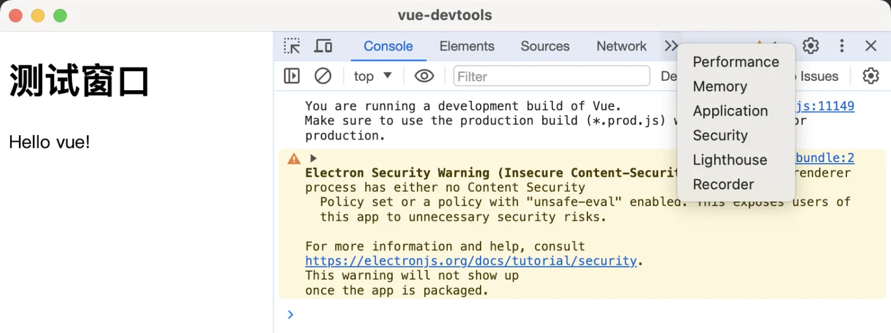
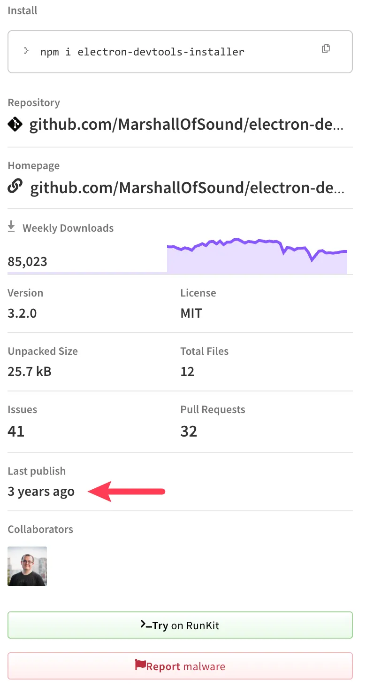

# [0005. 使用 electron-devtools-installer 安装 vue-devtools](https://github.com/tnotesjs/TNotes.electron/tree/main/notes/0005.%20%E4%BD%BF%E7%94%A8%20electron-devtools-installer%20%E5%AE%89%E8%A3%85%20vue-devtools)

<!-- region:toc -->

- [1. links](#1-links)
- [2. demo](#2-demo)

<!-- endregion:toc -->

- 按照官方提供的示例试了一下，最终结果是：**没能安装成功**。
- 如果不是自己写的测试用例有误，那就是 electron-devtools-installer 这个包过时了。

## 1. links

- https://www.npmjs.com/package/electron-devtools-installer
  - npm，electron-devtools-installer

## 2. demo

```js
// index.js
const { app, BrowserWindow } = require('electron')
const {
  default: installExtension,
  VUEJS_DEVTOOLS,
} = require('electron-devtools-installer')

let win
function createWindow() {
  win = new BrowserWindow()
  win.loadFile('./index.html')
  win.webContents.openDevTools()
}

app.whenReady().then(() => {
  installExtension(VUEJS_DEVTOOLS)
    .then((name) => {
      console.log(`Added Extension:  ${name}`)
      createWindow()
    })
    .catch((err) => console.log('An error occurred: ', err))
})
```

```html
<!-- index.html -->
<!DOCTYPE html>
<html lang="en">
  <head>
    <meta charset="UTF-8" />
    <meta name="viewport" content="width=device-width, initial-scale=1.0" />
    <title>vue-devtools</title>
  </head>
  <body>
    <h1>测试窗口</h1>
    <script src="https://unpkg.com/vue@3/dist/vue.global.js"></script>

    <div id="app">{{ message }}</div>

    <script>
      const { createApp, ref } = Vue

      createApp({
        setup() {
          const message = ref('Hello vue!')
          return {
            message,
          }
        },
      }).mount('#app')
    </script>
  </body>
</html>
```

**最终效果**

程序启动后，打印了 `Added Extension:  Vue.js devtools`，但是并没有在 devtools 中看到 vue-devtools 面板。



`electron-devtools-installer` 这个包可能是存在一些兼容性问题，最近一次更新已是 3 年前了，在目前最新版本的 electron 中不可用。


