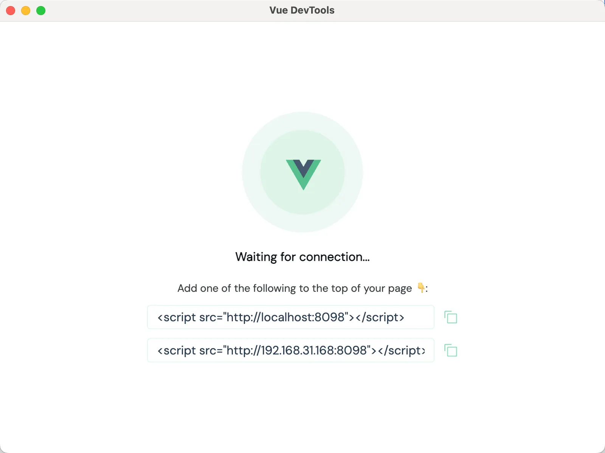
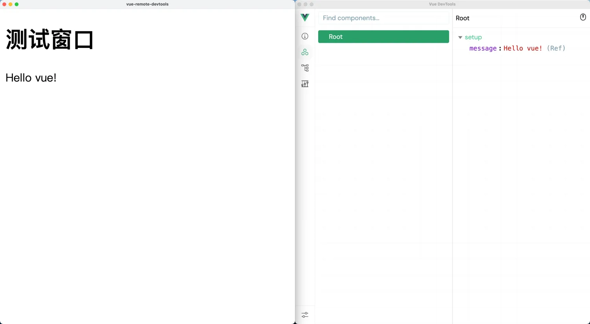

# [0006. 使用 vue-remote-devtools](https://github.com/tnotesjs/TNotes.electron/tree/main/notes/0006.%20%E4%BD%BF%E7%94%A8%20vue-remote-devtools)

<!-- region:toc -->

- [1. 视频](#1-视频)
- [2. links](#2-links)
- [3. demo](#3-demo)

<!-- endregion:toc -->

其它第三方插件的集成方案基本都类似，集成 vue 调试工具 vue-devtools 的示例可以作为一个参考。

- 介绍 vue-remote-devtools 的基本使用
- 本文介绍如何让基于 Electron 搭建的 Vue 工程，能够远程地使用 Vue 调试工具。本节介绍的其实是一个通用的法子，那些在非浏览器环境下搭建的 Vue 工程，如果想要使用 vue-devtools 的能力，都可以参考文中提到的这种方式。
- 其它第三方插件的集成方案基本都类似，集成 vue 调试工具 vue-devtools 的示例可以作为一个参考。

## 1. 视频

<BilibiliVideo id="BV1ABFyedEXu" />

## 2. links

- https://github.com/vuejs/devtools/tree/main/packages/shell-electron#vue-remote-devtools
  - 这是 vuejs 的 GitHub 仓库中的一篇文档，介绍了使用 vue-remote-devtools 来实现远程调试的方案。
- https://devtools-next.vuejs.org/guide/getting-started
  - 这是 Vue DevTools Next 官网。
- https://github.com/vuejs/devtools-next
  - 这是 Vue DevTools Next 在 GitHub 上的仓库链接。

## 3. demo

```json
// package.json
{
  "name": "vue-remote-devtools",
  "version": "1.0.0",
  "description": "",
  "main": "index.js",
  "scripts": {
    "test": "echo \"Error: no test specified\" && exit 1",
    "dev": "electron ."
  },
  "author": "",
  "license": "ISC",
  "dependencies": {
    "electron": "^29.1.1",
    "vue": "^3.4.21"
  },
  "devDependencies": {
    "@vue/devtools": "^7.0.16"
  }
}
```

```js
// index.js
const { app, BrowserWindow } = require('electron')

let win
function createWindow() {
  win = new BrowserWindow()
  win.loadFile('./index.html')
  win.webContents.openDevTools()
}

app.whenReady().then(createWindow)
```

```html
<!-- index.html -->
<!DOCTYPE html>
<html lang="en">
  <head>
    <meta charset="UTF-8" />
    <meta name="viewport" content="width=device-width, initial-scale=1.0" />
    <title>vue-remote-devtools</title>
  </head>
  <body>
    <h1>测试窗口</h1>
    <div id="app">{{ message }}</div>

    <!-- vue devtools 要求将以下脚本引入到需要远程调试的应用中 -->
    <script src="http://localhost:8098"></script>

    <script src="https://unpkg.com/vue@3/dist/vue.global.js"></script>
    <script>
      const { createApp, ref } = Vue

      createApp({
        setup() {
          const message = ref('Hello vue!')
          return {
            message,
          }
        },
      }).mount('#app')
    </script>
  </body>
</html>
```

**启动并查看最终效果**

demo 启动步骤如下。

```bash
# 安装依赖
$ npm i

# 启动 vue-devtools 的 websocket 服务端
$ ./node_modules/.bin/vue-devtools

# 启动 Electron 应用
$ npm run dev
```

执行完命令 `./node_modules/.bin/vue-devtools` 之后，会在本地唤起一个 Vue Devtools 的窗口。



页面提示目前正处于等待连接的状态，这相当于启动了一个 websocket 的服务端，等待客户端来连接它，实现双向通信。而连接的方式，窗口中也提示了，将下面的两个 script 标签之一，复制到需要远程调试的项目中。

执行完命令 `npm run dev` 之后，会启动我们的 Electron 应用，会发现上一步唤起的 Vue Devtools 的窗口内容发生了变化，变得和浏览器中的 Vue Devtools 插件一样了。



左边是我们的项目，右边是我们本地的调试工具，它们是两个互相独立的应用。但我们可以在调试工具中在线调试我们的项目。
