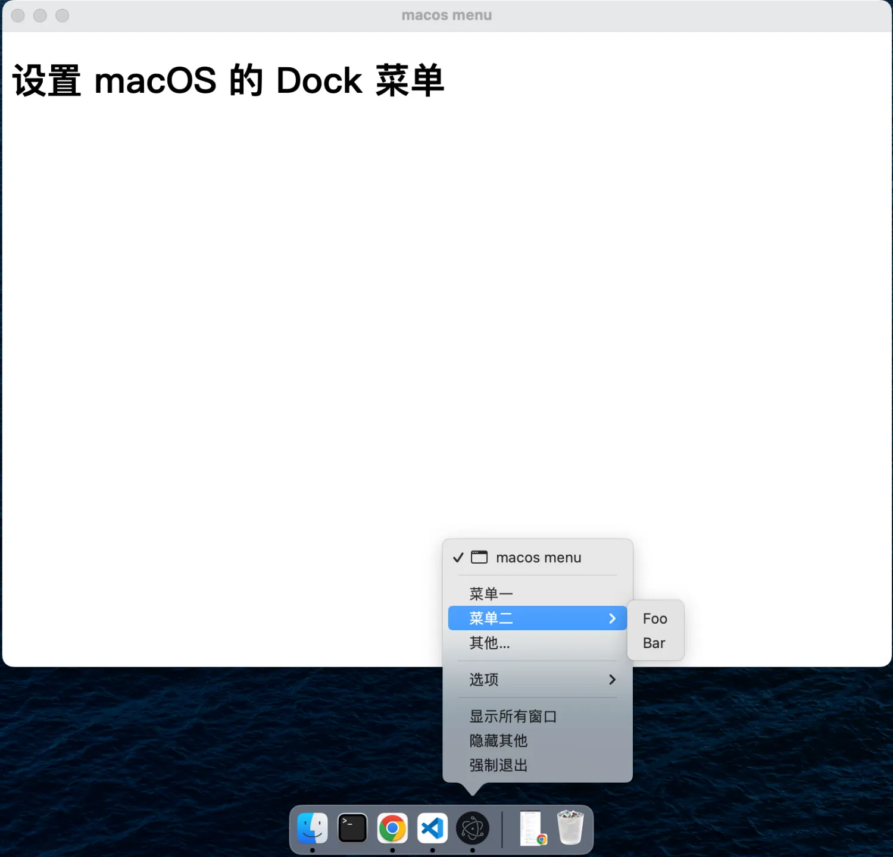

# [0009. 设置 macos 的 Dock 菜单](https://github.com/tnotesjs/TNotes.electron/tree/main/notes/0009.%20%E8%AE%BE%E7%BD%AE%20macos%20%E7%9A%84%20Dock%20%E8%8F%9C%E5%8D%95)

<!-- region:toc -->

- [1. links](#1-links)
- [2. Dock 菜单是什么](#2-dock-菜单是什么)
- [3. demo](#3-demo)

<!-- endregion:toc -->

- 如何通过 Menu 模块来创建 macos 上的 Dock 菜单

## 1. links

- https://www.electronjs.org/zh/docs/latest/tutorial/macos-dock
  - Electron，介绍了 macos 上的 Dock 菜单的相关内容。
- https://www.electronjs.org/zh/docs/latest/api/app#appdock-macos-%E5%8F%AA%E8%AF%BB
  - 查看有关 app.dock API 的相关内容。

## 2. Dock 菜单是什么

- Q：Dock 菜单是什么？
- A：Dock 菜单，这是 macos 特有的。


- 比如上图中框选出来的 vscode 图标，这其实就是一个 Dock 菜单项。

## 3. demo

```js
// index.js
const { app, BrowserWindow, Menu } = require('electron')

let win
function createWindow() {
  win = new BrowserWindow()
  win.loadFile('./index.html')
}

function createDockMenu() {
  const dockTempalte = [
    {
      label: '菜单一',
      click() {
        console.log('New Window')
      },
    },
    {
      label: '菜单二',
      submenu: [{ label: 'Foo' }, { label: 'Bar' }],
    },
    {
      label: '其他...',
    },
  ]

  const dockMenu = Menu.buildFromTemplate(dockTempalte)
  app.dock.setMenu(dockMenu)
}

app.whenReady().then(() => {
  createWindow()
  createDockMenu()
})
```

- `createWindow()` 不是必须的，即便没有窗口，也不影响 dock 菜单的创建。
- `app.dock.setMenu(dockMenu)` 创建 macos 的 dock 菜单。

**最终效果**

右键底部 Dock 栏中的应用图标，会弹出配置好的 Dock 菜单项。


