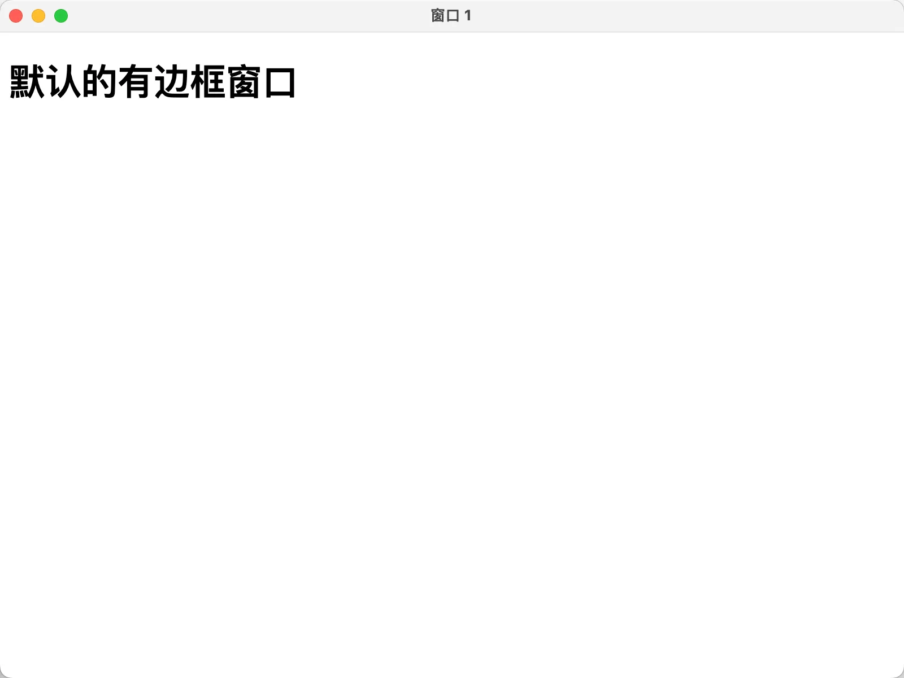
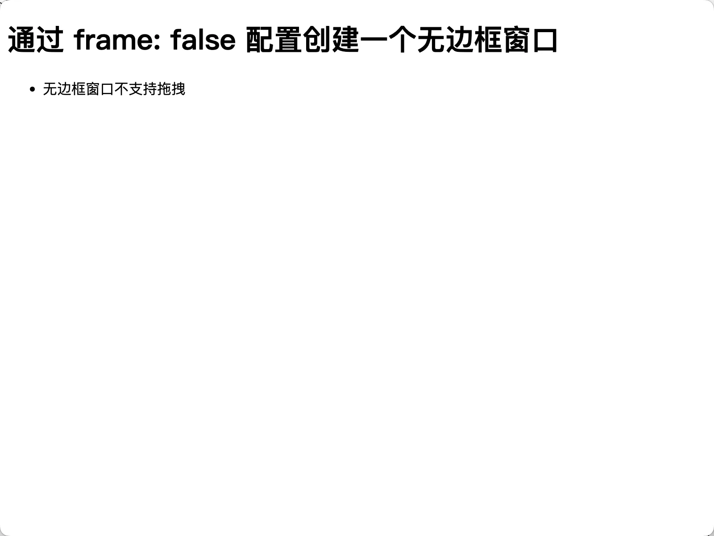

- 创建无边框窗口 frame: false
- 无边框窗口的特点

## 1. 视频

<BilibiliVideo id="BV1YfFye3ERK" />

## 2. links

- https://www.electronjs.org/zh/docs/latest/tutorial/window-customization
  - 官方文档，自定义窗口，查看官方文档中对于如何创建【自定义窗口】的描述。
- https://www.electronjs.org/docs/latest/api/structures/browser-window-options
  - 官方文档，查看创建 BrowserWindow 实例的相关配置项 options。

## 3. demo

```js
// index.js
const { BrowserWindow, app } = require('electron')

let win, win_without_frame
function createWindow() {
  win = new BrowserWindow()
  win_without_frame = new BrowserWindow({ frame: false })

  win.loadFile('./index.html')
  win_without_frame.loadFile('./index_without_frame.html')
}

app.whenReady().then(createWindow)
```

- `frame: false` 去掉窗口默认自带的边框，也就是去掉标题栏部分。

```html
<!-- index.html -->
<!DOCTYPE html>
<html lang="en">
  <head>
    <meta charset="UTF-8" />
    <meta name="viewport" content="width=device-width, initial-scale=1.0" />
    <title>窗口 1</title>
  </head>
  <body>
    <h1>默认的有边框窗口</h1>
  </body>
</html>
```

```html
<!-- index_without_frame.html -->
<!DOCTYPE html>
<html lang="en">
  <head>
    <meta charset="UTF-8" />
    <meta name="viewport" content="width=device-width, initial-scale=1.0" />
    <title>无边框窗口</title>
  </head>
  <body>
    <h1>通过 frame: false 配置创建一个无边框窗口</h1>
    <ul>
      <li>无边框窗口不支持拖拽</li>
    </ul>
  </body>
</html>
```

- `<title>无边框窗口</title>` 这一部分是没有意义的，因为窗口无边框，这个标题压根就不会显示出来。

**最终效果**

- 
- 
