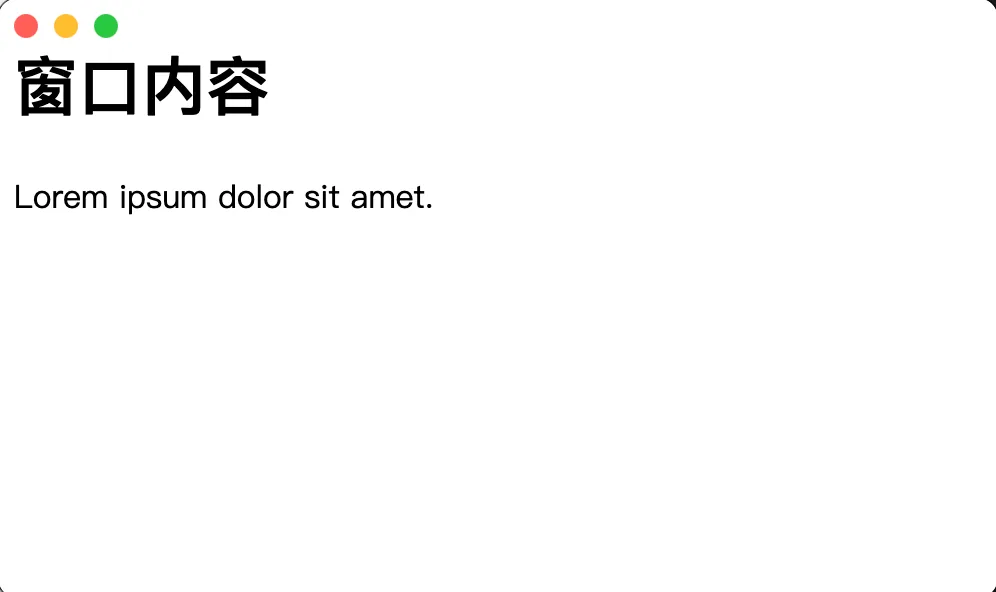
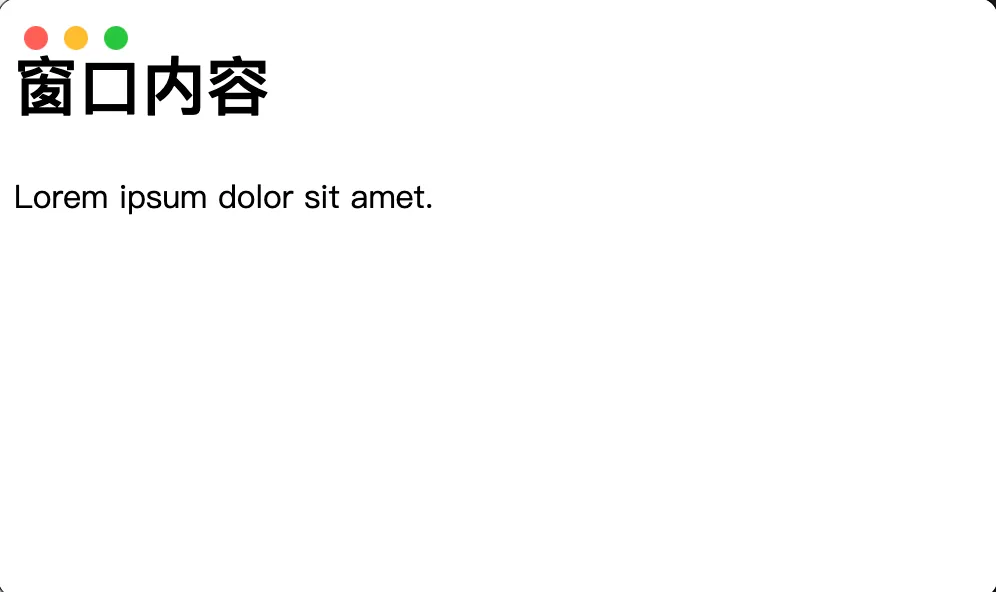

- 只需要调整 BrowserWindow 的配置即可实现在 macos 中隐藏窗口标题栏但是不隐藏交通灯，并且可以微调交通灯的位置。

## 1. demo

```js
// index.js
const { BrowserWindow, app } = require('electron')

let win
function createWindow() {
  win = new BrowserWindow({
    width: 500,
    height: 300,
    titleBarStyle: 'hidden',
    trafficLightPosition: { x: 12, y: 12 },
  })
  win.loadFile('./index.html')
}

app.whenReady().then(createWindow)
```

- `titleBarStyle: 'hidden'` 在 macos 上，这个配置会将窗口的标题栏给隐藏，但是并不会隐藏窗口左上角的交通灯。如果是在 windows 上，那么整个标题栏都将被隐藏。
- `trafficLightPosition: { x: 12, y: 12 }` 顾名思义，这玩意儿是用来配置交通灯位置的，默认情况下交通灯会紧挨着左上角。

```html
<!-- index.html -->
<!DOCTYPE html>
<html lang="en">
  <head>
    <meta charset="UTF-8" />
    <meta name="viewport" content="width=device-width, initial-scale=1.0" />
    <!-- title 不可见 -->
    <title>窗口标题</title>
  </head>
  <body>
    <h1>窗口内容</h1>
    <div>Lorem ipsum dolor sit amet.</div>
  </body>
</html>
```

**最终效果**

- 没有配置 `trafficLightPosition` 的情况下显示的效果。



- `trafficLightPosition: { x: 12, y: 12 }` 交通灯偏移后的效果。


