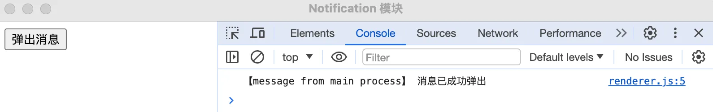

- 如何使用 Notification 弹出系统通知
- 这个 demo 使用 electron 的内置模块 Notification 实现了一个简单的 demo，最终效果仅仅是将系统消息给展示出来，没有加其它多余的交互逻辑。

## 1. links

- https://www.electronjs.org/zh/docs/latest/tutorial/notifications
  - Electron，查看通知（Notifications）示例。

## 2. demo

```js
// index.js
const { BrowserWindow, app, ipcMain, Notification } = require('electron')

app.whenReady().then(async () => {
  const win = new BrowserWindow({
    webPreferences: { nodeIntegration: true, contextIsolation: false },
  })

  win.webContents.openDevTools()

  win.loadFile('./index.html')
})

ipcMain.handle('show-notify', async (_, title, body) => {
  const notify = new Notification({ title, body })
  notify.show()
  return '消息已成功弹出'
})
```

```js
// renderer.js
const { ipcRenderer } = require('electron')

document.getElementById('btn').addEventListener('click', async () => {
  const res = await ipcRenderer.invoke('show-notify', '标题 123', '内容 abc')
  console.log('【message from main process】', res)
})
```

**最终效果**



点击【弹出消息】按钮，会弹出系统消息。


