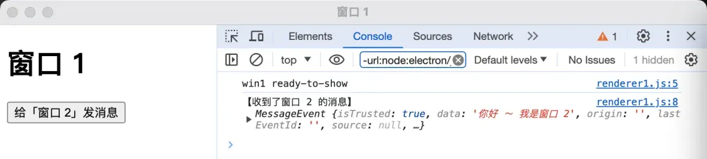
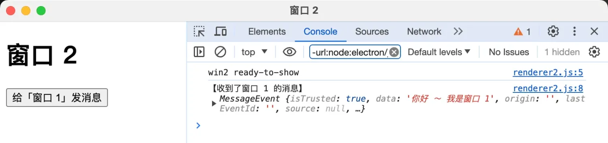

# [0040. 使用 MessagePort 实现两个渲染进程之间的互相通信](https://github.com/tnotesjs/TNotes.electron/tree/main/notes/0040.%20%E4%BD%BF%E7%94%A8%20MessagePort%20%E5%AE%9E%E7%8E%B0%E4%B8%A4%E4%B8%AA%E6%B8%B2%E6%9F%93%E8%BF%9B%E7%A8%8B%E4%B9%8B%E9%97%B4%E7%9A%84%E4%BA%92%E7%9B%B8%E9%80%9A%E4%BF%A1)

<!-- region:toc -->

- [1. 视频](#1-视频)
- [2. Electron 官方文档 - 如何在两个渲染进程之间建立 MessageChannel](#2-electron-官方文档---如何在两个渲染进程之间建立-messagechannel)
- [3. Electron 官方文档 - 主进程的 MessageChannelMain 模块](#3-electron-官方文档---主进程的-messagechannelmain-模块)
- [4. 引用 - electron.0003. 比较消息端口 MessageChannel 和 ipcRenderer.invoke、ipcMain.handle 的性能](#4-引用---electron0003-比较消息端口-messagechannel-和-ipcrendererinvokeipcmainhandle-的性能)
- [5. demos.1 - 使用 MessagePort 实现两个渲染进程之间的互相通信](#5-demos1---使用-messageport-实现两个渲染进程之间的互相通信)

<!-- endregion:toc -->

## 1. 视频

<BilibiliVideo id="BV1CBFyeREuR" />

## 2. Electron 官方文档 - 如何在两个渲染进程之间建立 MessageChannel

- https://www.electronjs.org/zh/docs/latest/tutorial/message-ports#%E5%9C%A8%E4%B8%A4%E4%B8%AA%E6%B8%B2%E6%9F%93%E8%BF%9B%E7%A8%8B%E4%B9%8B%E9%97%B4%E5%BB%BA%E7%AB%8B-messagechannel

## 3. Electron 官方文档 - 主进程的 MessageChannelMain 模块

- https://www.electronjs.org/zh/docs/latest/api/message-channel-main

## 4. 引用 - electron.0003. 比较消息端口 MessageChannel 和 ipcRenderer.invoke、ipcMain.handle 的性能

- **electron.0003** 是 MessagePort 性能测试案例。
- 听说 MessagePort 这玩意儿性能还不错，没有实际测试过，工作上也基本上没用过，于是写了这个 demo。

## 5. demos.1 - 使用 MessagePort 实现两个渲染进程之间的互相通信

::: code-group

```js [index.js]
const { BrowserWindow, app, MessageChannelMain } = require('electron')

app.whenReady().then(async () => {
  const win1 = new BrowserWindow({
    webPreferences: { nodeIntegration: true, contextIsolation: false },
  })
  const win2 = new BrowserWindow({
    webPreferences: { nodeIntegration: true, contextIsolation: false },
  })

  win1.webContents.openDevTools()
  win2.webContents.openDevTools()

  win1.loadFile('./index1.html')
  win2.loadFile('./index2.html')

  // 建立通道，当 webContents 准备就绪后，使用 postMessage 向每个 webContents 发送一个端口。
  const { port1, port2 } = new MessageChannelMain() // [!code highlight]
  win1.once('ready-to-show', (_) =>
    win1.webContents.postMessage('port', null, [port1]),
  ) // [!code highlight]
  win2.once('ready-to-show', (_) =>
    win2.webContents.postMessage('port', null, [port2]),
  ) // [!code highlight]
})
```

```js [renderer1.js]
const { ipcRenderer } = require('electron')

let electronMessagePort
ipcRenderer.on('port', (e) => {
  console.log('win1 ready-to-show')
  electronMessagePort = e.ports[0] // [!code highlight]
  document
    .getElementById('btn')
    .addEventListener('click', (_) =>
      electronMessagePort.postMessage('你好 ～ 我是窗口 1'),
    ) // [!code highlight]
  electronMessagePort.onmessage = (msg) =>
    console.log('【收到了窗口 2 的消息】', msg) // [!code highlight]
})
```

```js [renderer2.js]
const { ipcRenderer } = require('electron')

let electronMessagePort
ipcRenderer.on('port', (e) => {
  console.log('win2 ready-to-show')
  electronMessagePort = e.ports[0] // [!code highlight]
  document
    .getElementById('btn')
    .addEventListener('click', (_) =>
      electronMessagePort.postMessage('你好 ～ 我是窗口 2'),
    ) // [!code highlight]
  electronMessagePort.onmessage = (msg) =>
    console.log('【收到了窗口 1 的消息】', msg) // [!code highlight]
})
```

:::

- **最终效果**
  - 
  - 
