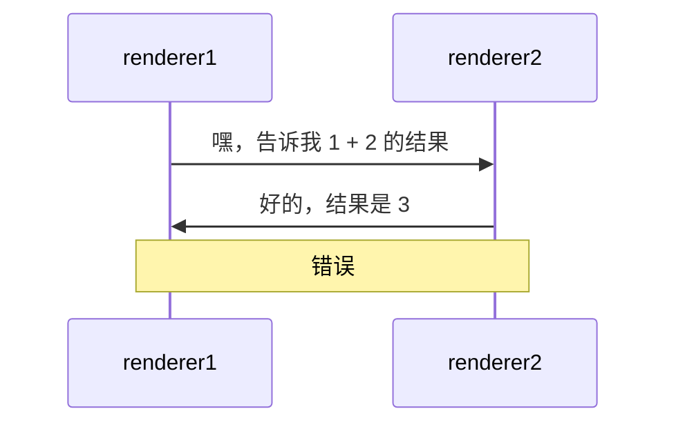
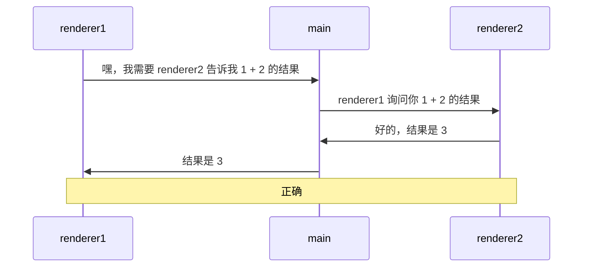
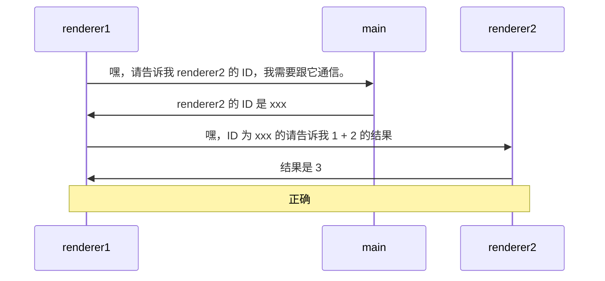

# [0047. 分析渲染进程之间的通信](https://github.com/Tdahuyou/TNotes.electron/tree/main/notes/0047.%20%E5%88%86%E6%9E%90%E6%B8%B2%E6%9F%93%E8%BF%9B%E7%A8%8B%E4%B9%8B%E9%97%B4%E7%9A%84%E9%80%9A%E4%BF%A1)

<!-- region:toc -->

- [1. 📒 错误做法 ❌](#1--错误做法-)
- [2. 📒 主进程转发消息](#2--主进程转发消息)
- [3. 📒 主进程转发 ID](#3--主进程转发-id)
- [4. 📒 走消息端口](#4--走消息端口)

<!-- endregion:toc -->
- 注意：mermaid 在 vitepress 中无法正常渲染，后续会将 mermaid 集成到 TNotes 中，在看笔记的时候，先点击标题，跳转到 github 上查看 mermaid 图。

## 1. 📒 错误做法 ❌

- 在 Electron 中，主进程只能有一个，但是渲染进程可以有多个，并且每个渲染进程之间是相互独立的，也就是说渲染进程和渲染进程之间互相并不知道彼此的存在，那么又何谈渲染进程之间的通信呢？
- 这时候就需要依赖主进程了，如果你想要实现渲染进程之间的互相通信。

## 2. 📒 主进程转发消息

- 让主进程来帮你做转发消息。
- electron.0042 这个笔记中的 demo1、demo2 使用的都是这种通信方式。

## 3. 📒 主进程转发 ID

- 让主进程告诉你，你想要与之通信的那个渲染进程的 ID，然后你再根据 ID 来给指定的渲染进程发消息。
- electron.0041 该笔记中的 demo 采用的是这种通信方式。
- 上述两种方式都可以实现渲染进程之间的 **间接** 相互通信。在后续的内容中，我们将结合具体的示例来看看代码实现。

## 4. 📒 走消息端口

- **🔍 查阅官方文档 > Electron 中的消息端口**
  - https://www.electronjs.org/zh/docs/latest/tutorial/message-ports
- 
- 使用 **Electron 中的消息端口** 来实现两个渲染进程之间的通信。
- electron.0040 该笔记中的 demo 介绍了这种方式实现的详细步骤。
